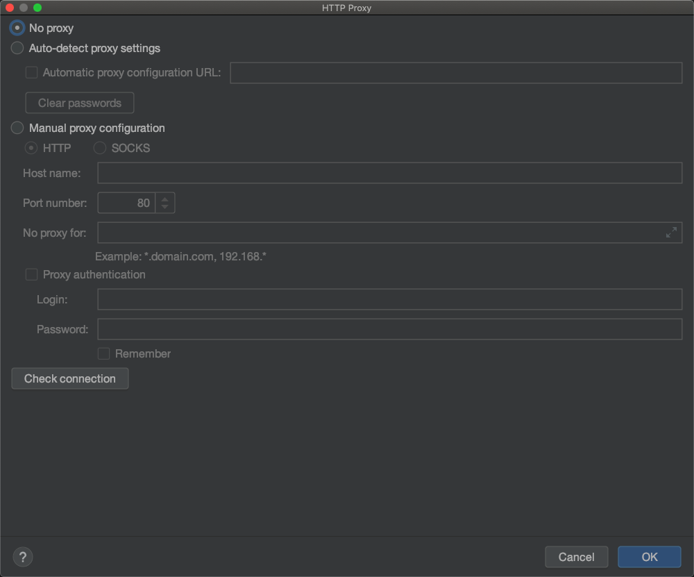

### 1.2 搭建flutter环境
本章节介绍一些`flutter`的mac环境安装和ide与模拟器的使用。

### 1.2.1安装flutter

flutter同时会构建`android`和`iOS`两个平台的发布包，所以flutter同时依赖`android`和`iOS`SDK，在安装`Flutter`时也是需要安装构建平台的工具和SDK。

### 镜像
在国内方位flutter速度太慢，所以`flutter`专门为中国区开发者使用了临时镜像，设置下面的值到环境变量中：

```dart
export PUB_HOSTED_URL=https://pub.flutter-io.cn
export FLUTTER_STORAGE_BASE_URL=https://storage.flutter-io.cn
```
### mac 上搭建Flutter环境

在mac上可以同时进行Android和iOS设备测试

#### 系统要求
安装flutter最低要求

- macos(64)
- 磁盘空间（700MB）
- Flutter依赖下面命令行工具
 - `bash`、`mkdir`、`rm`、`git`、`curl`、`zunzip`、`which`
 
 #### 获取Flutter SDK
 1. 去[flutter官方下载最新可用的安装包](https://flutter.dev/docs/development/tools/sdk/releases)
 2. 解压到固定文件夹
 
 ```dart
 cd ~/development
 unzip ~/Downloads/flutter_macoxs_v1.17.5.zip 
 ```
 
 3. 添加`flutter`相关工具到path中：
 
```
export PATH='pwd'/flutter/bin:$PATH
 
source ~/.bash_profile 
// 安装 zsh的话就添加到 ~/.zshrc
source ~/.zshrc
```

#### 安装Xcode

1. 在`AppStore`搜索`Xcode`进行安装
2. 配置`Xcode`命令行工具以使用新安装的`Xcode`版本 `sudo xcode-select --switch /Applications/Xcode.app/Contents/Developer` 对于大多数情况，当您想要使用最新版本的`Xcode`时，这是正确的路径。如果您需要使用不同的版本，请指定相应路径。
确保`Xcode`许可协议是通过打开一次`Xcode`或通过命令`sudo xcodebuild -license`同意过了

使用`Xcode`可以在iOS设备或模拟器运行`Flutter`了


#### 安装Android Stydio

1. 下载`Android Studio`,可以去官网下载，网址是 `https://developer.android.google.cn/studio/`或者自行网上下载
2. 安装好之后安装模拟器


3. 安装插件 `Dart`、 `Flutter`
快捷键`commond `+`,`或者`Android Studio -> Preferences->Plugins`,

搜索`dart`和`Flutter`进行安装

设置无代理或者自行设置代理




4. 至此 `Android Studio`安装完成，可以新建`Flutter 项目`进行编码了


#### 使用Android Studio 新建 Flutter项目

`File->New->New Fluttr project`,选择`Flutter Application`


若创建时间超过5分钟无响应，则可以强制关闭，然后查看目录是否已经有该工程，否则重新创建即可。


#### 运行程序

打开刚才新建的工程，点击运行


运行成功


中间遇到问题，解决问题即可。
