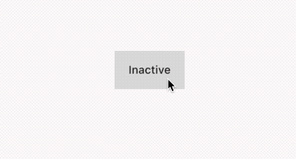
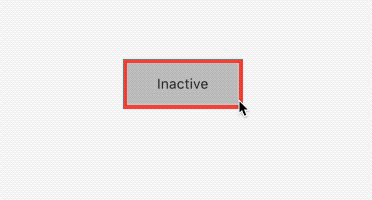

# 状态管理

## 3.2.1 状态管理 简介

`Widget`分为有状态和无状态，有状态的则就需要有人来管理了，父组件管理和自己管理各有什么优劣呢？

- 如果状态是用户数据，如：复选框、滑块位置、最好有父组件管理。
- 如果状态是有关界面的效果，例如颜色、动画、最好由自己管理。
- 如果某一个状态是不同的Widget共享，则最好是父组件管理。

在组件内部管理，封装性当然是好一点，而缺少了灵活性，在父组件中管理子组件的状态，则更灵活，设计组件的时候，应已灵活多变为要点，多位父组件管理。

接下来我们用几个例子分别演示`自己管理`、`父管理`、`多组件管理`来说明状态管理不同方式。


我们使用一个简单的例子：一个盒子，活跃状态是`红色`，不活跃是`灰色`.

### 自己管理状态
自己管理状态，外界无需参与即可完成完整步骤，完全封闭。

```dart
class TapBox extends StatefulWidget {
  TapBoxState createState() => TapBoxState();
}

class TapBoxState extends State<TapBox> {
  bool _selected = false;
  @override
  Widget build(BuildContext context) {
    return Scaffold(
      appBar: AppBar(
        title: Text('自己管理状态'),
      ),
      body: Center(
        child: Column(
          mainAxisAlignment: MainAxisAlignment.center,
          children: <Widget>[
            Container(
              color: _selected ? Colors.red : Colors.black12,
              child: FlatButton(
                child: Text(_selected ? 'Active' : 'Inactive'),
                onPressed: _tap,
              ),
            )
          ],
        ),
      ),
    );
  }

  void _tap() {
    setState(() {
      _selected = !_selected;
    });
  }
}
```

效果:



### 父组件管理
父组件可以指定子组件的状态，当条件复杂的时候，提交数据到服务后台，失败了，这种情况就用父组件来传递状态到子组件。

```dart
///  封装好的子组件  
class TapBox2 extends StatefulWidget {
  final bool selected;
  final onChange onchange;
  TapBox2({Key key, this.selected, this.onchange}) : super(key: key);
  TapBoxState2 createState() => TapBoxState2();
}

typedef onChange = Function(bool);

class TapBoxState2 extends State<TapBox2> {
  bool _selected;
  @override
  void initState() {
    _selected = widget.selected == true;
    super.initState();
  }

  @override
  Widget build(BuildContext context) {
    return Container(
      color: widget.selected == true ? Colors.red : Colors.black12,
      child: FlatButton(
        child: Text(widget.selected == true ? 'Active' : 'Inactive'),
        onPressed: _tap,
      ),
    );
  }

  void _tap() {
    if (widget.onchange != null) {
      _selected = !_selected;
      widget.onchange(_selected);
    }
  }
}


///  父组件来管理


class TapBox extends StatefulWidget {
  TapBoxState createState() => TapBoxState();
}

class TapBoxState extends State<TapBox> {
  bool _selected = false;
  @override
  Widget build(BuildContext context) {
    return Scaffold(
      appBar: AppBar(
        title: Text('管理状态'),
      ),
      body: Center(
        child: Column(
          mainAxisAlignment: MainAxisAlignment.center,
          children: <Widget>[
            Container(
              color: _selected ? Colors.red : Colors.black12,
              child: TapBox2(

                onchange: (v) {
                  setState(() {
                    _selected = v;
                  });
                },
                selected: _selected,
              ),
            )
          ],
        ),
      ),
    );
  }
}
```
效果：


### 混合管理

有些组件，混合方式比较适用，这种情况，组件自身管理一部分状态，父组件管理一些外部状态。

下面的例子是不活跃状态按下盒子周围显示红色边框，活跃状态按下显示蓝色边框，抬起时边框消失，点击完成后，状态进行改变。**活跃状态由外部管理,边框变化有内部管理。**

```dart
class TapBox3 extends StatefulWidget {
  final bool selected;
  final onChange onchange;
  TapBox3({Key key, this.selected, this.onchange}) : super(key: key);
  TapBoxState3 createState() => TapBoxState3();
}

class TapBoxState3 extends State<TapBox3> {
  bool _touching = false;
  @override
  void initState() {
    super.initState();
  }

  @override
  Widget build(BuildContext context) {
    return Container(
      child: GestureDetector(
        child: Container(
          height: 50,
          width: 120,
          alignment: Alignment.center,
          child: Text(widget.selected == true ? 'Active' : 'Inactive'),
          decoration: new BoxDecoration(
              color: widget.selected == true ? Colors.red : Colors.black12,
              border: _touching
                  ? Border.all(
                      color:
                          widget.selected == false ? Colors.red : Colors.blue,
                      width: 4)
                  : null),
        ),
        onTap: _tap,
        onTapDown: (TapDownDetails details) {
          _touchStart();
        },
        onTapUp: (detail) {
          _touchend();
        },
      ),
    );
  }

  void _tap() {
    if (widget.onchange != null) {
      widget.onchange(!widget.selected);
    }
  }

  void _touchStart() {
    setState(() {
      _touching = true;
    });
  }

  void _touchend() {
    setState(() {
      _touching = false;
    });
  }
}


/// 父组件管理活跃状态

Container(
      color: _selected ? Colors.red : Colors.black12,
      child: TapBox3(
        onchange: (v) {
          setState(() {
            _selected = v;
          });
        },
        selected: _selected,
      ),
    )
```
效果：




### 3.2.2 全局状态管理

当跨页面状态管理的时候，上面的情况已经不适用，我们可以采用`eventBus`来进行数据传递，或者使用`Provider`进行数据管理和页面刷新。

自己管理或者父级管理本质是可以调用`State`的`setState((){})`进行`Widget`的`build`函数，当这些组件不在一个页面，则无法进行直接通信，这时我们有2中方法解决。

- 实现一个全局的时间总线，将状态对应一个事件，然后在对应的`Widget`进行刷新。
- 使用专门管理状态的包，如`Provider`、`Redux`，详细用法见[pub](https://pub.flutter-io.cn/)

> 在后续章节中会介绍状态管理的机制原理，再次不做累述。


