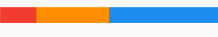
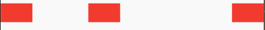

## 4.3 弹性布局（Flex）
`Flex`弹性布局，是常见的一种布局，他允许盒子按照一定比例来分配空间。
 
###  Flex

`Flex`组件可以沿着水平或者垂直方向排列组件，如果你知道主轴方向，使用`Row`或`Column`可能会更方便点，因为`Row`和`Column`都是继承`Flex`,参数基本相同，所以`Flex`可以用的地方，基本`Row`和`Column`都可以满足要求。


```dart
 Flex({
    Key key,
    @required this.direction,
    this.mainAxisAlignment = MainAxisAlignment.start,
    this.mainAxisSize = MainAxisSize.max,
    this.crossAxisAlignment = CrossAxisAlignment.center,
    this.textDirection,
    this.verticalDirection = VerticalDirection.down,
    this.textBaseline,
    List<Widget> children = const <Widget>[],
  }) 
```


- `direction`: 指定`Axis.vertical`它就是`Column`，指定为`Axis.horizontal`它就是`Row`.
- `mainAxisAlignment`: 主轴的排列位置，如果文本方向是`TextDirection.ltr`,`start`,按照从左向右的开始方向排列,否则从右向左排列。`center`是按照中间向两边排列，`end`是按照从结尾向开始方向排列。`spaceBetween`是两个子组件间隔一致。`spaceEvenly`是所有的空隙一致。`spaceAround`开始和结束是中间的间隙的一半。
- `crossAxisAlignment` 副轴方向，和主轴方向类似，`start`是排列在开始位置。`end`排列在底部。`center`排列在副轴中间。`baseline`根据基线排列，`stretch`要求他的子组件副轴方向充满父组件。


效果图：

展示了主轴的常用的效果：


### Expanded
可以按照比例扩展`Row`或者`Column`、`Flex`的所占空间。

```dart
Expanded({
    Key key,
    int flex = 1,
    @required Widget child,
  })
```

例子：

```dart
Container(
height: 30,
child: Row(children: <Widget>[
  Expanded(
    flex: 1,
    child: Container(
      color: Colors.red,
    ),
  ),
  Expanded(
    flex: 2,
    child: Container(
      color: Colors.orange,
    ),
  ),
  Expanded(
    flex: 3,
    child: Container(
      color: Colors.blue,
    ),
  )
]))
```

效果：



### Spacer


```dart
const Spacer({Key key, this.flex = 1})
```
源码也很简单，其实是封装了`Expanded`，主动添加了一个大小是`0,0`的`SizedBox.shrink()`.


例子：

```dart
Container(
    height: 30,
    child: Row(children: <Widget>[
      Container(
        width: 50,
        color: Colors.red,
      ),
      Spacer(
        flex: 1,
      ),
      Container(
        width: 50,
        color: Colors.red,
      ),
      Spacer(
        flex: 2,
      ),
      Container(
        width: 50,
        color: Colors.red,
      ),
    ]))
```

效果：




### 实际应用

当我们想子组件随着用父组件变大而变大，屏幕变宽而变宽，那么请使用`弹性布局`.

```dart
Row(
  children: <Widget>[
    Expanded(
      child: OutlineButton(
        child: Text('Expanded btn'),
      ),
    )
  ],
),
OutlineButton(
  child: Text('btn'),
),
```


效果：


如果距离左侧 或者右侧边距`20px`呢？

```dart

Row(
  children: <Widget>[
    SizedBox(
      width: 20,
    ),
    Expanded(
      child: OutlineButton(
        child: Text('Expanded btn'),
      ),
    ),
    SizedBox(
      width: 20,
    ),
  ],
)
```

效果图：


### 总结：
 **如果横着排列请用`Row`,如果横着有些随着屏幕变宽也变宽，使用`Row`+`Expanded`,如果固定间隔请使用`SizedBox`,如果间隔按照比例分配，请用`Spacer`**

弹性布局比较简单，多用才能有更深理解。