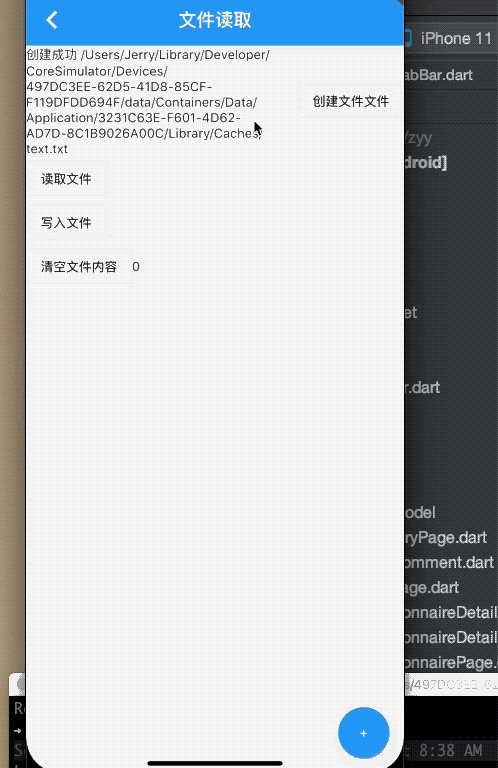

## 11.1 文件操作

`Dart`的`IO`库包含了文件读写的相关类，是Dart的语法的一部分，在哪个平台都是由`Dart IO`来完成的，而在Flutter运行的系统中，只是文件系统有一些差异。

### APP目录

Android 和iOS应用存在目录不同，`PathProvider`插件提供了一个平台透明的方式来访问设备文件系统的常用位置

- **临时目录**: 可以使用`getTemporaryDirectory `来获取临时目录，系统可以随时清楚该目录(缓存).在`iOS`上，这对应于`NSTemporaryDirectory()` 返回的值。在`Android`上，这是`getCacheDir()`返回的值

- **文档目录**： 可以使用`getApplicationDocumentsDirectory()`来获取应用程序的文档目录，该目录用于存储只有自己可以访问的文件。只有当应用程序被卸载时，系统才会清除该目录。在`iOS`上，这对应于`NSDocumentDirectory`。在`Android`上，这是`AppData`目录

- **外部存储目录**：可以使用`getExternalStorageDirectory()`来获取外部存储目录，如SD卡；由于`iOS`不支持外部目录，所以在`iOS`下调用该方法会抛出`UnsupportedError`异常，而在`Android`下结果是`android SDK中getExternalStorageDirectory`的返回值


下边我们使用一个简单的例子来演示一下如何使用`PathProvider`来创建、读取、写入文件的。

### 例子

1. 引入PathProvider插件，在`pubspec.yaml`文件中添加声明；

```dart
  path_provider: ^1.6.11
``` 
然后执行`flutter pub get`,最新版本号在`dart pub `[获取](https://pub.flutter-io.cn/packages/path_provider)


```dart

class BaseFileRoute extends StatefulWidget {
  BaseFileRoute({Key key}) : super(key: key);

  @override
  _BaseFileRouteState createState() => _BaseFileRouteState();
}

class _BaseFileRouteState extends State<BaseFileRoute> {
  @override
  Widget build(BuildContext context) {
    return Scaffold(
      appBar: AppBar(
        title: Text('文件读取'),
      ),
      body: _body(),
      floatingActionButton: FloatingActionButton(
        child: Text('+'),
        onPressed: () {
          setState(() {
            _count += 1;
          });
        },
      ),
    );
  }

  int _count = 0;
  String _string = '';
  String _error = '';
  String _writeStr = '';
  Widget _body() {
    return Center(
      child: Column(
        children: <Widget>[
          Row(
            children: <Widget>[
              Expanded(
                child: Text(_error),
              ),
              OutlineButton(
                child: Text('创建文件文件'),
                onPressed: _createFile,
              ),
            ],
          ),
          Row(
            children: <Widget>[
              OutlineButton(
                child: Text('读取文件'),
                onPressed: _read,
              ),
              Expanded(
                child: Text(_string),
              ),
            ],
          ),
          Row(
            children: <Widget>[
              OutlineButton(
                child: Text('写入文件'),
                onPressed: _write,
              ),
              Expanded(
                child: Text(_writeStr),
              )
            ],
          ),
          Row(
            children: <Widget>[
              OutlineButton(
                child: Text('清空文件内容'),
                onPressed: _clearData,
              ),
              Text(_count.toString()),
            ],
          )
        ],
      ),
    );
  }

  void _read() async {
    var file = new File(await _path());
    var st = await file.readAsString();
    setState(() {
      _string = st;
    });
  }

  void _write() async {
    var file = new File(await _path());
    var st = await file.readAsString();

    st += '  $_count';
    file.writeAsString(
      st,
    );
    setState(() {
      _writeStr = '写入成功 $_count';
    });
  }

  void _clearData() async {
    var file = new File(await _path());
    var st = await file.readAsString();

    st += '  $_count';
    file.writeAsString(
      '',
    );
    setState(() {
      _writeStr = '文件已清空';
    });
  }

  Future<String> _path() async {
    var path = await getTemporaryDirectory();
    var all = path.path + '/text.txt';
    return all;
  }

  void _createFile() async {
    try {
      var path = await getTemporaryDirectory();
      var all = path.path + '/text.txt';
      var current = Directory(all);
      if (current.existsSync() == false) {
        var d = new File(all);
        var f = await d.create();
        if (f.existsSync()) {
          print('创建成功 ${d.path}');
          setState(() {
            _error = '创建成功 ${d.path}';
          });
        } else {
          setState(() {
            _error = '文件创建失败';
          });
        }
      } else {
        setState(() {
          _error = '文件已存在';
        });
      }
    } catch (e) {
      setState(() {
        _error = '${e.toString()}';
      });
      print(e.toString());
    }
  }
}
```

效果如下：

