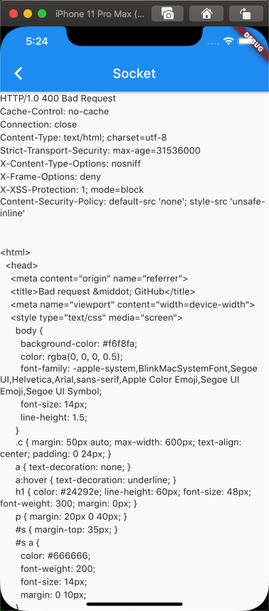

## 11.6 Socket

我们之前介绍的Http协议和WebSocket协议都属于应用层协议，除了他们还要很多如：FTP,SMTP,等，这些应用层的协议都是通过SocketAPI来实现的，其实，操作系统中提供的原生网络请求API是标准的，在c语言的Socket库中，主要提供了端到端简历链接和发送数据的 基础API，而高级的Socket库其实都说说对系统的SocketAPI的封装。Flutter 的SocketAPi在Dart中IO包中，我们看个例子：

```dart
 var socket = await Socket.connect('baidu.com', 80);
    socket.write('GET / HTTP:/1.1');
    socket.write('Host:baidu.com');
    socket.write('Connection:close');
    socket.writeln();

    utf8.decoder.bind(socket).listen((event) {
      print(event);
    });

    socket.flush();

    await socket.close(); //关闭
```


