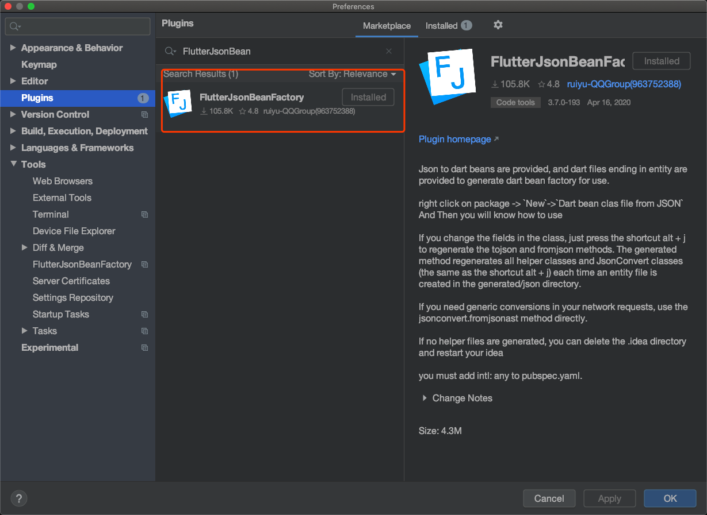

## 11.7 Json To Dart Model

实际开发中该接口返回的数据往往是JSON或者XML等，入职前的请求Github中返回的是Json格式字符串，为了方便我们在代码中操作JSON，首先要将JSON转成Dart对象，这个可以通过`dart:convert`中内置的JSON解码器来实现，转成List或者Map,就可以查找其中的值。


```dart
String jsonStr = '[{"name":"Jack Ma"},{"name":"QiangDong liu"}]';
List items = json.decode(jsonStr);
print(items[0]['name']); // Jack Ma

```

通过`json.decode()`将JSON字符串转成序列化的List/Map比较简单，对于项目变大，手动写序列化逻辑比较复杂，当字段名字稍微复杂点，可能名字会打错导致运行出错，这是我们不想看到的。

其实，这问题在很多平台开发中都会遇到，而也早就有了解决 方法，`Json Model 化`,具体做法是通过预定义一些与JSON结构对应的Model类，然后在请求到数据再动态创建model类的实例。这样子在开发阶段使用的model类的实例，而不是List和Map,这样子访问内部属性时就不会拼错。

例如：

```dart
class User {
  final String name;
  final String email;

  User(this.name, this.email);

  User.fromJson(Map<String, dynamic> json)
      : name = json['name'],
        email = json['email'];

  Map<String, dynamic> toJson() =>
    <String, dynamic>{
      'name': name,
      'email': email,
    };
}
```

现在，序列化逻辑移动到了模型内部，采用这种方式，我们非常容易的反序列化了。


```dart
Map userMap = json.decode(json);
var user = new User.fromJson(userMap);

print('Howdy, ${user.name}!');
print('We sent the verification link to ${user.email}.');
```

### 自动生成Model

我们介绍下官方库[`json_serializable`](https://pub.dev/packages/json_serializable)，

导入：

```
 json_annotation: ^*.0.0

```

然后运行`pub packages get`.

### 以json_serializable的方式创建model类

我们示例一下用`json_serializable `如何将我们的user类转换为一个`json_serializable `.

**user.dart**

```dart
import 'package:json_annotation/json_annotation.dart';

// user.g.dart 将在我们运行生成命令后自动生成
part 'user.g.dart';

///这个标注是告诉生成器，这个类是需要生成Model类的
@JsonSerializable()

class User{
  User(this.name, this.email);

  String name;
  String email;
  //不同的类使用不同的mixin即可
  factory User.fromJson(Map<String, dynamic> json) => _$UserFromJson(json);
  Map<String, dynamic> toJson() => _$UserToJson(this);  
}
```

然后在根目录运行代码生成器

```
flutter packages pub run build_runner build

```

这触发了一次构建，我们可以在需要我们的model生成json序列化代码，他通过我们的源文件生成model类的源文件，来生成对应的.g.dart文件，一个好的建议是将所有model类放在已单独的目录下，然后再改目录下执行命令。

### 持续生成

按照上面的每次写一个model都是需要单独运行一个代码生成器，可以用下边的 命令来启动观察者，
```
flutter packages pub run build_runner watch
```

### 使用FlutterJsonBeanFactory

#### 安装插件
安装插件并重启，在mac电脑Androidstudio 中快捷键'com+,'打开界面，安装并重启。



然后就可以使用插件了。准备好需要转成model的格式的字符串。


#### 代码使用

字符串转`model`

```dart
String jsonStr = '{"list":[{"name":"Jack Ma"},{"name":"QiangDong liu"}]}';
UserEntity list = JsonConvert.fromJsonAsT<UserEntity>(json.decode(jsonStr));

```

`dio` 返回结果直接转`model`

```dart
(_dio.httpClientAdapter as DefaultHttpClientAdapter).onHttpClientCreate =
    (client) {
  client.findProxy = (uri) {
    return "PROXY localhost:1088";
  };

};
Response res = await _dio.get('https://api.github.com/users/ifgyong/repos');
List<dynamic> list = res.data;
List<GitModel> gitList = [];
if (res.data is List) {
  (res.data as List).forEach((element) {
    GitModel modl = JsonConvert.fromJsonAsT<GitModel>(element);
    gitList.add(modl);
  });
  print('${gitList.length}'); // 输出 30
}
```


