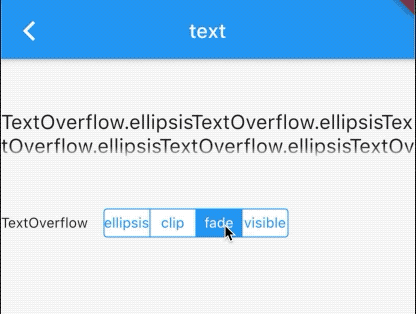
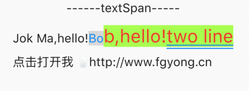
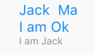

# 文本和样式

## 3.1 Text and TextStyle 

`text`用于显示简单的文字和样式，下面看下简单的例子

```dart
Text('text HelloWord',
      textAlign: TextAlign.left,)
      
Text(
        '加了style的文本',
        style: TextStyle(
            color: Colors.red,
            fontSize: 30,
            height: 1.4,
            background: new Paint()..color = Colors.black12,
            decoration: TextDecoration.underline,
            decorationColor: Colors.blue,
            decorationStyle: TextDecorationStyle.wavy),
      )
```

效果如下：


一个是简单的文本显示，属性  `textAlign:TextAlign.left`

好像没起作用，原因是文本没超过一行，没效果。

底部波纹代码如下：

```dart
decoration: TextDecoration.underline,
decorationColor: Colors.blue,
decorationStyle: TextDecorationStyle.wavy
```

这三行的样式是在底部添加了波纹线，SDK一共给了4中线的样式，

```dart
enum TextDecorationStyle {
  /// Draw a solid line
  solid,
  /// Draw two lines
  double,
  /// Draw a dotted line
  dotted,
  /// Draw a dashed line
  dashed,
  /// Draw a sinusoidal line
  wavy
}
```

效果如下：


喜欢哪一个随意挑选哦。

当文本超过一行的话可以截断或者换行 用到了属性`TextOverflow`

```dart
 Text(
    'TextOverflow.visible' * 10,
    textAlign: TextAlign.left,
    maxLines: 1,
    overflow: TextOverflow.visible,
  )
```

官方提供了四种方式，在设置`maxLines=2`效果如下



默认`maxLines`是无限的，自动换行的。如果设置固定行数，则文本最多不超过该行数，超过该行数则被截断，截断方式如上图所示。系统还提供了文字间隔`wordSpacing`和字符间隔`letterSpacing`，字体放大倍数`textScaleFactor`,如果不设置 ，会 `MediaQueryData.textScaleFactor`获取，默认是`1.0`。

### 

## 3.2. TextSpan

首先看一个简单例子：

```dart

TextSpan(
        text: 'Jok Ma,hello!',
        style: TextStyle(
          fontSize: 20,
        ),
        children: [
          TextSpan(
              text: 'Bo',
              style: TextStyle(
                  fontSize: 20,
                  color: Colors.blue,
                  backgroundColor: Colors.black12)),
          TextSpan(
              text: 'b,hello!',
              style: TextStyle(
                  fontSize: 30,
                  color: Colors.red,
                  backgroundColor: Colors.lightGreenAccent)),
          TextSpan(
              text: 'two line',
              style: TextStyle(
                  fontSize: 30,
                  color: Colors.red,
                  backgroundColor: Colors.lightGreenAccent,
                  decoration: TextDecoration.underline,
                  decorationColor: Colors.blue,
                  decorationStyle: TextDecorationStyle.double)),
          TextSpan(
            text: '\n点击打开我 🖱http://www.fgyong.cn',
            style: TextStyle(fontSize: 20, height: 2),
            recognizer: new TapGestureRecognizer()..onTap = () {
                        _openUrl('http://www.fgyong.cn');
                      },
          ),
        ]),
  ),
 //是否打开url
void _openUrl(String url) async {
if (await canLaunch(url)) {
  await launch(url);
} else {
  throw 'could not launch $url';
}
}
  
```
效果如下：



这里使用了`TextSpan`组件，和`Text`类似的都有`style`，这一点完全一致，不同的是`TextSpan`可以添加`children`,这是一个数组，可以连续添加很多`TextSpan`,每个都可以单独设置样式，比如一个手机号，一个网址，。。可以通过`recognizer: new TapGestureRecognizer()..onTap = _openUrl`来实现点击文本跳转`_openUrl`函数，这给文本带来了更多的可能性。

`height`属性是计算方式是`fontSize * height`，默认是`1.0`，设置字体大小还有一个属性是`textScaleFactor`，这个是计算方式是`fontSize *  textScaleFactor`,默认是`1.0`.

- `fontSize`字体具体的大小
- `height` 行高
- `textScaleFactor`，本质是`fontSize *  textScaleFactor`,默认是`1.0 * fontSize `

## 3.3 DefaultTextStyle
可以被继承的`TextStyle`,当一个子树基本样式类似，可以使用`DefaultTextStyle`

```

DefaultTextStyle(
        //1.设置文本默认样式
        style: TextStyle(
          color: Colors.blue,
          fontSize: 30.0,
        ),
        textAlign: TextAlign.start,
        child: Column(
          crossAxisAlignment: CrossAxisAlignment.start,
          children: <Widget>[
            Text("Jack  Ma"),
            Text("I am Ok"),
            Text(
              "I am Jack",
              style: TextStyle(
                  inherit: false, //2.不继承默认样式
                  color: Colors.grey),
            ),
          ],
        ),
      )
      
```

效果如下：



这里边默认样式是字体大小30(逻辑像素),然后通过`DefaultTextStyle`设置子树的样式，这样子所有子树中的样式都遵从该样式，可以通过`inherit: false`显示指定不继承该样式。

## 3.3.4 字体

当开发人员想使用自定义(非默认)字体,可以去[Google下载](https://fonts.google.com/)，则可以通过`pubspec.yml`中声明他，然后将字体移动到指定位置如：

```


```
[更多字体设置见官网](https://flutter.dev/docs/cookbook/design/fonts#from-packages)