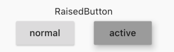
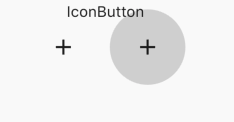

## 3.4 按钮
### 3.4.1 Material组件库的按钮

Material 组件库中提供了多种按钮组件如`RaisedButton`、`FlatButton`、`OutlineButton`等，它们都是直接或间接对`RawMaterialButton`组件的包装定制，所以他们大多数属性都和`RawMaterialButton`一样。在介绍各个按钮时我们先介绍其默认外观，而按钮的外观大都可以通过属性来自定义，我们在后面统一介绍这些属性。另外，所有Material 库中的按钮都有如下相同点：

按下时都会有“水波动画”（又称“涟漪动画”，就是点击时按钮上会出现波纹的动画）。
有一个onPressed属性来设置点击回调，当按钮按下时会执行该回调，如果不提供该回调则按钮会处于禁用状态，禁用状态不响应用户点击。
### FlatButton
`FlatButton `是一个扁平按钮，在默认背景透明无阴影，按下后有深色背景，如图：


使用起来很简单：

```dart
FlatButton(
           child: Text('nomal'),
           onPressed: () {},),
```

### RaisedButton
`RaisedButton `是漂浮按钮，默认带有背景和阴影，活跃状态按钮背景变大，如图所示



### IconButton
`IconButton`默认是icon作为widget，背景透明，按压状态下，波纹状，背景变大。如图所示




### FloatingActionButton
`FloatingActionButton`即是悬浮按钮，默认背景是主题色，按压也会有波纹。右边是按压，左边是正常状态。


使用例子：

```dart
FloatingActionButton(child: Icon(Icons.add),
                onPressed: () {},
              )
```

### BackButton CloseButton

官方封装好的返回和关闭按钮,如图：


使用例子:

```dart
BackButton(onPressed: () {},),
              
CloseButton(onPressed: () {},),
```

### OutlineButton
`OutlineButton`带边框的按钮，默认有灰色边框，按压下边框高亮，可以同时兼备`icon`和`label`,如图：


使用也很简单：

```dart

OutlineButton(
    child: Text('OutlineButton'),
    onPressed: () {},
  ),
  SizedBox(
    width: 10,
  ),
  OutlineButton.icon(
    icon: Icon(Icons.add),
    label: Text('label'),
    onPressed: () {},
  ),
  SizedBox(
    width: 10,
  ),
  OutlineButton.icon(
    icon: Icon(Icons.add),
    label: Text('active'),
    onPressed: () {},
  )
```

### 自定义按钮外观

外观可以通过属性来定义，不同按钮基本一样，我们以`IconButton`为例子，介绍一下常用属性，详细的可以查看官方文档。


```dart
textColor : 文本和icon的颜色
disabledBorderColor: 不点击状态下的边框颜色
highlightedBorderColor： 点击状态下边框颜色
splashColor:波纹颜色
borderSide：边框宽度和颜色
```

 

#### 示例：


代码如下：

```dart

OutlineButton.icon(
      onPressed: () {},
      icon: Icon(Icons.add),
      label: Text('diy style'),
      color: Colors.black12,
      textColor: Colors.blue,
      disabledBorderColor: Colors.black,
      highlightedBorderColor: Colors.greenAccent,
      splashColor: Colors.red
    )
```

如何自己实现一个`Button`,在后续章节中会再次详细讲到，在此不过多累述。


