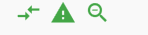

## 3.5 图片及Icon

### 3.5.1 图片
`Flutter`中，我们可以通过`image`加载并显示图片，数据源可以是`asset`、`file`、`内存`、`网络`。

### Image

`image`Widget有一个必选的参数，对应了一个`ImageProvider`,下边我们来演示一下`image`的使用。

#### 从assets加载
首先将文件复制到工程指定文件夹内，我们移动至`img`文件夹下，
然后在`pubpspec.yaml`内声明

```dart
assets:
- img/1.jpeg
```
然后运行`flutter pub get`,(或者 android studio 中编辑 `pubpspec.yaml `点击右上角`pub get`按钮)。

然后代码中可以使用了，实例:

```dart
Image.asset('img/1.jpeg')
```

效果如图所示：


#### 从网络加载

```dart
Image(
  image: NetworkImage(
      "https://timgsa.baidu.com/timg?image&quality=80&size=b9999_10000&sec=1593336370404&di=c03084a66d06c1af8995088158e907c3&imgtype=0&src=http%3A%2F%2Fdmimg.5054399.com%2Fallimg%2Fpkm%2Fpk%2F13.jpg"),
  width: 100.0,
)
```
或者使用快捷的构造函数`Image.network`用于从网络加载、显示图片

```dart
Image.network(
      "https://timgsa.baidu.com/timg?image&quality=80&size=b9999_10000&sec=1593336370404&di=c03084a66d06c1af8995088158e907c3&imgtype=0&src=http%3A%2F%2Fdmimg.5054399.com%2Fallimg%2Fpkm%2Fpk%2F13.jpg",
      width: 120,
    ),
```

#### 参数
`Image`在显示图片是定义了一系列参数，通过定义一系列参数达到改变图片外观、大小、混合效果等，我们看下Image的主要参数：

```dart
const Image({
  ...
  this.width, //图片的宽
  this.height, //图片高度
  this.color, //图片的混合色值
  this.colorBlendMode, //混合模式
  this.fit,//缩放模式
  this.alignment = Alignment.center, //对齐方式
  this.repeat = ImageRepeat.noRepeat, //重复方式
  ...
})
```

- width、height ：用户设置图片大小，当不指定大小，图片则在富容器内进行占满，当设置`width`或`height`时，另外一个会按照比例缩放，但可以通过`fit`来指定缩放规则。
- `fit`:指定图片在容器内的缩放规则。有如下几个值
 - `fill`:会拉伸铺满，图片会变形
 - `cover`: 按照图片的长宽放大后填满容器，不会变形。
 - `fitWidth`: 图片会随着缩放到显示的宽度，在保证不变形的条件下进行适应宽度,超出部分会裁剪。
 - `fitHeight`:图片高度会按照等比例缩放到适应高度，超出部分会裁剪。
 - `none`: 无适应规则，会显示当前容器的大小，如果图片过大，则只会显示中间部分。
 
看图，简单明了：


`color`指定混合颜色，`colorBlendMode`指定混合模式。
例子：

```dart

Image(
    image: NetworkImage(
        "https://timgsa.baidu.com/timg?image&quality=80&size=b9999_10000&sec=1593336370404&di=c03084a66d06c1af8995088158e907c3&imgtype=0&src=http%3A%2F%2Fdmimg.5054399.com%2Fallimg%2Fpkm%2Fpk%2F13.jpg"),
    width: 100.0,
    color: Colors.greenAccent,
    colorBlendMode: BlendMode.colorBurn,
  )
```

效果：


`repeat`是当图片不够容器大小可以设置沿着`X`或者`Y`进行重复铺。

```dart

Image(
    image: NetworkImage(
        "https://timgsa.baidu.com/timg?image&quality=80&size=b9999_10000&sec=1593336370404&di=c03084a66d06c1af8995088158e907c3&imgtype=0&src=http%3A%2F%2Fdmimg.5054399.com%2Fallimg%2Fpkm%2Fpk%2F13.jpg"),
    width: 100.0,
    height: 200,
    color: Colors.greenAccent,
    colorBlendMode: BlendMode.colorBurn,
    repeat: ImageRepeat.repeat,
  )
```
效果：


### Image 从网络下载动画
`Image`从网络下载会与短暂的 空白时间，这是我们不想看到的，我们可以在加载的时候显示`菊花转`。


```dart

Image(
        image: NetworkImage(
            "https://ss2.bdstatic.com/70cFvnSh_Q1YnxGkpoWK1HF6hhy/it/u=2053400745,529716701&fm=26&gp=0.jpg"),
        width: 100.0,
        height: 200,
        loadingBuilder: (
          BuildContext context,
          Widget child,
          ImageChunkEvent loadingProgress,
        ) {
          if (loadingProgress == null) {
            return child;
          }
          return CircularProgressIndicator();
        },
      )
```

效果如图所示：


### 3.5.2 Icon

`flutter`中可以使用iconFont，就是将图标做成文件，通过指定字符加载不同icon.

> 字体文件中，每一个字符都对应一个位码，不同字体就是字形不同，即字符对应的字形不同，最终渲染的不同的图标。

Flutter默认包含了一套`Material Design`的字体图标，在`pubspec.yaml`文件中的配置如下

```dart
uses-material-design: true
```

Material Design所有图标可以在[其官网查看](https://material.io/tools/icons/).

例子：

```dart
Text('\uE915 \uE002 \uE900',
  style: TextStyle(
      fontFamily: "MaterialIcons",
      fontSize: 24.0,
      color: Colors.green))
```
效果：



对着code 找图标明显不是太人性化，那么可以使用[cupertino_icons](https://pub.flutter-io.cn/packages/cupertino_icons)

```dart
Icon(
Icons.clear,
color: Colors.red,
),
Icon(
Icons.add,
color: Colors.greenAccent,
),
Icon(
Icons.collections,
color: Colors.blue,
),
Icon(
Icons.extension,
color: Colors.orange,
)

```


### 使用自定义字体图标

我们也可以使用自定义字体图标。iconfont.cn上有很多字体图标素材，我们可以选择自己需要的图标打包下载后，会生成一些不同格式的字体文件，在Flutter中，我们使用ttf格式即可。

假设我们项目中需要使用一个书籍图标和微信图标，我们打包下载后导入：

导入字体图标文件；这一步和导入字体文件相同，假设我们的字体图标文件保存在项目根目录下，路径为"fonts/iconfont.ttf"：

```dart
fonts:
  - family: myIcon  #指定一个字体名
    fonts:
      - asset: fonts/iconfont.ttf
```
为了使用方便，我们定义一个MyIcons类，功能和Icons类一样：将字体文件中的所有图标都定义成静态变量：

```dart
class MyIcons{
  // book 图标
  static const IconData book = const IconData(
      0xe614, 
      fontFamily: 'myIcon', 
      matchTextDirection: true
  );
  // 微信图标
  static const IconData wechat = const IconData(
      0xec7d,  
      fontFamily: 'myIcon', 
      matchTextDirection: true
  );
}
使用

Row(
  mainAxisAlignment: MainAxisAlignment.center,
  children: <Widget>[
    Icon(MyIcons.book,color: Colors.purple,),
    Icon(MyIcons.wechat,color: Colors.green,),
  ],
)

```
运行后效果如图3-22所示：

 


