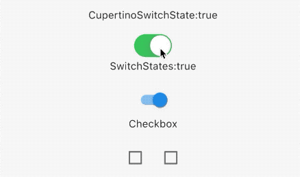
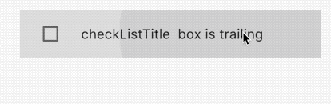
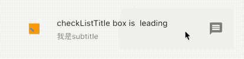
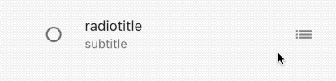
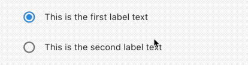
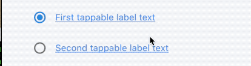

## 3.6 单选和复选

### 3.6.1 单选和复选
`单选和复选`很简单，只需要一个`value`和一个属性来维护每个`选择框`的`value`即可。


```dart
class BaseSwitch extends StatefulWidget {
  @override
  State<StatefulWidget> createState() {
    return BaseSwitchState();
  }
}

class BaseSwitchState extends State<BaseSwitch> {
  @override
  Widget build(BuildContext context) {
    return Scaffold(
      appBar: AppBar(
        title: Text('弹框'),
      ),
      body: Container(
        margin: EdgeInsets.all(30),
        child: _body(),
      ),
    );
  }

  bool _state1 = false, _state2 = true, _s3 = true, _s4 = false;
  Widget _body() {
    Widget w = Column(
      children: <Widget>[
        Container(
          height: 30,
          child: Text('CupertinoSwitchState:$_state1'),
        ),
        CupertinoSwitch(
          value: _state1,
          onChanged: (v) {
            setState(() {
              _state1 = v;
            });
          },
        ),
        Container(
          height: 30,
          child: Text('SwitchStates:$_state2'),
        ),
        Switch(
          value: _state2,
          onChanged: (v) {
            setState(() {
              _state2 = v;
            });
          },
        ),
        Container(
          height: 30,
          child: Text('Checkbox'),
        ),
        Row(
          mainAxisAlignment: MainAxisAlignment.center,
          children: <Widget>[
            Checkbox(
              value: _s3,
              onChanged: (v) {
                setState(() {
                  _s3 = v;
                });
              },
            ),
            Checkbox(
              value: _s4,
              onChanged: (v) {
                setState(() {
                  _s4 = v;
                });
              },
            )
          ],
        )
      ],
    );
    return w;
  }
}
```

效果如下：




### 属性和外观

`Switch`和`CheckBox`属性很简单，可以设置`value`来控制是否被选中，需要父级控件来维护,状态改变时也是父级来维护,另外还可以设置`activeColor`激活颜色，和`normal`状态的颜色`trackColor`。

这样子设计组件的好处是，交互交给外部，自己只处理样式，这样子传递的信息可以更灵活。

### CheckboxListTile
`CheckboxListTile`是`官方控件`，像一个按钮一样，点击任一地方都可以实现选择和取消选择，还可以添加`icon`，可以控制`CheckBox`的位置。

我们看下属性：

```dart
const CheckboxListTile({
    ...
    @required this.value,
    @required this.onChanged,
    this.activeColor,
    this.checkColor,
    this.title,
    this.subtitle,
    this.isThreeLine = false,
    this.dense,
    this.secondary,
    this.selected = false,
    this.controlAffinity = ListTileControlAffinity.platform,
  })
```
- `value`是有选中状态，由父组件来维护
- `onChanged`是状态改变回调函数
- `activeColor` 选中状态颜色
- `checkColor` 选中状态`✔️`的颜色
- `dense`如果为null，就使用主题`ListTileTheme.dense`
- `secondary`和`Checkbox`对称的组件，可以是一个`Icon`
- `isThreeLine` 是否是强制显示三行
- `subtitle`子标题
- `selected`是否选中，默认是`false`
- `controlAffinity` 是`CheckBox` 的位置

| controlAffinity |memo|
|:-:|:-:|
|`leading`|`checkbox`在左边|
|`trailing`|`checkbox`在右边|
|`platform`|`checkbox`典型的样式|


例子：

```dart
CheckboxListTile(
  onChanged: (v) {
    setState(() {
      _checkList2 = v;
    });
  },
  title: Text('checkListTitle  box is trailing'),
  value: _checkList2,
  controlAffinity: ListTileControlAffinity.leading,
),
```

效果：



### 外观

可以给小部件添加`icon`和`子主题`，`icon`一般和`checkbox`在对称的位置，子主题在主题的下边，当使用默认主题`ListTileTheme.dense`,文字部件会自动使用系统的样式。

例子：

```dart
CheckboxListTile(
      onChanged: (v) {
        setState(() {
          _checkList1 = v;
        });
      },
      title: Text('checkListTitle box is  leading'),
      value: _checkList1,
      controlAffinity: ListTileControlAffinity.leading,
      secondary: Icon(Icons.message),
      activeColor: Colors.orange,
      checkColor: Colors.blue,
      subtitle: Text('我是subtitle'),
      dense: true,
    ),
```

效果：



### RadioListTile
`RadioListTile`和`CheckboxListTile`属性基本一致，最大的不同是前者只能由未选中该为选中，选中之后不能继续操作，也就是不能再次点击实现反选功能。

```dart
CheckboxListTile(
  onChanged: (v) {
    setState(() {
      _checkList2 = v;
    });
  },
  title: Text('checkListTitle  box is trailing'),
  value: _checkList2,
  secondary: Icon(Icons.message),
  controlAffinity: ListTileControlAffinity.leading,
),
```



如果觉得不是很方便，可以自定义一个类似这个样式的小部件，我们下边实现一个选中之后可以反选的`RadioWidget`.


```dart

class LinkedLabelRadio extends StatelessWidget {
  const LinkedLabelRadio({
    this.label,
    this.padding,
    this.groupValue,
    this.value,
    this.onChanged,
  });

  final String label;
  final EdgeInsets padding;
  final bool groupValue;
  final bool value;
  final Function onChanged;

  @override
  Widget build(BuildContext context) {
    return Padding(
      padding: padding,
      child: Row(
        children: <Widget>[
          Radio<bool>(
              groupValue: groupValue,
              value: value,
              onChanged: (bool newValue) {
                onChanged(newValue);
              }),
          RichText(
            text: TextSpan(
              text: label,
              style: TextStyle(
                color: Colors.blueAccent,
                decoration: TextDecoration.underline,
              ),
              recognizer: TapGestureRecognizer()
                ..onTap = () {
                  print('Label has been tapped.');
                },
            ),
          ),
        ],
      ),
    );
  }
}

///-------------build widget----------------------
/// 添加到build 中
/// 还需要父组件来维护一个 _isRadioSelected

bool _isRadioSelected = false;


LabeledRadio(
  label: 'This is the first label text',
  padding: const EdgeInsets.symmetric(horizontal: 5.0),
  value: true,
  groupValue: _isRadioSelected,
  onChanged: (bool newValue) {
    setState(() {
      _isRadioSelected = newValue;
    });
  },
),
```

效果：




再封装一个附带超链接的`Radio`,点击超链接，执行回调函数，点击其他区域，执行`selected`状态变更。

```dart
class LinkedLabelRadio extends StatelessWidget {
  const LinkedLabelRadio({
    this.label,
    this.padding,
    this.groupValue,
    this.value,
    this.onChanged,
  });

  final String label;
  final EdgeInsets padding;
  final bool groupValue;
  final bool value;
  final Function onChanged;

  @override
  Widget build(BuildContext context) {
    return Padding(
      padding: padding,
      child: Row(
        children: <Widget>[
          Radio<bool>(
              groupValue: groupValue,
              value: value,
              onChanged: (bool newValue) {
                onChanged(newValue);
              }),
          RichText(
            text: TextSpan(
              text: label,
              style: TextStyle(
                color: Colors.blueAccent,
                decoration: TextDecoration.underline,
              ),
              recognizer: TapGestureRecognizer()
                ..onTap = () {
                  print('Label has been tapped.');
                },
            ),
          ),
        ],
      ),
    );
  }
}

/// ----------------widget-----------------

 LinkedLabelRadio(
  label: 'First tappable label text',
  padding: EdgeInsets.symmetric(horizontal: 5.0),
  value: true,
  groupValue: _isRadioSelected2,
  onChanged: (bool newValue) {
    setState(() {
      _isRadioSelected2 = newValue;
    });
  },
),
LinkedLabelRadio(
  label: 'Second tappable label text',
  padding: EdgeInsets.symmetric(horizontal: 5.0),
  value: false,
  groupValue: _isRadioSelected2,
  onChanged: (bool newValue) {
    setState(() {
      _isRadioSelected2 = newValue;
    });
  },
),
```


效果：




更多自定义组装在后续章节中会一一讲解，再次不过多累述。
