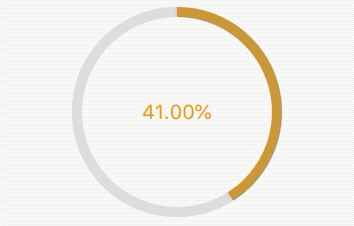

## 3.8 进度指示器

`Material `组件库中提供了两种进度指示器：`LinearProgressIndicator`和`CircularProgressIndicator`，它们都可以同时用于精确的进度指示和模糊的进度指示。精确进度通常用于任务进度可以计算和预估的情况，比如文件下载；而模糊进度则用户任务进度无法准确获得的情况，如下拉刷新，数据提交等。

### 3.8.1  LinearProgressIndicator
 `LinearProgressIndicator`线形的进度指示器，看文档如下：

 ```dart
const LinearProgressIndicator({
Key key,
double value,
Color backgroundColor,
Animation<Color> ,
String semanticsLabel,
String semanticsValue,
}) 
 ```
 
 - `value`默认为`null`，效果为动画,范围是`[0,1]`
 - `backgroundColor `是动画背景颜色，为静态的
 - `valueColor `是动画前景色，可以使用`AnimationController`搭配达到颜色变化的目的。也可以使用`AlwaysStoppedAnimation`来达到静态颜色。

 例子：
 
 ```dart
LinearProgressIndicator(
      valueColor: AlwaysStoppedAnimation(Colors.orange),
      backgroundColor: Colors.black12,
    )
 ```
 
 效果：
 
 
 
 
 设置大小和线条宽度：
 
 ```
SizedBox(
      height: 20,
      width: 200,
      child: LinearProgressIndicator(
//          value: 0.1,
        valueColor: AlwaysStoppedAnimation(Colors.orange),
        backgroundColor: Colors.black12,
      ),
    ),
 ```
 
 效果：
 
  
  
  
  ###  CircularProgressIndicator
  
  `CircularProgressIndicator`是原型进度指示器，可以自己配置颜色和进度，相关属性紧紧比`LinearProgressIndicator`多了一个线条宽度`strokeWidth`.
  
  相关属性：
  
  ```
  CircularProgressIndicator({
    ...
    double value,
    Color backgroundColor,
    Animation<Color> valueColor,
    this.strokeWidth = 4.0
    ...
  })
  ```
 - `value`默认为`null`，效果为动画,范围是`[0,1]`
 - `backgroundColor `是动画背景颜色，为静态的
 - `valueColor `是动画前景色，可以使用`AnimationController`搭配达到颜色变化的目的。也可以使用`AlwaysStoppedAnimation`来达到静态颜色。
 - `this.strokeWidth `默认为4，可以自定单独设置。
 
 例子：
 
 ```
 CircularProgressIndicator(
          valueColor: AlwaysStoppedAnimation(Colors.orange),
          backgroundColor: Colors.greenAccent,
        )
 ```
 
 效果：
 
 
 
 
### 自定义外观

通过`strokeWidth`定义线条宽度，通过`valueColor`定义渐变色,`backgroundColor`定义背景色。

例子：

```
AnimationController _controller;

  @override
  void initState() {
    _controller =
        AnimationController(vsync: this, duration: Duration(milliseconds: 2000))
          ..repeat();
    super.initState();
  }
  
SizedBox(
  height: 200,
  width: 200,
  child: CircularProgressIndicator(
    valueColor: ColorTween(begin: Colors.grey, end: Colors.orange)
        .animate(_controller),
    backgroundColor: Colors.black12,
    strokeWidth: 10,
  ),
),
```

效果：

 
 
 
> 更多进度指示器 和好网的样式可以参考[flutter_easyHub](https://github.com/ifgyong/flutter_easyHub)

 
 

### 进度条

利用`value`可以定制，可以用在下载进度指示器上。

例子：

```
 AnimationController _controller;
  Timer _timer;
  double _value = 0;
  @override
  void initState() {
    _controller =
        AnimationController(vsync: this, duration: Duration(milliseconds: 2000))
          ..repeat();
    _timer = Timer.periodic(Duration(milliseconds: 16), (t) {
      _value += 0.01;
      if (_value >= 1.0) {
        _value = 0;
      }
      setState(() {});
    });
    super.initState();
}
  
SizedBox(
  height: 200,
  width: 200,
  child: Stack(
    children: <Widget>[
      Positioned.fill(
        child: CircularProgressIndicator(
          valueColor: ColorTween(begin: Colors.blue, end: Colors.orange)
              .animate(_controller),
          backgroundColor: Colors.black12,
          strokeWidth: 10,
          value: _value,
        ),
      ),
      Positioned.fill(
          child: Center(
        child: Text(
          '${(_value * 100).toDouble().toStringAsFixed(2)}%',
          style: TextStyle(fontSize: 20, color: Colors.orange),
        ),
      ))
    ],
  ),
),
```

效果：




