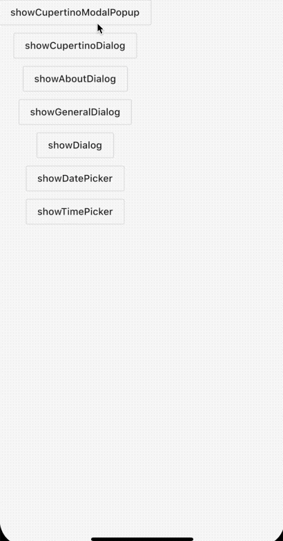
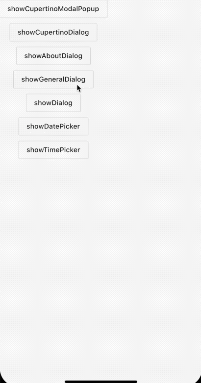

## 3.9 弹窗

 组件库中提供了多种弹窗适用于选择时间、定时、用户选择、表单提交等。。。
 
 
### 3.9.1 showCupertinoDialog
`showCupertinoModalPopup `是一个`iOS-style`风格的弹窗，从底部弹出，附带了一个唯一动画和渐变消失的动画，按钮也是`iOS-style`风格，点击遮罩返回。下面看下代码：

例子：

```dart
void _showActionSheet() {
showCupertinoModalPopup(
    context: context,
    builder: (ctx) {
      return CupertinoActionSheet(
        title: Text('温馨提示'),
        message: Text('我是支付选项，任意选择一个进行支付哦'),
        actions: <Widget>[
          CupertinoActionSheetAction(onPressed: _pop, child: Text('微信')),
          CupertinoActionSheetAction(onPressed: _pop, child: Text('支付宝')),
          CupertinoActionSheetAction(
            onPressed: _pop,
            child: Text('取消'),
            isDestructiveAction: true,
          ),
        ],
      );
    });
}
```

效果：




### 3.9.2 showCupertinoDialog
`showCupertinoDialog`是对`showGeneralDialog`的一个封装，只是`barrierDismissible`、`barrierColor`、`transitionDuration`进行了`iOS-style`格调的设置。

源码：

```dart

Future<T> showCupertinoDialog<T>({
  @required BuildContext context,
  @required WidgetBuilder builder,
  bool useRootNavigator = true,
  RouteSettings routeSettings,
}) {
  assert(builder != null);
  assert(useRootNavigator != null);
  return showGeneralDialog(
    context: context,
    barrierDismissible: false,
    barrierColor: CupertinoDynamicColor.resolve(_kModalBarrierColor, context),
    // This transition duration was eyeballed comparing with iOS
    transitionDuration: const Duration(milliseconds: 250),
    pageBuilder: (BuildContext context, Animation<double> animation, Animation<double> secondaryAnimation) {
      return builder(context);
    },
    transitionBuilder: _buildCupertinoDialogTransitions,
    useRootNavigator: useRootNavigator,
    routeSettings: routeSettings,
  );
}

```
 
 和`showCupertinoModalPopup`区别是一个从底部，一个全屏。
 
 下面看下例子；
 
 ```dart
showCupertinoDialog(
    context: context,
    builder: (ctx) {
      return CupertinoActionSheet(
        title: Text('温馨提示'),
        message: Text('我是showCupertinoDialog'),
        actions: <Widget>[
          CupertinoActionSheetAction(onPressed: _pop, child: Text('微信')),
          CupertinoActionSheetAction(onPressed: _pop, child: Text('支付宝')),
          CupertinoActionSheetAction(
            onPressed: _pop,
            child: Text('取消'),
            isDestructiveAction: true,
          ),
        ],
      );
    });
 ```
 
 效果：
 
 
 
### 3.9.3 showAboutDialog

`showAboutDialog`是`flutter`官方封装的一个关于我的组件，包含了版本号、icon、以及Licenses内容。

例子：

```dart
showAboutDialog(
  context: context,
  applicationVersion: '1.0.0',
  applicationIcon: Icon(Icons.scatter_plot),
  applicationName: 'Jack ma',
);
```

 
 
### 3.9.4 showGeneralDialog

`showGeneralDialog`是一个比较基础的弹窗， 可以用这个封装成任意其他的弹窗。

例子：

```dart
showGeneralDialog(
    context: context,
    barrierDismissible: true,
    barrierLabel: 'cancel',
    transitionDuration: Duration(milliseconds: 1000),
    pageBuilder: (BuildContext context, Animation<double> animation,
        Animation<double> secondaryAnimation) {
      return Material(
        child: Scaffold(
          body: Center(
            child: CupertinoActionSheet(
              title: Text('温馨提示'),
              message: Text('我是showGeneralDialog，任意选择一个进行支付哦'),
              actions: <Widget>[
                CupertinoActionSheetAction(
                    onPressed: _pop, child: Text('微信')),
                CupertinoActionSheetAction(
                    onPressed: _pop, child: Text('支付宝')),
                CupertinoActionSheetAction(
                  onPressed: _pop,
                  child: Text('取消'),
                  isDestructiveAction: true,
                ),
              ],
            ),
          ),
        ),
      );
    });
```

效果：


### 3.9.4 showDialog

`showDialog`也是封装的`showGeneralDialog`,只是固定参数进行了适配。

```dart

void _showDialog() {
showDialog(context: context, child: bd());
}
Widget bd() {
return CupertinoActionSheet(
  title: Text('温馨提示'),
  message: Text('我是支付选项，任意选择一个进行支付哦'),
  actions: <Widget>[
    CupertinoActionSheetAction(onPressed: _pop, child: Text('微信')),
    CupertinoActionSheetAction(onPressed: _pop, child: Text('支付宝')),
    CupertinoActionSheetAction(
      onPressed: _pop,
      child: Text('取消'),
      isDestructiveAction: true,
    ),
  ],
);
}
  
```


### 3.9.6 showDatePicker

`showDatePicker`是官方提供的一个日历组件，也是座位弹窗形式展现，参数很简单。

```dart
showDatePicker({
  @required BuildContext context,
  @required DateTime initialDate,
  @required DateTime firstDate,
  @required DateTime lastDate
  ...
  }
```
只需要配置当前的上下文和开始结束时间即可。

例子：

```dart

showDatePicker(
        context: this.context,
        initialDate: DateTime.now(), //初始时间
        firstDate: DateTime.now(), //开始时间
        lastDate: DateTime.now().add(Duration(days: 10)), //最后时间是当前时间加上10天
        initialDatePickerMode: DatePickerMode.year, //最开始展示年份
        initialEntryMode: DatePickerEntryMode.input, //开始是输入时间还是日历
        selectableDayPredicate: (time) {
          print(time.toString());
          return true;
        })
```

效果：


### 3.9.7 showTimePicker

`showTimePicker`是一个选择时间长短的控件,使用起来很简单，只需要传入默认时间即可。

```dart
showTimePicker(
        context: this.context, 
        initialTime: TimeOfDay(hour: 1, minute: 10))
```

效果：


