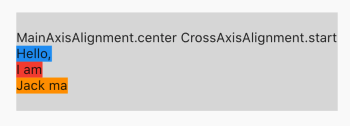
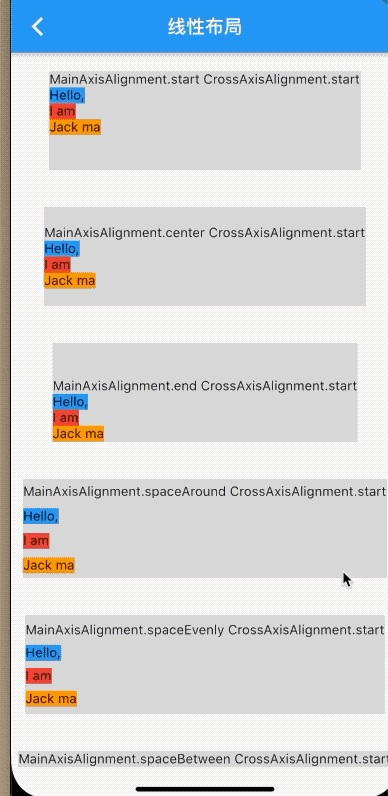

## 4.2 线性布局（Row、Column）
`Row`、 `Column`是线性布局，通俗的来讲就是按照横轴或者纵轴来布局，他们可以相互嵌套实现负责的布局。
 


### 主轴和横轴
在线性布局中，分为纵轴和横轴,如果布局是水平分布，那么主轴是指水平方向；如果布局是垂直方向，那么主轴就是指垂直方向，而纵轴是水平方向。官方提供了两个枚举来表示来表示主轴`MainAxisAlignment `和纵轴`CrossAxisAlignment `.


###  Row

`Row `组件可以沿着水平排列组件，每一个`Row`都是一列，子组件依次排列。


```dart
Row({
    Key key,
    MainAxisAlignment mainAxisAlignment = MainAxisAlignment.start,
    MainAxisSize mainAxisSize = MainAxisSize.max,
    CrossAxisAlignment crossAxisAlignment = CrossAxisAlignment.center,
    TextDirection textDirection,
    VerticalDirection verticalDirection = VerticalDirection.down,
    TextBaseline textBaseline,
    List<Widget> children = const <Widget>[],
  })
```


- `mainAxisAlignment`: 主轴的排列位置，如果文本方向是`TextDirection.ltr`,`start`,按照从左向右的开始方向排列,否则从右向左排列。`center`是按照中间向两边排列，`end`是按照从结尾向开始方向排列。`spaceBetween`是两个子组件间隔一致。`spaceEvenly`是所有的空隙一致。`spaceAround`开始和结束是中间的间隙的一半。默认是`MainAxisAlignment.start`.
- `crossAxisAlignment` 副轴方向，和主轴方向类似，`start`是排列在开始位置。`end`排列在底部。`center`排列在副轴中间。`baseline`根据基线排列，`stretch`要求他的子组件副轴方向充满父组件，默认是`CrossAxisAlignment.center`。
- `MainAxisSize `:`MainAxisSize.max`是可用空间的最大值，大当然可用空间必须有约束，大小必须是能计算出来的，否则将崩溃。因为空间大小不可能是无限制的。
- `children`:子部件数组。

### 例子

```dart
class BaseRowAndColumn extends StatelessWidget {
  @override
  Widget build(BuildContext context) {
    return Scaffold(
        appBar: AppBar(
          title: Text('线性布局'),
        ),
        body: SafeArea(
            child: CupertinoScrollbar(
          child: SingleChildScrollView(
            child: Column(
              children: <Widget>[
                _body(MainAxisAlignment.start, CrossAxisAlignment.start),
                _body(MainAxisAlignment.end, CrossAxisAlignment.start),
                _body(MainAxisAlignment.spaceBetween, CrossAxisAlignment.start),
                _body(MainAxisAlignment.spaceEvenly, CrossAxisAlignment.start),
                _body(MainAxisAlignment.spaceAround, CrossAxisAlignment.start),
                _body(MainAxisAlignment.center, CrossAxisAlignment.start),
                _body(MainAxisAlignment.center, CrossAxisAlignment.start),
                _body(MainAxisAlignment.center, CrossAxisAlignment.stretch),
                _body(MainAxisAlignment.center, CrossAxisAlignment.end),
              ],
            ),
          ),
        )));
  }

  Widget _body(MainAxisAlignment mainAxisAlignment,
      CrossAxisAlignment crossAxisAlignment) {
    return Container(
      margin: EdgeInsets.symmetric(vertical: 10),
      child: Column(
        children: <Widget>[
          Text('$mainAxisAlignment $crossAxisAlignment'),
          Container(
            height: 50,
            child: Row(
              mainAxisAlignment: mainAxisAlignment,
              crossAxisAlignment: crossAxisAlignment,
              children: <Widget>[
                Container(
                  color: Colors.blue,
                  child: Text('Hello,'),
                ),
                Container(
                  color: Colors.red,
                  child: Text('I am'),
                ),
                Container(
                  color: Colors.orange,
                  child: Text('Jack ma'),
                ),
              ],
            ),
            color: Colors.black12,
          )
        ],
      ),
    );
  }
}
```
效果图：

展示了主轴的常用的效果：


- `MainAxisAlignment`:`start`是比较简单是排列是从开始到结束，`end`是主轴结尾开始排列，`spaceBetween`是间隙均匀分布(不包含左侧和右侧)，`spaceEvenly`所有间隙空间均匀分布(包含左侧和右侧),`spaceAround`所有间隙空间均匀分布(左侧和右侧占用中间间隙的一半)
- `CrossAxisAlignment`: `start`在顶部排列，`end`在底部排列，`center`在中间排列，`stretch`铺满父级空间排列。


### Column
`Column`是按照纵轴排列，每个组件占用一行空间。
```dart
Column({
    Key key,
    MainAxisAlignment mainAxisAlignment = MainAxisAlignment.start,
    MainAxisSize mainAxisSize = MainAxisSize.max,
    CrossAxisAlignment crossAxisAlignment = CrossAxisAlignment.center,
    TextDirection textDirection,
    VerticalDirection verticalDirection = VerticalDirection.down,
    TextBaseline textBaseline,
    List<Widget> children = const <Widget>[],
  }) 
```
大多数参数和`Row`一致，不同的是主轴和纵轴方向正好相反，下面看一个例子：

```dart
  Widget _bd2() {
    return Column(
      children: <Widget>[
        _column(MainAxisAlignment.start, CrossAxisAlignment.start),
        _column(MainAxisAlignment.center, CrossAxisAlignment.start),
        _column(MainAxisAlignment.end, CrossAxisAlignment.start),
        _column(MainAxisAlignment.spaceAround, CrossAxisAlignment.start),
        _column(MainAxisAlignment.spaceEvenly, CrossAxisAlignment.start),
        _column(MainAxisAlignment.spaceBetween, CrossAxisAlignment.start),
        _column(MainAxisAlignment.start, CrossAxisAlignment.start),
        _column(MainAxisAlignment.start, CrossAxisAlignment.center),
        _column(MainAxisAlignment.start, CrossAxisAlignment.end),
        _column(MainAxisAlignment.start, CrossAxisAlignment.stretch),
//        _column(MainAxisAlignment.start, CrossAxisAlignment.start),
      ],
    );
  }

  Widget _column(MainAxisAlignment mainAxisAlignment,
      CrossAxisAlignment crossAxisAlignment) {
    return Container(
      margin: EdgeInsets.symmetric(vertical: 20),
      color: Colors.black12,
      height: 105,
      child: Column(
        mainAxisAlignment: mainAxisAlignment,
        crossAxisAlignment: crossAxisAlignment,
        children: <Widget>[
          Text('$mainAxisAlignment $crossAxisAlignment'),
          Container(
            color: Colors.blue,
            child: Text('Hello,'),
          ),
          Container(
            color: Colors.red,
            child: Text('I am'),
          ),
          Container(
            color: Colors.orange,
            child: Text('Jack ma'),
          ),
        ],
      ),
    );
  }
```


效果：

|横轴和纵轴|效果|
|:-:|:-:|
|`MainAxisAlignment.start, CrossAxisAlignment.start`||
|`MainAxisAlignment.center, CrossAxisAlignment.start`||
|`MainAxisAlignment.end, CrossAxisAlignment.start`||
|`MainAxisAlignment.spaceAround, CrossAxisAlignment.start`||
|`MainAxisAlignment.spaceEvently, CrossAxisAlignment.start`||
|`MainAxisAlignment.spaceBeteen, CrossAxisAlignment.start`||
|`MainAxisAlignment.start, CrossAxisAlignment.center`||
|`MainAxisAlignment.start, CrossAxisAlignment.end`||
|`MainAxisAlignment.start, CrossAxisAlignment.stretch`||

总的效果：




```dart
  Widget _bd3() {
    return Container(
      color: Colors.red,
      height: 100,
      child: Row(
        children: <Widget>[
          Container(
            width: 100,
            color: Colors.black,
          ),
        ],
      ),
    );
  }
```

这里`row`中的子控件指定了`width`,高度没指定，默认是铺满`高度`
效果：


当`row`中嵌套了另外一个`row`则显示真实大小。原因是当子控件有真实大小，在`row`中则父组件未指定高度，则父组件高度和子组件高度一致。

```dart

  Widget _bd3() {
    return Container(
      color: Colors.red,
      height: 100,
      child: Row(
        children: <Widget>[
          Container(
              width: 100,
              color: Colors.black,
              child: Row(
                children: <Widget>[
                  Container(
                    height: 50,
                    width: 50,
                    color: Colors.blue,
                  ),
                ],
                mainAxisSize: MainAxisSize.max,
              )),
        ],
      ),
    );
  }
}
```


 
当我们想让一个子组件充满父组件则需要使用弹性控件包裹一下。弹性组件后边的章节会详细讲解，再次不多啰嗦了。

```dart
Widget _bd3() {
return Container(
  color: Colors.red,
  height: 100,
  child: Row(
    children: <Widget>[
      Expanded(
        child: Container(
          margin: EdgeInsets.all(20),
          color: Colors.black,
        ),
      ),
    ],
  ),
);
}
```

效果：


效果：


在`Column`空间充满父组件：


```dart
Widget _bd3() {
return Container(
  child: Column(
    children: <Widget>[
      Expanded(
        child: Container(
          margin: EdgeInsets.all(20),
          color: Colors.red,
          child: Text('Are you OK?'),
        ),
      ),
    ],
  ),
);
}
```

效果图：


### 总结：
 **`Row`和`Column`主轴和副轴完全相反，他们的主轴方向就是`Row`是横着的，`Column`是垂直的。多层嵌套的话，最好每层的组件都做好约束，想铺满父组件就是用弹性控件`Expanded`**

