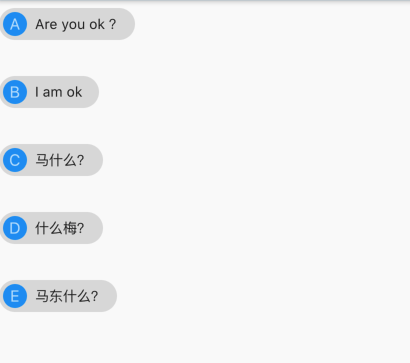

## 4.4 流式布局

   流式布局就是瀑布一样的由上而下的依次排开的布局方式，我们称之为是流式布局。`flutter`中的流式布局是`Wrap`和`Flow`,当超过屏幕大小则进行换行操作。
 
###  Wrap
```dart
Wrap({
  ...
  this.direction = Axis.horizontal,
  this.alignment = WrapAlignment.start,
  this.spacing = 0.0,
  this.runAlignment = WrapAlignment.start,
  this.runSpacing = 0.0,
  this.crossAxisAlignment = WrapCrossAlignment.start,
  this.textDirection,
  this.verticalDirection = VerticalDirection.down,
  List<Widget> children = const <Widget>[],
})
```

- `direction` 、`alignment` 、`crossAxisAlignment` 、`textDirection` 、`children `这些参数在前面已经讲过很多次了，再次便不重复讲解。
- `spacing` : 主轴方向间隔
- `runSpacing` : 副轴方向间隔
- `runAlignment` : 副轴方向的排列位置

设置主轴间隔是`20px`,副轴方向间隔是`30px`,主轴居中`WrapAlignment.center`

例子：

```dart
Widget _body() {
return Wrap(
  alignment: WrapAlignment.center,
  spacing: 20.0,
  runSpacing: 30,
//          direction: Axis.vertical,
  children: <Widget>[
    _item('Are you ok ？', 'A'),
    _item('I am ok ', 'B'),
    _item('马什么？', 'C'),
    _item('什么梅？', 'D'),
    _item('马东什么？', 'E'),
  ],
);
}
```

效果：

 


改成纵轴排列：

```dart
Widget _body() {
return Wrap(
  runAlignment: WrapAlignment.start,
  alignment: WrapAlignment.center,
  spacing: 20.0,
  runSpacing: 30,
  direction: Axis.vertical,
  children: <Widget>[
    _item('Are you ok ？', 'A'),
    _item('I am ok ', 'B'),
    _item('马什么？', 'C'),
    _item('什么梅？', 'D'),
    _item('马东什么？', 'E'),
  ],
);
}
```
效果：

 


### Flow

`Flow`相对于`Wrap`比较复杂，需要自己实现子组件的位置转换，所以使用流式布局则有限考虑`Wrap`，是否满足。`Flow`主要应用在自定义布局策略或性能要求高的场景，有点如下：

- 性能强劲；`Flow`是对于子组件以及位置调整非常高效的空间，`Flow`的转换矩阵对于子组件进行调整进行了优化，`Flow`定位之后，如果子组件位置或者尺寸发生了变化，在`FlowDelegate`中的`PaintChild()`方法调用`context,paintChild()`进行重绘，而在`context.paintChild`在重绘针具并没有调整组件位置。
- 灵活；可以自己实现`FlowDelegate`的`paintChild()`方法，需要自己计算每一个组件的位置。

缺点：

- 使用比较复杂
- 不能自适应组件大小，必须指定父容器大小或实现`BaseFlowDelegate `的`getSize`返回固定大小。

示例：

我们对刚才的子组件进行布局：

```
class BaseFlowDelegate extends FlowDelegate {
  EdgeInsets margin;
  BaseFlowDelegate({this.margin = EdgeInsets.zero});
  @override
  void paintChildren(FlowPaintingContext context) {
    var x = margin.left;
    var y = margin.top;
    //计算每一个子widget的位置
    for (int i = 0; i < context.childCount; i++) {
      var w = context.getChildSize(i).width + x + margin.right;
      if (w <= context.size.width) {
        context.paintChild(i,
            transform: new Matrix4.translationValues(x, y, 0.0));
        x = w + margin.left;
      } else {
        x = margin.left;
        y += context.getChildSize(i).height + margin.top + margin.bottom;
        //绘制子widget(有优化)
        context.paintChild(i,
            transform: new Matrix4.translationValues(x, y, 0.0));
        x += context.getChildSize(i).width + margin.left + margin.right;
      }
    }
  }

  @override
  getSize(BoxConstraints constraints) {
    //指定Flow的大小
    return Size(double.infinity, double.infinity);
  }

  @override
  bool shouldRepaint(FlowDelegate oldDelegate) {
    return oldDelegate != this;
  }
}


/// --------------布局列表-------------------
Widget _bd2() {
return Flow.unwrapped(
  delegate: BaseFlowDelegate(margin: EdgeInsets.all(20)),
  children: _list(),
);
}

List<Widget> _list() {
return <Widget>[
  _item('Are you ok ？', 'A'),
  _item('I am ok ', 'B'),
  _item('马什么？', 'C'),
  _item('什么梅？', 'D'),
  _item('马东什么？', 'E'),
];
}
```


效果：


我们根据传入的`Margin`来计算每一个`Child`的具体位置，然后使用`context.paintChild()`来绘制出来。由于`Flow`不能适配父级大小，我们通过`getSize`来确定`Flow`大小。
