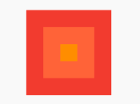
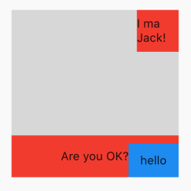
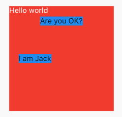

## 4.5 层叠布局 Stack、Positioned

   
 
### 4.5.1 Stack
层叠布局和`iOS`中的常用布局一致，iOSer很容易理解，子组件根据父组件的位置来确定自己的位置，父组件允许子组件一层一层叠起来，需要在添加的时候注意顺序，先添加的在底部，后添加的在上面。`Stack`允许子组件堆叠，`Positioned`用于根据`Stack`的四个角来确定自己的位置和大小。

#### Stack

```dart
Stack({
    Key key,
    this.alignment = AlignmentDirectional.topStart,
    this.textDirection,
    this.fit = StackFit.loose,
    this.overflow = Overflow.clip,
    List<Widget> children = const <Widget>[],
  }) 
```
- `alignment`:和`Align`中的一致，现在只需要了解是相对于父组件的位置，具体的算法见[4.6 相对定位](books/4.6align.md).
- `textDirection`:和Row、Wrap的textDirection功能一样，都用于确定alignment对齐的参考系，即：textDirection的值为TextDirection.ltr，则alignment的start代表左，end代表右，即从左往右的顺序；textDirection的值为TextDirection.rtl，则alignment的start代表右，end代表左，即从右往左的顺序
- `fit`:此参数用于确定没有定位的子组件如何去适应Stack的大小。`StackFit.loose`表示使用子组件的大小，`StackFit.expand`表示扩伸到Stack的大小
- `overflow`：此属性决定如何显示超出Stack显示空间的子组件；值为`Overflow.clip`时，超出部分会被剪裁（隐藏），值为`Overflow.visible` 时则不会。
- `children `:子组件数组

### Positioned

```dart
const Positioned({
  Key key,
  this.left, 
  this.top,
  this.right,
  this.bottom,
  this.width,
  this.height,
  @required Widget child,
})
```

`left`、`top` 、`right`、 `bottom`分别代表离`Stack`左、上、右、底四边的距离。`width`和`height`用于指定需要定位元素的宽度和高度。注意，`Positioned`的`width`、`height` 和其它地方的意义稍微有点区别，此处用于配合`left`、`top` 、`right`、 `bottom`来定位组件，举个例子，在水平方向时，你只能指定`left`、`right`、`width`三个属性中的两个，如指定`left`和`width`后，`right`会自动算出`(left+width)`，如果同时指定三个属性则会报错，垂直方向同理.

### 例子：


```dart
Stack(
  fit: StackFit.loose,//保证组件真实大小
  children: <Widget>[
    Positioned.fill(
        child: Container(
      color: Colors.red,
    )),
    Positioned.fill(
        left: 20,
        right: 20,
        bottom: 20,
        top: 20,
        child: Container(
          color: Colors.deepOrangeAccent,
        )),
    Positioned.fill(
        left: 40,
        right: 40,
        bottom: 40,
        top: 40,
        child: Container(
          color: Colors.orange,
        )),
  ],
    )
```
`Positioned.fill`表示充满父组件，不过还可以指定`left`、`right`、`top`、`bottom`一个或者多个来约束大小。
第一个边距是`0`,第二个边距是`20`，第三个边距是`40`，大小一次减小。

效果：




例子二：

```dart
Stack(
  fit: StackFit.loose,
  alignment: Alignment.bottomRight,
  children: <Widget>[
    Positioned(
      left: 0,
      right: 0,
      height: 50,
      child: Container(
        color: Colors.red,
        alignment: Alignment.center,
        child: Text('Are you OK?'),
      ),
    ),
    Positioned(
      right: 0,
      height: 50,
      width: 50,
      top: 0,
      child: Container(
        color: Colors.red,
        alignment: Alignment.center,
        child: Text('I ma Jack!'),
      ),
    ),
    Positioned(
      height: 40,
      width: 60,
      child: Container(
        color: Colors.blue,
        alignment: Alignment.center,
        child: Text('hello'),
      ),
    ),
  ],
)
```
`Are you ok?`未指定位置，只是指定了大小，上下位置未指定，所以上下位置遵从父组件的`alignment`,在父组件底部。

`I am Jack!`指定了具体的上下和大小，则忽略父组件的位置参数。

`hello`至指定大小，横轴和纵轴都未指定，所以遵从父组件的`bottomRight`，在父组件的右下角。

效果图：



实例三：

```dart
Stack(
      fit: StackFit.expand,
      alignment: Alignment.center,
      children: <Widget>[
        Container(
          child: Text("Hello world", style: TextStyle(color: Colors.white)),
          color: Colors.red,
        ),
        Positioned(
          top: 20.0,
          child: Container(
            child: Text("Are you OK?"),
            color: Colors.blue,
          ),
        ),
        Positioned(
            left: 18.0,
            child: Container(
              child: Text("I am Jack"),
              color: Colors.blue,
            )),
      ],
    )
```
`Hello world`，未指定位置，故遵从父组件`fit`属性，铺满父组件。
因为是层叠布局，第一个指定了位置，所以不会铺满,

`Are you OK?`指定了位置，大小是控件大小，根据文字自动算出，所以展示实际大小。

`I am Jack`指定位置，大小有子组件字符串自动算出，故未铺满父组件。

效果：




