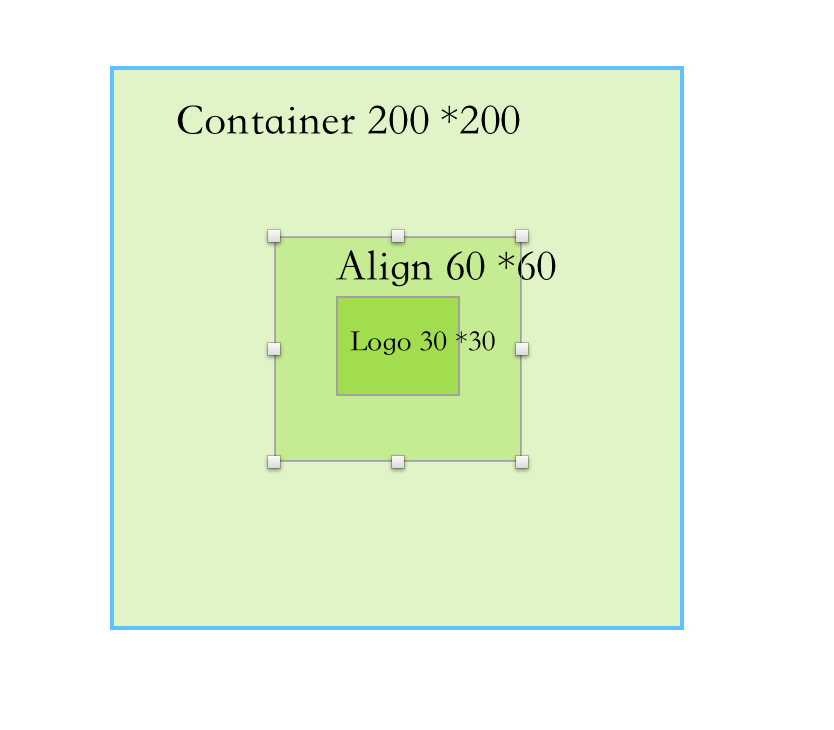

## 4.6 对齐与相对定位(Align)

   
 
### 4.6.1 Align
`Align`组件可以调整子组件的位置，并根据父组件的高度和宽度来确定自身的高度，我们来看下属性：

```dart
Align({
    Key key,
    this.alignment = Alignment.center,
    this.widthFactor,
    this.heightFactor,
    Widget child,
  }) 
```

- `alignment`在父组件中的位置，我们看下他的所有值和计算方式。
`TopLeft = Alignment(-1.0, -1.0) `中间点是`[0,0]`,右下角是`[1,1]`,具体的看下图：


|alignment|含义|
|:-:|:-:|
|topLeft|顶部左侧|
|topCenter|顶部中间|
|topRight|顶部右侧|
|centerLeft|中间侧|
|center|中间|
|centerRight|中间右侧|
|bottomLeft|底部左侧|
|bottomCenter|底部中间|
|bottomRight|底部右侧|


- `widthFactor`和`heightFactor`是`父组件/当前组件`的比例系数，在父组件未指定具体大小的时候，则通过计算得出父组件大小，具体公式：

> `子组件宽度* widthFactor =父组件宽度`
> `子组件高度* heightFactor =父组件高度`

例子：

```
Container(
color: Colors.black12,
child: Align(
    alignment: Alignment.bottomRight,
    widthFactor: 2,
    heightFactor: 2,
    child: FlutterLogo(
      size: 30,
    )),
),
```

效果：


当前`logo`大小是`30*30`,父组件大小是`30*2=60`,宽度和高度一致。当显示指定大小，则忽略该参数。

```dart
Container(
    width: 200,
    height: 200,
    color: Colors.black12,
    child: Align(
        alignment: Alignment.bottomRight,
        widthFactor: 2,
        heightFactor: 2,
        child: FlutterLogo(
          size: 30,
        )),
  ),
```

效果：


除了这种方式，也可以在父组件中指定子组件的位置

```dart
Container(
    width: 200,
    height: 200,
    color: Colors.black12,
    alignment: Alignment.center,
    child: Align(
        alignment: Alignment.bottomRight,
        widthFactor: 2,
        heightFactor: 2,
        child: FlutterLogo(
          size: 30,
        )),
  )
```

当`父组件`中指定了位置，则在`Align`中`Logo`站的大小还是`widthFactor  * 30`,再次基础上面再执行子组件的位置。也就是父组件大小是`200*200`,子组件`Logo`具体大小是`30*30`,`Align`相对于`父组件`居中，占地大小是`60*60`,`Logo`相对于`Align`在底部右侧。

千言万语不如一张图：



根据源码得知：

```dart
static const Alignment topLeft = Alignment(-1.0, -1.0)
```
其实官方的9中位置，只是提前定义好的，如果自己想要有其他的具体的位置的话，可以使用`Alignment(x, y)`或者`FractionalOffset(x, y)`来指定具体的其他位置。

### Alignment

`Alignment`其实就是一个坐标，具体的坐标系是


原点在中间，组件的偏移量换算公式是
```dart
(Alignment.x*childWidth/2+childWidth/2, Alignment.y*childHeight/2+childHeight/2)
```

`childWidth `在子组件的宽度，`childHeight `是子组件的高度

我们再看这个例子：

```dart

Container(
    width: 200,
    height: 200,
    color: Colors.black12,
    child: Align(
        alignment: Alignment(0, 1),
        child: FlutterLogo(
          size: 30,
        )),
  )
```
我们将`Alignment(1.0, -1.0)`带入上面的工时得出：`FlutterLogo`实际偏移坐标是`(100,200)`

再看另外一个例子：


```dart

Container(
    width: 200,
    height: 200,
    color: Colors.black12,
    child: Align(
        alignment: Alignment(2, 1),
        child: FlutterLogo(
          size: 30,
        )),
  )
```
经过计算得出`FlutterLogo`偏移量是`(300,200)`。


### FractionalOffset
`FractionalOffset `是继承`Alignment `，他们最大不同就是原点坐标不一致，`Alignment `原点在组件中间,`FractionalOffset `在组件左上角，和`iOS`坐标系有点类似。

坐标系如图所示：


偏移量公式是

```dart
实际偏移 = (FractionalOffse.x * childWidth, FractionalOffse.y * childHeight)

```
下面我们看个例子：

```dart
Container(
    width: 200,
    height: 200,
    color: Colors.blue[50],
    child: Align(
        alignment: FractionalOffset(0.5, 0.5),
        child: FlutterLogo(
          size: 30,
        )),
  ),
```

将公式带入`FractionalOffset(0.5, 0.5)`得出，最终`FlutterLogo`的偏移量是`(100,100)`.

再看另外一个例子;

```dart
Container(
    width: 200,
    height: 200,
    color: Colors.blue[50],
    child: Align(
        alignment: FractionalOffset(0, -0.1),
        child: FlutterLogo(
          size: 30,
        )),
  ),
```
将公式带入`FractionalOffset(0, -0.1)`得出，最终`FlutterLogo`的偏移量是`(0,-20)`.

效果如下：


### 4.6.2 Center

`Center`是继承`Align`的，源码很简单

```dart
class Center extends Align {
  /// Creates a widget that centers its child.
  const Center({ Key key, double widthFactor, double heightFactor, Widget child })
    : super(key: key, widthFactor: widthFactor, heightFactor: heightFactor, child: child);
}
```
因为`Align`默认是位置是`center`,所以用`Align()`和`Center`效果是一致的。只是`Center`无法另外指定其他位置。


我们看下面的例子：

```dart
DecoratedBox(
decoration: BoxDecoration(color: Colors.blue),
child: Center(
  child: Text('center2'),
),
),
SizedBox(
height: 20,
),
DecoratedBox(
decoration: BoxDecoration(color: Colors.blue),
child: Center(
  widthFactor: 1,
  heightFactor: 1,
  child: Text('center2'),
),
)
```

效果：


当`widthFactor `和`heightFactor `没指定时，默认是铺满父容器的

### 总结

这一节主要讲解了`Align`组件及两种偏移类`Alignment` 和`FractionalOffset`，读者需要理解这两种偏移类的区别及各自的坐标转化公式。另外，在此建议读者在需要制定一些精确的偏移时应优先使用`FractionalOffset`，因为它的坐标原点和布局系统相同，能更容易算出实际偏移。


 
