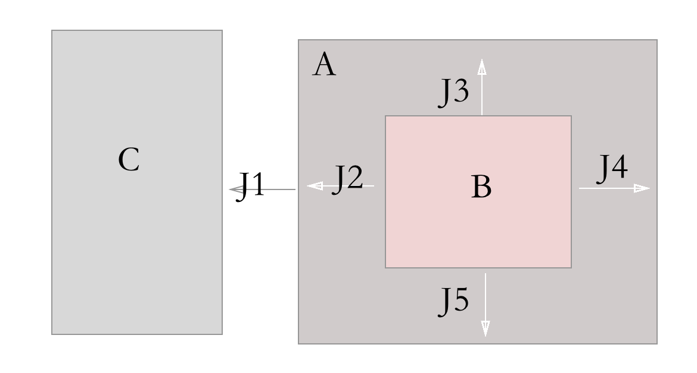
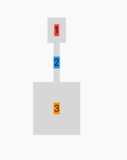

## 5.1 Padding

   
 
`Padding`属于对于组件的约束条件，用起来也很简单。
其实`padding`也是容器来组件的属性，这个和`css`盒子模型保持一致，另外一个参数是`margin`是容器的外边距，`padding`是内边距。

看下图就理解了：


<div align=center>

**组件C和A的距离可以用`Margin`表示，而`A`内部显示文本`B`中的`Padding`则是`J2/j3/j4/j5`表示4个方向的距离。**


我们看下属性：

```dart
Widget _body() {
return Center(
  child: Column(
    mainAxisAlignment: MainAxisAlignment.center,
    children: <Widget>[
      Container(
        color: Colors.black12,
        child: Padding(
          /// 设置上下左右各10像素 颜色是父级颜色

          padding: EdgeInsets.all(10),
          child: Container(
            color: Colors.red,
            child: Text('1'),
          ),
        ),
      ),
      Container(
        color: Colors.black12,
        child: Padding(
          /// 设置上下20像素 颜色是父级颜色

          padding: EdgeInsets.symmetric(vertical: 20),
          child: Container(
            color: Colors.blue,
            child: Text('2'),
          ),
        ),
      ),
      Container(
        color: Colors.black12,
        child: Padding(
          /// 设置上下左右各30像素 颜色是父级颜色
          padding:
              EdgeInsets.only(left: 30, top: 30, right: 30, bottom: 30),
          child: Container(
            color: Colors.orange,
            child: Text('3'),
          ),
        ),
      )
    ],
  ),
);
}
```

<div align=center>

 
