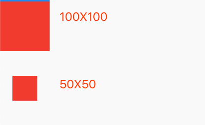
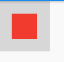

## 5.2 尺寸限制的容器

   
 
`Flutter`提供了很多个尺寸限制的容器比如：`ConstrainedBox`、`SizedBox`、`UnconstrainedBox`、`AspectRatio`等.

### 5.2.1 ConstrainedBox
`ConstrainedBox `用于最子组件添加额外的约束，例如：如果你想子组件的最小高度是100像素，可以使用`const BoxConstraints(minHeight: 100.0)`作为子组件的约束。

### 例子

我们在第一个`Container`限制最小高度是50px,最小宽度50px，最大宽度和高度200px，第二个是大小为50px的`Container`用来做对比。
当子控件小于父控件的尺寸限制的时候，遵从父控件的约束。

```dart
Column(
    children: <Widget>[
      Container(
        constraints: BoxConstraints(
            minWidth: 50, minHeight: 50, maxHeight: 200, maxWidth: 100),
        color: Colors.red,
        child: Container(
          width: 30,
          height: 30,
          color: Colors.blue,
        ),
      ),
      Container(
        height: 50,
        width: 50,
        color: Colors.red,
      )
    ],
  )
```


效果：


 


```dart
const BoxConstraints({
    this.minWidth = 0.0,
    this.maxWidth = double.infinity,
    this.minHeight = 0.0,
    this.maxHeight = double.infinity,
  }) 
```

当不设置最大宽度和高度，默认是设置尽可能的大，最下都是0.0。`BoxConstraints `还有很多便捷函数;

- `BoxConstraints.tight(Size size)`固定`size`
- `BoxConstraints.tightFor({
    double width,
    double height,
  })`最小宽度和高度，最大还是默认尽可能大。
  
- `BoxConstraints.tightForFinite({
    double width = double.infinity,
    double height = double.infinity,
  })`设置`width`和`height`就是设置里最下，最大仍然是尽可能大`double.infinity`.
  
- `BoxConstraints.loose(Size size)`真实大小
- `BoxConstraints.expand`弹性到最大


### 5.2.2  SizedBox

`SizedBox`用于给子元素指定固定高度，如：

```dart
SizedBox(
  width: 80.0,
  height: 80.0,
  child: redBox
)
```


等价于：

```dart
Container(
      constraints: BoxConstraints(maxWidth: 100, maxHeight: 100),
      color: Colors.red,
    )
```

`SizedBox `中的`createRenderObject()`是返回的是`RenderConstrainedBox`

```dart
@override
RenderConstrainedBox createRenderObject(BuildContext context) {
return RenderConstrainedBox(
  additionalConstraints: _additionalConstraints,
);
}
```

### 5.2.3 复杂情况 限制重复

如果一个组件有多个父级`ConstrinedBox`限制，那么最后谁会生效呢？

一级组件限制大小是100，二级限制是50，那么最最终显示的是100.
```dart
ConstrainedBox(
        constraints: BoxConstraints(
          maxWidth: 100,
          maxHeight: 100,
        ),
        child: ConstrainedBox(
          constraints: BoxConstraints(
            maxWidth: 50,
            maxHeight: 50,
          ),
          child: _redBox(),
        ),
      )
```
效果如下：



当`maxHeight `多重限制则显示较小的
> 那么`minWidth`?有兴趣的同学可以自己试一下。


当子层级不想使用父级约束了怎么办？`Flutter`提供了`UnconstrainedBox `用来去除父级的限制。

### UnconstrainedBox
`UnconstrainedBox `只会把父级的约束失效，不会对子部件产生其他影响。我们做一个测试，父类最小是`100X100`,去除影响后子部件应该是`50X50`.

```dart
  Widget _widget() {
    return Container(
      color: Colors.black12,
      constraints: BoxConstraints(
          minHeight: 100, minWidth: 100, maxWidth: 200, maxHeight: 200),
      child: UnconstrainedBox(
        child: _redBox(),
      ),
    );
  }
```

我们看下效果：



之类父级的背景还是`100X100`，子部件大小是`50X50`,虽然没有影响子部件，但是父级的约束对父级影响还是在的。


**当我们开发中发现，虽然指定了`BoxConstraints`的大小，但是还是失效了，显而易见是父级已经指定了约束，那么我们就是用`UnconstrainedBox`来包裹一下，即可去掉父级对子级的影响。**


