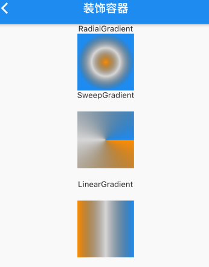
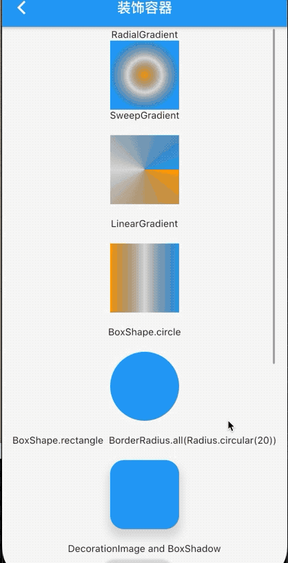

## 5.3 装饰类的容器

   
其实该限制容器很简单，就是设置颜色、背景图片、形状、渐变、的一些外观容器。我们先看下属性：
 
```dart 
BoxDecoration({
    this.color, //颜色
    this.image,//图片 如果颜色同时设置，颜色在下，背景图片在上,child在最上层
    this.border,//边框
    this.borderRadius,//圆角半径
    this.boxShadow,//阴影
    this.gradient,//颜色渐变
    this.backgroundBlendMode,//背景混合模式
    this.shape = BoxShape.rectangle,//形状，当设置原型则不能不设置this.borderRadius
  })
```

下边我们看下例子,首先使用了渐变的三种效果我们来看下：

```dart
Text('RadialGradient'),
        Container(
          width: 100,
          height: 100,
          decoration: BoxDecoration(
            color: Colors.blue,
            gradient: RadialGradient(
                colors: [Colors.orange, Colors.black12, Colors.blue]),
          ),
        ),
        Text('SweepGradient'),
        Padding(
          padding: EdgeInsets.all(20),
          child: Container(
            width: 100,
            height: 100,
            decoration: BoxDecoration(
              color: Colors.blue,
              gradient: SweepGradient(
                  colors: [Colors.orange, Colors.black12, Colors.blue]),
            ),
          ),
        ),
        Text('LinearGradient'),
        Padding(
          padding: EdgeInsets.all(20),
          child: Container(
            width: 100,
            height: 100,
            decoration: BoxDecoration(
              color: Colors.blue,
              gradient: LinearGradient(
                  colors: [Colors.orange, Colors.black12, Colors.blue]),
            ),
          ),
        ),
```




然后看下原型和矩形的应用：

```dart

Text('BoxShape.circle'),
        Padding(
          padding: EdgeInsets.all(20),
          child: Container(
            width: 100,
            height: 100,
            decoration: BoxDecoration(
              color: Colors.blue,
              shape: BoxShape.circle,
            ),
          ),
        ),
        Text('BoxShape.rectangle  BorderRadius.all(Radius.circular(20))'),
        Padding(
          padding: EdgeInsets.all(20),
          child: Container(
            width: 100,
            height: 100,
            decoration: BoxDecoration(
                color: Colors.blue,
                borderRadius: BorderRadius.all(Radius.circular(20)),
                shape: BoxShape.rectangle,
                boxShadow: [
                  BoxShadow(
                      offset: Offset(0, 10),
                      color: Colors.black12,
                      blurRadius: 10.0,
                      spreadRadius: 3)
                ]),
          ),
        ),
        Text('DecorationImage and BoxShadow'),
        Padding(
          padding: EdgeInsets.all(20),
          child: Container(
            width: 100,
            height: 100,
            decoration: BoxDecoration(
                color: Colors.blue,
                borderRadius: BorderRadius.all(Radius.circular(20)),
                shape: BoxShape.rectangle,
                image: DecorationImage(
                    image: AssetImage('img/fl.png'), fit: BoxFit.contain),
                boxShadow: [
                  BoxShadow(
                      offset: Offset(-10, -10),

                      ///左上角偏移
                      color: Colors.black12, //背景颜色
                      blurRadius: 2.0, //模糊度 2就是2个像素变成一个像素
                      spreadRadius: 3), //外扩范围
                  BoxShadow(
                      offset: Offset(10, 10),
                      color: Colors.black12,
                      blurRadius: 2.0,
                      spreadRadius: 3)
                ]),
          ),
        ),
```


再看下有图片的情况下和child：

```dart
Text('child and image and color'),
        Padding(
            padding: EdgeInsets.all(20),
            child: Container(
              width: 100,
              height: 100,
              decoration: BoxDecoration(
                color: Colors.red,
                borderRadius: BorderRadius.all(Radius.circular(20)),
                image: DecorationImage(
                    image: AssetImage('img/fl.png'), fit: BoxFit.contain),
              ),
              child: FlutterLogo(
                size: 20,
              ),
            ))
```


最长用的设置边框：

```dart
Padding(
        padding: EdgeInsets.all(20),
        child: Container(
          width: 100,
          height: 100,
          decoration: BoxDecoration(
            color: Colors.red,
            border: Border.fromBorderSide(BorderSide(
              color: Colors.orange,
              width: 10,
            )), //
            borderRadius: BorderRadius.all(Radius.circular(20)),
          ),
          child: FlutterLogo(
            size: 20,
          ),
        ))
```


效果集合:


