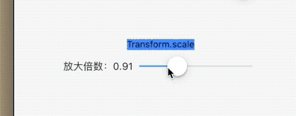

## 5.4 变换 Transform

   
`Transform `可以实现容器的放大缩小、位移、偏移。。。

我们首先看下`Transform `的几个遍历构造函数，开发中最常用的。

首先我们看下`Transform.rotate`，旋转容器，属性`angle`是旋转度数，单位是π,2π为一周，就是360°。

```dart
  Transform.rotate(
    angle: _rotate,
    alignment: Alignment.center,
    child: Container(
      child: Text('Transform.rotate'),
      color: Colors.blue,
    ),
  ),
  Row(
    mainAxisAlignment: MainAxisAlignment.center,
    children: <Widget>[
      Text('旋转角度：' + _rotate.toStringAsFixed(2)),
      CupertinoSlider(
        value: _rotate,
        max: pi * 2,
        min: 0,
        onChanged: (v) {
          setState(() {
            _rotate = v;
          });
        },
      ),
    ],
  ),
```


在看下放大和缩小

```dart
  Transform.scale(
    scale: _scale,
    alignment: Alignment.center,
    child: Container(
      child: Text('Transform.scale'),
      color: Colors.blueAccent,
    ),
  ),
  Row(
    mainAxisAlignment: MainAxisAlignment.center,
    children: <Widget>[
      Text('放大倍数：' + _scale.toStringAsFixed(2)),
      CupertinoSlider(
        value: _scale,
        max: 3,
        min: 0.01,
        onChanged: (v) {
          setState(() {
            _scale = v;
          });
        },
      ),
    ],
  ),
```


可以看到放大和缩小文本容器直接超出父组件了，已经覆盖了下边的`slider`，原因`Tranform`变换发生在layout阶段，不是布局阶段，导致渲染树已经已经创建完成，原由的布局不再改变，其实这是性能更好的变现，只是变换的时候提前设置好容器大小即可。

然后再看下位移：

```dart
Transform.translate(
    offset: _offset,
    child: Container(
      child: Text('Transform.translate'),
      color: Colors.blueAccent,
    ),
  ),
  Row(
    mainAxisAlignment: MainAxisAlignment.center,
    children: <Widget>[
      Text('位移X：' + _offset.dx.toStringAsFixed(2)),
      CupertinoSlider(
        value: _offset.dx,
        max: 100,
        min: -100,
        onChanged: (v) {
          setState(() {
            _offset = Offset(v, _offset.dy);
          });
        },
      ),
    ],
  ),
  Row(
    mainAxisAlignment: MainAxisAlignment.center,
    children: <Widget>[
      Text('位移Y：' + _offset.dy.toStringAsFixed(2)),
      CupertinoSlider(
        value: _offset.dy,
        max: 100,
        min: -100,
        onChanged: (v) {
          setState(() {
            _offset = Offset(_offset.dx, v);
          });
        },
      ),
    ],
  )
```


除了这几个想要自己更复杂的变换，则需要使用`Transform`
x轴扭曲`pi/10`，y轴旋转`pi/20`

```dart
Container(
    width: 50,
    height: 50,
    alignment: Alignment.center,
    child: Container(
      transform: new Matrix4.skew(pi / 10, 0),
      child: Text('Matrix4'),
      color: Colors.blueGrey,
    ),
    color: Colors.lightBlueAccent,
  )
```


当然我们也可以使用`Matrix4.identity()..scale`来达到`Transform.scale`的效果。
首先通过`Matrix4.identity()`创建一个默认的矩阵，通过`setEntry(3, 2, 0.01)`设置视角，然后就可以开始愉快的玩耍了。


```dart

Transform(
    transform: new Matrix4.identity()
      ..setEntry(3, 2, 0.01)
      ..rotateX(_rotateX)
      ..rotateY(_rotateY),
    alignment: Alignment.center,
    child: Container(
      width: 100,
      height: 100,
      child: Text('Matrix4'),
      alignment: Alignment.center,
      color: Colors.lightBlueAccent,
    ),
  ),
  Row(
    mainAxisAlignment: MainAxisAlignment.center,
    children: <Widget>[
      Text('翻转X：' + _rotateX.toStringAsFixed(2)),
      CupertinoSlider(
        value: _rotateX,
        max: pi / 2,
        min: -pi / 2,
        onChanged: (v) {
          setState(() {
            _rotateX = v;
          });
        },
      ),
    ],
  ),
  Row(
    mainAxisAlignment: MainAxisAlignment.center,
    children: <Widget>[
      Text('翻转Y：' + _rotateY.toStringAsFixed(2)),
      CupertinoSlider(
        value: _rotateY,
        max: pi / 2,
        min: -pi / 2,
        onChanged: (v) {
          setState(() {
            _rotateY = v;
          });
        },
      ),
    ],
  ),
```


感兴趣的同学可以关注后续章节，后续会详解矩阵参数，再次不过多累述。


### RotatedBox
`RotatedBox`和使用`Transform.rotate`效果一样，不过该组件的变换是在`createRenderObject`中实现的，所以性能上和`Tranform`还是有点差异的。 `RotatedBox `是使用`RenderRotatedBox`来实现旋转的，传入的参数`int`，1是90°，2是180°，3是270°，4是360°。


使用起来更简单;

```dart
Container(
    color: Colors.orange,
    width: 120,
    height: 50,
    alignment: Alignment.center,
    child: RotatedBox(
      child: Container(
        width: 100,
        height: 100,
        child: Text('RotatedBox'),
        color: Colors.lightBlueAccent,
      ),
      quarterTurns: 1,
    ),
  )
```
可以发现，子组件旋转的时候，组件大小没变，一直呆在父组件内部，这点正是和`Transform`不一致的地方。开发的时候，可以根据这区别来才去使用哪一个合适。


### 总结

想要只是简单使用只需要使用便捷函数即可，想要好好精细玩耍，使用`Matrix4`才是王道，后续章节会自定义组件实现好玩的动画，欢迎读者持续关注哦。


