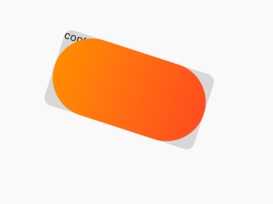

## 5.5 Container容器 
   
`Container `就是`H5`的`Div`,`iOS`的`view`。首先我们看下属性：

```dart
Container({
    Key key,
    this.alignment,//子部件的位置
    this.padding,//内边框
    this.color,//颜色
    this.decoration,//装饰器 位于child底部
    this.foregroundDecoration,//前景装饰器 唯一child上边
    double width,//宽度
    double height,//高度
    BoxConstraints constraints,//约束
    this.margin,//外边框
    this.transform,//变换
    this.child,//子部件
    this.clipBehavior = Clip.none,//剪切类型
  }) 
```


看下这个例子，设置了前景和背景的装饰器，前景的装饰器会遮盖住`child`和装饰器`decoration `，然后进行了围绕`z`进行旋转`pi/10`,前景色使用了渐变色。

```dart
Widget _body() {
return Center(
  child: Column(
    mainAxisAlignment: MainAxisAlignment.center,
    crossAxisAlignment: CrossAxisAlignment.center,
    children: <Widget>[
      Container(
        clipBehavior: Clip.none,
        width: 200,
        height: 100,
        decoration: BoxDecoration(
            shape: BoxShape.rectangle,
            color: Colors.black12,
            borderRadius: BorderRadius.all(Radius.circular(10))),
        foregroundDecoration: BoxDecoration(
            borderRadius: BorderRadius.all(Radius.circular(50)),
            gradient:
                LinearGradient(colors: [Colors.orange, Colors.deepOrange])),
        transform: Matrix4.identity()..rotateZ(pi / 10),
        child: Text('container'),
      )
    ],
  ),
);
}
```


效果是这样子的：



在稍微改下，前景色去掉，前景变成背景色。


```dart
Container(
    clipBehavior: Clip.none,
    width: 200,
    height: 100,
    decoration: BoxDecoration(
        borderRadius: BorderRadius.all(Radius.circular(10)),
        gradient:
            LinearGradient(colors: [Colors.orange, Colors.deepOrange])),
    transform: Matrix4.identity()..rotateZ(pi / 10),
    child: Text(
      'www.flutter.fgyong.cn',
      style: TextStyle(fontSize: 18, color: Colors.white),
    ),
    alignment: Alignment.center,
  )
```


