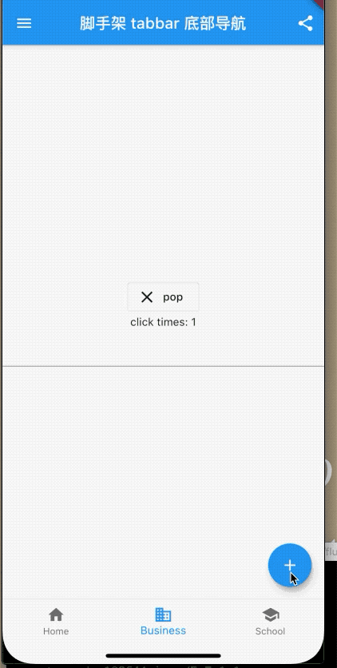
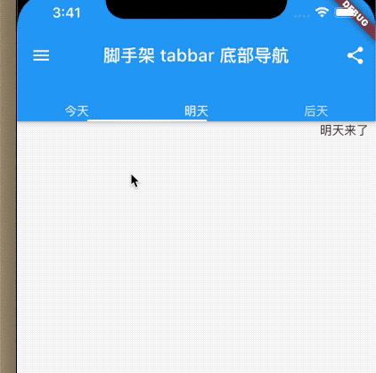
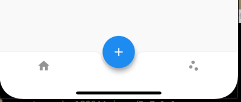

## 5.6 脚手架 
   
`Scaffold `就是一个大容器，里边包含了很多的其他容器，比如抽屉、悬浮按钮、`bottombar`、等等。

我们先看一下属性

```dart
Scaffold({
    Key key,
    this.appBar,
    this.body,
    this.floatingActionButton,
    this.floatingActionButtonLocation,
    this.floatingActionButtonAnimator,
    this.persistentFooterButtons,
    this.drawer,
    this.endDrawer,
    this.bottomNavigationBar,
    this.bottomSheet,
    this.backgroundColor,
    this.resizeToAvoidBottomPadding,
    this.resizeToAvoidBottomInset,
    this.primary = true,
    this.drawerDragStartBehavior = DragStartBehavior.start,
    this.extendBody = false,
    this.extendBodyBehindAppBar = false,
    this.drawerScrimColor,
    this.drawerEdgeDragWidth,
    this.drawerEnableOpenDragGesture = true,
    this.endDrawerEnableOpenDragGesture = true,
  })
```

- `appBar` 默认导航栏
- `body`页面的主体
- `floatingActionButton`、`floatingActionButtonLocation`、`floatingActionButtonAnimator`悬浮按钮和属性
- `drawer`抽屉
- `endDrawer`右侧抽屉
- `bottomNavigationBar`底部导航
- `bottomSheet`底部工具栏 位于导航上面
- `backgroundColor`背景颜色
- `resizeToAvoidBottomPadding`、`resizeToAvoidBottomInset`当`Textfield`编辑状态是否谈起页面。
- `drawerEnableOpenDragGesture`手势拖动打开抽屉


#### 例子

```dart
class _ScaffoldRouteState extends State<BaseBars> {
  int _selectedIndex = 1;

  @override
  Widget build(BuildContext context) {
    return Scaffold(
      appBar: AppBar(
        //导航栏
        title: Text("脚手架 tabbar 底部导航"),
        actions: <Widget>[
          //导航栏右侧菜单
          IconButton(icon: Icon(Icons.share), onPressed: () {}),
        ],
      ),
      drawer: new Drawer(
        child: _drawer(),
      ), //抽屉
      bottomNavigationBar: _bottomNavigationBar(),
//      bottomSheet: _bottomNavigationBar(),
      floatingActionButton: FloatingActionButton(
          //悬浮按钮
          child: Icon(Icons.add),
          onPressed: _onAdd),
      resizeToAvoidBottomInset: true, //谈起键盘则页面上移
      primary: true, //是否展示在顶部东航栏高度，true占用高度，否则只是在状态栏
      body: Center(
        child: Column(
          mainAxisAlignment: MainAxisAlignment.center,
          children: <Widget>[_bd2(), Text('click times: $_count'), TextField()],
        ),
      ),
//      extendBody: true,
//      extendBodyBehindAppBar: true,
      drawerEdgeDragWidth: 20, //手势多动偏移量 默认20px
      drawerDragStartBehavior: DragStartBehavior.start,
      drawerEnableOpenDragGesture: true, //手势拖动打开抽屉
    );
  }

  BottomNavigationBar _bottomNavigationBar() {
    return BottomNavigationBar(
      // 底部导航
      items: <BottomNavigationBarItem>[
        BottomNavigationBarItem(icon: Icon(Icons.home), title: Text('Home')),
        BottomNavigationBarItem(
            icon: Icon(Icons.business), title: Text('Business')),
        BottomNavigationBarItem(
            icon: Icon(Icons.school), title: Text('School')),
      ],
      currentIndex: _selectedIndex,
      fixedColor: Colors.blue,
      onTap: _onItemTapped,
    );
  }

  int _count = 0;
  void _onItemTapped(int index) {
    setState(() {
      _selectedIndex = index;
    });
  }

  void _onAdd() {
    setState(() {
      _count++;
    });
  }

  Widget _bd2() {
    return OutlineButton.icon(
        onPressed: () {
          Navigator.pop(context);
        },
        icon: Icon(
          Icons.close,
          size: 25,
        ),
        label: Text('pop '));
  }

  Widget _drawer() {
    return Column(
      mainAxisAlignment: MainAxisAlignment.center,
      children: <Widget>[
        Text('点击我返回，左滑返回，点击遮罩返回'),
        _bd2(),
      ],
    );
  }
}
```

效果：



### AppBar

`AppBar `是一个`Material`风格的导航栏，通过它可以设置导航栏标题、导航栏菜单、导航栏底部的Tab标题等,我们看下属性

```dart
 AppBar({
   ...
    this.leading,//导航左侧部件
    this.automaticallyImplyLeading = true,//是否默认自动实现leading 按钮
    this.title,//标题部件
    this.actions,//导航左侧菜单
    this.bottom,//底部导航菜单 一般用于Tab数组
    this.toolbarOpacity = 1.0,
    this.bottomOpacity = 1.0,
    ...
  })
```


自定义一个`leading`，打开抽屉：

```dart

Scaffold(
  key: _globalKey,
  appBar: AppBar(
    //导航栏
    title: Text("脚手架 tabbar 底部导航"),
    actions: <Widget>[
      //导航栏右侧菜单
      IconButton(icon: Icon(Icons.share), onPressed: () {}),
    ],
    leading: IconButton(
      onPressed: () {
        _globalKey.currentState.openDrawer();
      },
      icon: Icon(Icons.open_with),
    ),
  )
  }
```


看效果了


### Tabbar


Material组件库中提供了一个TabBar组件，它可以快速生成Tab菜单.我们看一个例子;


```dart
  void initState() {
    _tabController = TabController(vsync: this, length: 3);
    super.initState();
  }
  
    @override
  Widget build(BuildContext context) {
    return Scaffold(
      key: _globalKey,
      appBar: AppBar(
        //导航栏
        title: Text("脚手架 tabbar 底部导航"),
        actions: <Widget>[
          //导航栏右侧菜单
          IconButton(icon: Icon(Icons.share), onPressed: () {}),
        ],
        bottom: TabBar(
          controller: _tabController,
          tabs: <Widget>[Text('今天'), Text('明天'), Text('后天')],
        ),
      ))
 }

```


使用`TabBarView`添加`body` 实现联动效果：


```dart
...
body: TabBarView(
        controller: _tabController,
        children: <Widget>[
          Container(
            alignment: Alignment.topCenter,
            child: Text('今天来了'),
          ),
          Container(
            alignment: Alignment.topCenter,
            child: Text('明天来了'),
          ),
          Container(
            alignment: Alignment.topCenter,
            child: Text('后天来了'),
          ),
        ],
      )
      ...
```

效果：




### FloatingActionButton
`FloatingActionButton`在底部，也可以嵌入到底部导航栏上。

```dart
bottomNavigationBar: BottomAppBar(
    color: Colors.white,
    shape: CircularNotchedRectangle(), // 底部导航栏打一个圆形的洞
    child: Row(
      children: [
        IconButton(icon: Icon(Icons.home)),
        SizedBox(), //中间位置空出
        IconButton(icon: Icon(Icons.scatter_plot)),
      ],
      mainAxisAlignment: MainAxisAlignment.spaceAround, //均分底部导航栏横向空间
    ),
  ),
  floatingActionButtonLocation: FloatingActionButtonLocation.centerDocked,
  floatingActionButton: FloatingActionButton(
      //悬浮按钮
      child: Icon(Icons.add),
      onPressed: _onAdd)
```




或者嵌入右侧

```
...
[
IconButton(icon: Icon(Icons.home)),
IconButton(icon: Icon(Icons.scatter_plot)), 
SizedBox(),//右侧流出空隙
          ]
...

floatingActionButtonLocation: FloatingActionButtonLocation.endDocked,
```


或者在顶部

```
...
[
IconButton(icon: Icon(Icons.home)),
IconButton(icon: Icon(Icons.scatter_plot)), 

          ]
...

floatingActionButtonLocation: FloatingActionButtonLocation.miniStartTop,
```


`CircularNotchedRectangle`在底部打了一个洞，继承了`NotchedShape`，当然我们也可以自己定义一个形状。形状的位置是由`floatingActionButtonLocation `来确定的，

> 感兴趣的同学可以自己实现一个五角星的形状.


