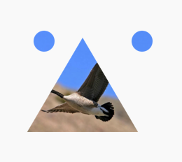

## 5.7 裁剪Clip

`Flutter`中提供了一些裁剪函数，可以用于部件进行裁剪操作。

|裁剪|效果|
|:-:|:-:|
|ClipOval|将子部件剪切为内贴圆型，当为矩形时，内切圆为椭圆|
|ClipRRect|剪切为圆角矩形|
|ClipRect|剪切子部件到实际占用的举行大小(溢出部分剪切掉)|

例子：

```dart
ClipOval(
  child: Container(
    width: 100,
    height: 100,
    color: Colors.blue,
  ),
)
```

效果：


```dart
  Widget _body() {
    Widget avator = Container(
      width: 100,
      height: 100,
      color: Colors.blue,
    );
    return Column(
      mainAxisAlignment: MainAxisAlignment.center,
      children: <Widget>[
        Text('ClipOval 剪切圆形'),
        ClipOval(
          child: avator,
        ),
        Text('ClipOval 圆角'),
        ClipRRect(
          borderRadius: BorderRadius.all(Radius.circular(10)),
          child: avator,
        ),
        Text('ClipOval 剪切为原来的1/4'),
        ClipRect(
          child: Align(
            alignment: Alignment.topRight,
            widthFactor: 0.5,
            heightFactor: 0.5,
            child: avator,
          ),
        )
      ],
    );
  }
}
```

效果：


### 5.7.2 CustomClipper

```dart
ClipPath({
    Key key,
    this.clipper,
    this.clipBehavior = Clip.antiAlias,
    Widget child,
  })
```
使用`ClipPath `可以实现剪切路径，`clipper`是剪切路径，抽象类`CustomClipper<Path>`。
`CustomClipper `是剪切自定义的特殊形状的部件，是抽象类，需要自己去实现。我们来实现一个画出笑脸的例子。
`BaseCustomPath `是实现了剪切的路径。

```dart

class BaseCustomPath extends CustomClipper<Path> {
    @override
  Path getClip(Size size) {
    Path path = Path();
    path.moveTo(size.width / 2, 40);
    path.lineTo(size.width - 15, size.height - 15);
    path.lineTo(15, size.height - 15);

    double p1 = 1 * pi;
    path.addArc(Rect.fromLTWH(30,30,30,30),
        p1, p1 + 2 * pi);
    path.lineTo(15, size.height - 15);
    path.addArc(
        Rect.fromLTWH(size.width - 30,30,30,30),
        p1,
        p1 + 2 * pi);
    path.lineTo(0, 0);
    return path;
  }
  
  @override
  bool shouldReclip(CustomClipper oldClipper) {
    return this != oldClipper;
  }
}
```

布局代码：

```dart

ClipPath(
      child: avator,
      clipper: BaseCustomPath(),
    )
```

效果：


蓝色看着不是很好看，我们换一个图片。


原图是：


效果图：




跟多好玩的剪切路径自己去探索哦。


   
 
