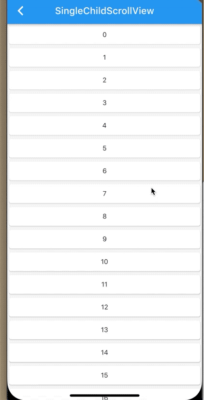

## 5.7 添加活性模板


```dart
SingleChildScrollView({
    this.scrollDirection = Axis.vertical,
    this.reverse = false,
    bool primary,
    this.controller,
    this.child,
  }) 
```

- `scrollDirection `:滚动方向
- `reverse`: 如果`false`,滚动方向为`Axis.vertical`,则从上向下滚动，当滚动方向是`Axis.horizontal`,滚动方向是从左向右，如果为`true`,则方向和上边的相反。
- `controller`：监测滑动的`controller`.
- `child`: 子部件
- `physics`: 滚动方式，

| `ScrollPhysics`|效果|
|:-:|:-:|
|`AlwaysScrollableScrollPhysics`|总是允许滚动|
|`BouncingScrollPhysics`|滚动到边界手势结束开始回弹|
|`ClampingScrollPhysics`|超出边界停止滚动|
|`NeverScrollableScrollPhysics`|总是不允许滚动|


`SingleChildScrollView`加载数据会一次性把数据加载完，当做一个长列表的时候最好使用`List`类型的，数据延迟加载，那样性能更好。

例子：

```dart
class _BaseSingleChildScrollViewState extends State<BaseSingleChildScrollView> {
  @override
  Widget build(BuildContext context) {
    return Scaffold(
      appBar: AppBar(
        title: Text('SingleChildScrollView'),
      ),
      body: _body(),
    );
  }

  Widget _body() {
    List<Widget> list = new List();
    for (int i = 0; i < 30; i++) {
      list.add(Card(
        child: Container(
          height: 40,
          width: MediaQuery.of(context).size.width,
          alignment: Alignment.center,
          child: Text('$i'),
        ),
      ));
    }
    return CupertinoScrollbar(
      child: SingleChildScrollView(
        reverse: true,
        physics: BouncingScrollPhysics(),
        scrollDirection: Axis.vertical,
        child: Column(
          children: list,
        ),
      ),
    );
  }
}
```



