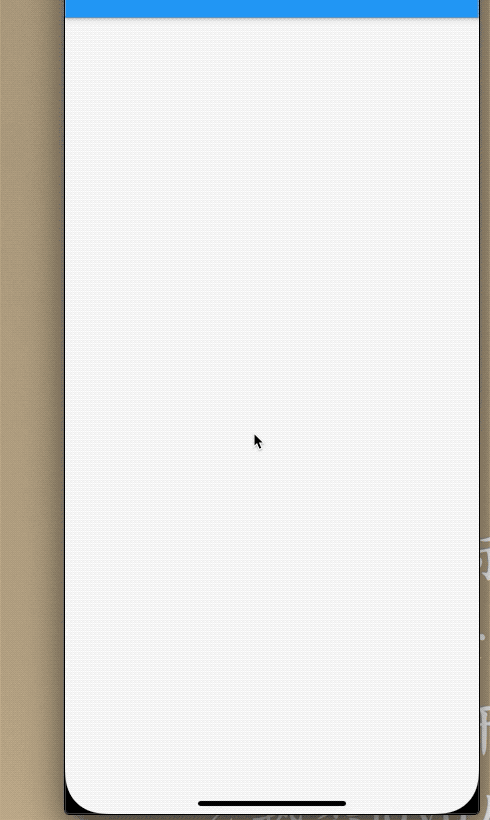

## 6.3 Listview

`ListView`和`iOS TableView`一样，可以滚动和延迟加载的长列表。性能高。

```dart
ListView({
    Axis scrollDirection = Axis.vertical,
    bool reverse = false,
    ScrollController controller,
    bool primary,
    ScrollPhysics physics,
    bool shrinkWrap = false,
    this.itemExtent,
    bool addAutomaticKeepAlives = true,
    bool addRepaintBoundaries = true,
    bool addSemanticIndexes = true,
    double cacheExtent,
    List<Widget> children = const <Widget>[],
    int semanticChildCount,
    DragStartBehavior dragStartBehavior = DragStartBehavior.start,
    ScrollViewKeyboardDismissBehavior keyboardDismissBehavior = ScrollViewKeyboardDismissBehavior.manual,
  })
```

- `shrinkWrap `: 是否根据`itemCount`来计算子控件数量
- `itemExtent`: 如果设置，则护士子控件大小，强制设置的数值。
- `addAutomaticKeepAlives`: 是否自动保存状态，默认是`true`.当为`true`,子部件使用`AutomaticKeepAlive`来包裹，当子部件划出屏幕它也不会被回收，它使用`KeepAliveNotification`来保存状态。如果用户自己管理状态则设置为`false`
- `addRepaintBoundaries`:是否被`RepaintBoundary`包裹， 通常。将滚动容器内的子级包裹在`RepaintBoundary `，因此列表在滚动时不需要重绘。如果子级易于重绘(如 纯色快、文本片段)，不添加重绘边界可能会更有效，并在滚动中简单的重绘子级。
- `addSemanticIndexes`: 是否在`IndexedSemantics`包裹每个子部件，平时滚动时子部件不许使用语义索引已生成正确的索引仅仅在`IndexedChildSemantics`小部件提供的时候。

**上边几个属性是`ListView`共同所有，他们效果一样的**

### 默认构造函数
默认的构造函数有`childdren`参数，它接受一个`Widget`数组。这种方式适合少量子部件，因为这种方式，会一次性创建所有子部件，而不是懒加载(当使用的时候再创建)，导致性能低下，也就是默认构造函数的`ListView`没有使用`Sliver`的懒加载模型的，实际这种问题和`SingleChildScrollView+Column`的方式本质一样。

例子：

```dart
Widget _body() {
    List<Widget> list = new List();
    for (int i = 0; i < 30; i++) {
      list.add(Card(
        child: Container(
          height: 40,
          width: MediaQuery.of(context).size.width,
          alignment: Alignment.center,
          child: Text('$i'),
        ),
      ));
    }
    return ListView(
      itemExtent: 80,
      shrinkWrap: false,
      addAutomaticKeepAlives: true,
      children: list,
      addSemanticIndexes: true,
      cacheExtent: 50,
    );
  }
}
```

**次方式使用组件少的情况下，否则可能会卡**

### ListView.build

`ListView.build`适合列表较多或无线的情况，因为只有子组件真正显示才被创建，性能更好。

```dart
 ListView.builder({
    ...
    @required IndexedWidgetBuilder itemBuilder,
    int itemCount,
    ...
  })
  
```
 `IndexedWidgetBuilder `子部件创建函数，当子部件将要显示调用该函数。`itemCount`子部件数量，不设置则为无限大。当子部件滚动除屏幕则会被销毁。
 
 ```
  Widget _body2() {
    return ListView.builder(
      itemExtent: 80,
      itemBuilder: _buildCell,
    );
  }

  Widget _buildCell(ctx, int index) {
    return TestContainer(
      title: index.toString(),
    );
  }
  
  
  class TestContainer extends StatefulWidget {
  final String title;
  TestContainer({Key key, this.title}) : super(key: key);
  @override
  _TestContainerState createState() => _TestContainerState();
}

class _TestContainerState extends State<TestContainer> {
  @override
  Widget build(BuildContext context) {
    return _body();
  }

  Widget _body() {
    return Container(
      child: Text(widget.title ?? '123'),
    );
  }

  @override
  void dispose() {
    print(widget.title + ' dispose');
    super.dispose();
  }
}
 ```


### ListView.separated

`ListView.separated`是可以在列表子部件中间生成分隔子部件，参数`separatorBuilder`是分隔回调函数，原理和上面的`itemBuilder`一致。

例子：每行的下边添加一个分割线，颜色为灰色。

```dart
  Widget _body3() {
    return ListView.separated(
      itemBuilder: _buildCell,
      separatorBuilder: _buildSeparatedCell,
      itemCount: 30,
    );
  }

  Widget _buildCell(ctx, int index) {
    return TestContainer(
      title: index.toString(),
    );
  }

  Widget _buildSeparatedCell(ctx, int index) {
    return Divider(
      height: 2,
      thickness: 0.5,
      indent: 10,
      endIndent: 10,
      color: Colors.black45,
    );
  }
```


### 加载更多数据

代码比较简单，一次性加载`10`条数据，加载到`50`条数据，停止加载。

代码：


```
  Widget _body3() {
    return ListView.separated(
      itemBuilder: _buildCell,
      separatorBuilder: _buildSeparatedCell,
      itemCount: list.length,
    );
  }

  Widget _buildCell(ctx, int index) {
    if (index < list.length - 1) {
      return Container(
        height: 40,
        alignment: Alignment.center,
        child: TestContainer(
          title: list[index],
        ),
      );
    } else if (list.length >= 50) {
      return Container(
        alignment: Alignment.center,
        height: 30,
        child: Row(
          mainAxisAlignment: MainAxisAlignment.center,
          children: <Widget>[Icon(Icons.done), Text('没有更多数据了')],
        ),
      );
    } else {
      _getMoreData(); //加载数据
      return Container(
        alignment: Alignment.center,
        child: RefreshProgressIndicator(),
      );
    }
  }

  Widget _buildSeparatedCell(ctx, int index) {
    return Divider(
      height: 2,
      thickness: 0.5,
      indent: 10,
      endIndent: 10,
      color: index % 2 == 0 ? Colors.blue : Colors.orange,
    );
  }

  List<String> list;
  @override
  void initState() {
    list = new List();
    _getMoreData();
    super.initState();
  }

  void _getMoreData() async {
    await Future.delayed(Duration(milliseconds: 2000));
    for (int i = 0; i < 10; i++) {
      list.add(DateTime.now().toString());
    }
    setState(() {});
  }
  
    @override
  Widget build(BuildContext context) {
    return Scaffold(
      appBar: AppBar(
        title: Text('ListView '),
      ),
      body: _body3(),
    );
  }
```

效果：



### 固定头部信息

平时开发有需求固定头部关键信息，只刷新底部数据的 时候，那么我们来实现一个。


```dart

  Widget _body4() {
    return Column(
      children: <Widget>[
        Container(
          height: 30,
          width: MediaQuery.of(context).size.width,
          alignment: Alignment.center,
          decoration: BoxDecoration(
              gradient: LinearGradient(
                  colors: [Colors.lightBlueAccent, Colors.orange])),
          child: Text('我是头部信息，可以自定义的'),
        ),
        Expanded(
          child: ListView.separated(
            itemBuilder: _buildCell,
            separatorBuilder: _buildSeparatedCell,
            itemCount: list.length,
          ),
        )
      ],
    );
  }
```


### 总结

`ListView`是一个性能高的滚动列表，长列表首先考虑该部件，不同的构造函数应对了不同的模型，还有更多的便捷构造函数，感兴趣的同学可以看下官方文档。