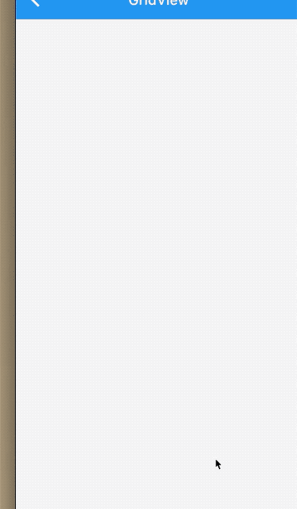

## 6.4 GridView

`GridView `是一个构成二维网格的列表，先看下它的属性：

```dart
GridView({
  Axis scrollDirection = Axis.vertical,
  bool reverse = false,
  ScrollController controller,
  bool primary,
  ScrollPhysics physics,
  bool shrinkWrap = false,
  EdgeInsetsGeometry padding,
  @required SliverGridDelegate gridDelegate, //控制子widget layout的委托
  bool addAutomaticKeepAlives = true,
  bool addRepaintBoundaries = true,
  double cacheExtent,
  List<Widget> children = const <Widget>[],
})
```

大多数属性在`ListView`已经介绍过了，在此不重复介绍了，如有疑问，请查看`ListVIew`章节，这边是多了一个`SliverGridDelegate `，这是`Grivd`的`layout`配置参数，有了它，子组件才有排列规则。

`SliverGridDelegate `是一个抽象类，定义了`DridView layout`的相关接口，子类需要实现他们的具体的布局算法。官方提供了已经实现好了的类，分别是`SliverGridDelegateWithFixedCrossAxisCount`和`SliverGridDelegateWithMaxCrossAxisExtent`,下边我们分别就介绍一个下他们。

### SliverGridDelegateWithFixedCrossAxisCount

该子类实现了一个横轴为固定元素数量的布局算法，看下属性;


```dart
SliverGridDelegateWithFixedCrossAxisCount({
  @required double crossAxisCount, 
  double mainAxisSpacing = 0.0,
  double crossAxisSpacing = 0.0,
  double childAspectRatio = 1.0,
})
```
|属性|含义|
|:-:|:-:|
| crossAxisCount |横轴排列个数|
| mainAxisSpacing |主轴间隙 默认是`0.0`|
| crossAxisSpacing |副轴间隙  默认是`0.0`|
| childAspectRatio |子部件比例 默认是`1.0`|

看下例子;我们实现了横轴排列4个，主轴和副轴间隙是`10`像素，比例是`0.5`.


```dart
    List<Widget> list = new List();
    for (int i = 0; i < 10; i++) {
      list.add(Container(
          height: 80,
          color: Colors.primaries[i % Colors.primaries.length],
          alignment: Alignment.center,
          child: TestContainer(
            title: DateTime.now().toString(),
          )));
    }

    return GridView(
      gridDelegate: SliverGridDelegateWithFixedCrossAxisCount(
          crossAxisCount: 4,
          mainAxisSpacing: 10,
          crossAxisSpacing: 10,
          childAspectRatio: 0.5),
      children: list,
    );
  }
```

效果：


### SliverGridDelegateWithMaxCrossAxisExtent

```
SliverGridDelegateWithMaxCrossAxisExtent({
    @required this.maxCrossAxisExtent,
    this.mainAxisSpacing = 0.0,
    this.crossAxisSpacing = 0.0,
    this.childAspectRatio = 1.0,
  })
```
和上边不一样的就是`maxCrossAxisExtent `最大宽度，其他属性完全一致。如果横轴为`500`,参数`maxCrossAxisExtent `为`150`
,那么最终长度为`125`.因为每个部件是平均划分的。

例子：

```dart
    List<Widget> list = new List();
    for (int i = 0; i < 10; i++) {
      list.add(Container(
          height: 80,
          color: Colors.primaries[i % Colors.primaries.length],
          alignment: Alignment.center,
          child: TestContainer(
            title: DateTime.now().toString(),
          )));
    }

    return GridView(
      gridDelegate: SliverGridDelegateWithMaxCrossAxisExtent(
//          crossAxisCount: 4,
          maxCrossAxisExtent: MediaQuery.of(context).size.width / 2 + 100.0,
          mainAxisSpacing: 10,
          crossAxisSpacing: 10,
          childAspectRatio: 0.5),
      children: list,
    );
  }
```

效果：


### GridView.builder

属性：

```dart
GridView.builder({
	...
    @required this.gridDelegate,
    @required IndexedWidgetBuilder itemBuilder,
    int itemCount,
    ...
  }) 
```
|属性|含义|
|:-:|:-:|
| gridDelegate |上文已介绍，布局算法实现|
| itemBuilder |子部件显示回调，当快要显示才会回调，滚出屏幕则销毁，也会再次回调该函数|
| itemCount |子部件数量,默认无限制|


实例：

```dart
  Widget _body() {

    return GridView.builder(
      gridDelegate: SliverGridDelegateWithMaxCrossAxisExtent(
//          crossAxisCount: 4,
          maxCrossAxisExtent: MediaQuery.of(context).size.width / 4 + 10.0,
          mainAxisSpacing: 10,
          crossAxisSpacing: 10,
          childAspectRatio: 2),
      itemBuilder: _buildCell,
      itemCount: _list.length,
      semanticChildCount: 13,
    );
  }

  List<Widget> _list;

  Widget _buildCell(BuildContext context, int index) {
    if (index < _list.length - 1) {
      return Container(
          height: 80, alignment: Alignment.center, child: _list[index]);
    } else if (_list.length < 100) {
      _getData();
      return Container(
        alignment: Alignment.center,
        child: RefreshProgressIndicator(),
      );
    } else {
      return Container(
          height: 80, alignment: Alignment.center, child: _list[index]);
    }
  }

  @override
  void initState() {
    _list = new List();
    _getData();
    super.initState();
  }

  void _getData() async {
    await Future.delayed(Duration(milliseconds: 1500));
    _list.addAll([
      Icon(Icons.directions),
      Icon(Icons.title),
      Icon(Icons.refresh),
      Icon(Icons.dehaze),
      Icon(Icons.ac_unit),
    ]);
    setState(() {});
  }
```

效果：




`GridView `子元素默认大小一致的，当然自己可以重写`SliverGridDelegate`，也可以在`pub`上使用三方写好的库,比如：[flutter_layout_grid](https://pub.flutter-io.cn/packages/flutter_layout_grid)、[flutter_staggered_grid_view](https://pub.flutter-io.cn/packages/flutter_staggered_grid_view)等等。


