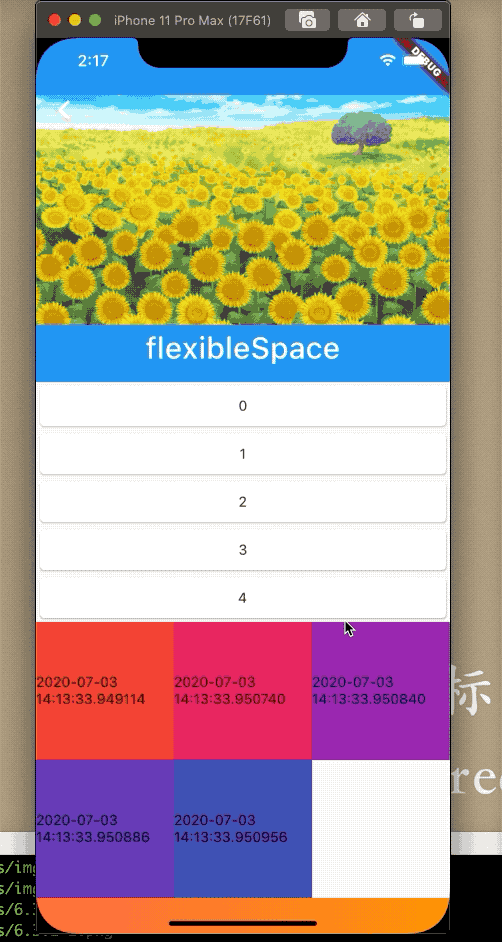

## 6.5  自定义滑动列表 CustomScrollView

`CustomScrollView `是一个可以自定义的滚动列表，支持使用`Sliver`的自定义滚动效果组件，可以同时包含多种滚动模型，例如：可以设置顶部一个`DridView`，底部一个`ListView`,让他们达成一致的滚动效果，不会出现滑动上边、下边没动的情况。`Flutter`提供了一些滚动组件，比如`SliverLit`、`SliverGridView`等等，实际`Sliver`版本的滚动模型和其他的区别就是，前者不包含滚动模型，而后者包含滚动模型，正是如此才能多个`Sliver`模型组合在一起实现一个大的滚动模型。
 
```dart
 const CustomScrollView({
	...
    this.slivers = const <Widget>[],
   ...
  })
```

属性`slivers`是`CustomScrollView `的`子组件`。

### 实现一个SliverList
例子：

```dart
  Widget _body() {
    List<Widget> list = new List();
    for (int i = 0; i < 30; i++) {
      list.add(Card(
        child: Container(
          height: 40,
          width: MediaQuery.of(context).size.width,
          alignment: Alignment.center,
          child: Text('$i'),
        ),
      ));
    }

    return CupertinoScrollbar(
      child: CustomScrollView(
        slivers: <Widget>[
          SliverList(
            delegate: SliverChildListDelegate(list),
          )
        ],
      ),
    );
  }
```


### 实现
顶部一个`SliverAppBar`来展示头部的头像或者`banner`滚动图,和`Appbar`一样，不过前者可以集成到`CustomScrollView`中去。中间一个数据列表，往下是一个`PageView`，一般用于中间差的广告或者其他的`banner`，底部继续其他的样式的滑动列表。

```dart

class BaseCustomScrollView extends StatefulWidget {
  @override
  _BaseCustomScrollViewState createState() => _BaseCustomScrollViewState();
}

class _BaseCustomScrollViewState extends State<BaseCustomScrollView> {
  @override
  Widget build(BuildContext context) {
    return Scaffold(
      body: _body(),
    );
  }

  Widget _body() {
    List<Widget> list = new List();
    for (int i = 0; i < 5; i++) {
      list.add(Card(
        child: Container(
          height: 40,
          width: MediaQuery.of(context).size.width,
          alignment: Alignment.center,
          child: Text('$i'),
        ),
      ));
    }

    return CupertinoScrollbar(
      child: CustomScrollView(
        slivers: <Widget>[
          SliverAppBar(
            expandedHeight: 300,
            flexibleSpace: FlexibleSpaceBar(
              title: Text('flexibleSpace'),
              collapseMode: CollapseMode.parallax, //消失效果
              stretchModes: [StretchMode.fadeTitle], //消失效果
              background: PageView(
                children: <Widget>[
                  Container(
//                    color: Colors.orange,
                    alignment: Alignment.center,
                    child: Image.asset('img/2.png'),
                  ),
                  Container(
                    alignment: Alignment.center,
                    child: Image.asset('img/2.png'),
                  ),
                  Container(
                    alignment: Alignment.center,
//                    color: Colors.orange,
                    child: Image.asset('img/2.png'),
                  ),
                  Container(
                    alignment: Alignment.center,
                    child: Image.asset('img/2.png'),
                  ),
                ],
              ),
              centerTitle: true,
            ),
//            title: Text('12'),
            pinned: true,
//            snap: true,
          ),
          SliverList(
            delegate: SliverChildListDelegate(list),
          ),
          SliverGrid(
            delegate:
                SliverChildBuilderDelegate(_buildCell, childCount: list.length),
            gridDelegate: SliverGridDelegateWithMaxCrossAxisExtent(
                maxCrossAxisExtent: 200),
          ),
          SliverToBoxAdapter(
            child: Container(
              height: 200,
              width: 200,
              child: PageView(
                children: <Widget>[
                  Container(
                    height: 50,
                    width: 200,
                    alignment: Alignment.center,
                    child: Text(
                      '中间插画，可以左右滑动的哦！！！',
                      style: TextStyle(fontSize: 30),
                    ),
                    decoration: BoxDecoration(
                        gradient: LinearGradient(
                            colors: [Colors.deepOrangeAccent, Colors.orange])),
                  ),
                  Container(
                    height: 50,
                    width: 200,
                    alignment: Alignment.center,
                    child: Text(
                      '中间插画，可以左右滑动的哦！！！',
                      style: TextStyle(fontSize: 30),
                    ),
                    decoration: BoxDecoration(
                        gradient: LinearGradient(
                            colors: [Colors.deepOrangeAccent, Colors.orange])),
                  )
                ],
              ),
            ),
          ),
          SliverGrid(
            delegate:
                SliverChildBuilderDelegate(_buildCell, childCount: list.length),
            gridDelegate:
                SliverGridDelegateWithFixedCrossAxisCount(crossAxisCount: 2),
          ),
        ],
      ),
    );
  }

  Widget _buildCell(ctx, int index) {
    if (index < list.length - 1) {
      return Container(
        height: 80,
        alignment: Alignment.center,
        color: Colors.primaries[index % Colors.primaries.length],
        child: TestContainer(
          title: list[index],
        ),
      );
    } else if (list.length >= 30) {
      return Container(
        alignment: Alignment.center,
        height: 80,
        child: Row(
          mainAxisAlignment: MainAxisAlignment.center,
          children: <Widget>[Icon(Icons.done), Text('没有更多数据了')],
        ),
      );
    } else {
      _getMoreData(); //加载数据
      return Container(
        alignment: Alignment.center,
        child: RefreshProgressIndicator(),
      );
    }
  }

  List<String> list;
  @override
  void initState() {
    list = new List();
    _getMoreData();
    super.initState();
  }

  void _getMoreData() async {
    await Future.delayed(Duration(milliseconds: 2000));

    setState(() {
      for (int i = 0; i < 10; i++) {
        list.add(DateTime.now().toString());
      }
    });
  }
}
```



