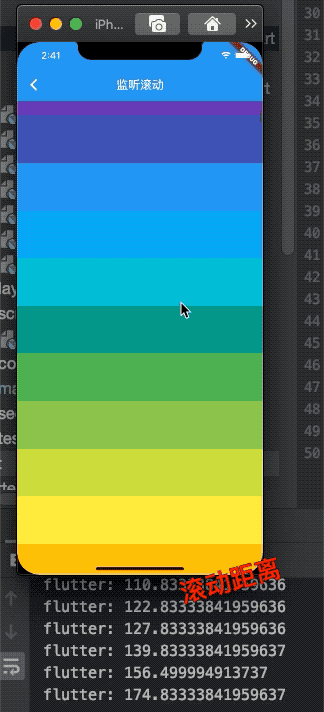
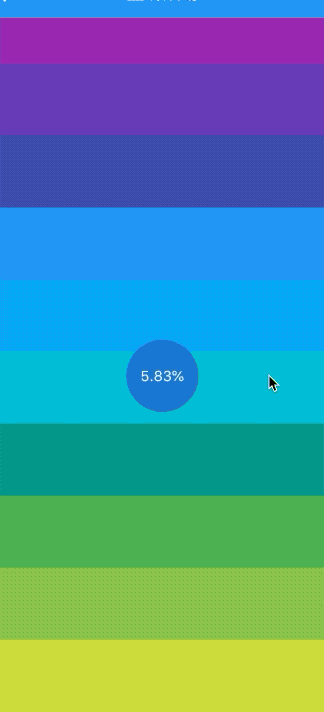

### 6.6 滚动及监听控制

本章讲解了多个滑动组件包括`SingChildScrollview`、`ListView`、`GridView`、`CustomScrollView`，他们都有一个属性`controller`,监听滚动控制器，我们以`SingChildScrollview `为例，讲解具体的用法。

###  6.6.1 ScrollController
构造函数很简单，

```dart
ScrollController({
  double initialScrollOffset = 0.0, //初始滚动位置
  this.keepScrollOffset = true,//是否保存滚动位置
  ...
})
```

|属性|使用方法|
|：-：|：-：|
|offset|滚动组件到当前位置|
|`jumpTo(double offset)`、`animateTo(double offset`|前者直接跳转，后者附带动画效果|

### 监听滚动

`ScrollController `的继承链是这样子的
`ScrollController<ChangeNotifier<Listenable`,所以可以监听。

```
  Widget _body() {
    return CupertinoScrollbar(
      child: ListView.builder(
        itemBuilder: _child,
        controller: _controller,
      ),
    );
  }

  Widget _child(ctx, int index) {
    return Container(
      height: 80,
      color: Colors.primaries[index % Colors.primaries.length],
    );
  }

  ScrollController _controller;
  @override
  void initState() {
    _controller = new ScrollController()
      ..addListener(() {
        print('${_controller.offset}');
      });
    super.initState();
  }
```

效果是：




### 监听滚动长度和比例


`Flutter Widget`树中子`Widget`可以通过发送通知（`Notification`）与父(包括祖先)Widget通信。父级组件可以通过`NotificationListener`组件来监听自己关注的通知。

可滚动组件在滚动时会发送`ScrollNotification`类型的通知，`ScrollBar`正是通过监听滚动通知来实现的。通过`NotificationListener`监听滚动事件和通过`ScrollController`有两个主要的不同：

通过`NotificationListener`可以在从可滚动组件到`widget`树根之间任意位置都能监听。而`ScrollController`只能和具体的可滚动组件关联后才可以。
收到滚动事件后获得的信息不同；`NotificationListener`在收到滚动事件时，通知中会携带当前滚动位置和`ViewPort`的一些信息，而`ScrollController`只能获取当前滚动位置。

接受滚动时间参数类型是`ScrollNotification `,他包含属性`metrics`,该属性描述滚动的范围和大小

|属性|含义|
|:-:|:-:|
|maxScrollExtent|滚动的最大距离|
|pixels|滚动的当前位置|
|viewportDimension|滚动的最大距离|
|axisDirection|滚动的方向|
|outOfRange|是否已超出范围，超出有效区域会触发|
|atEdge|现在在底部或者顶部|
|extentBefore|划出顶部的范围|
|extentAfter|划出底部的距离|
更多属性见[flutter API](https://api.flutter.dev/flutter/widgets/ScrollMetrics-class.html)

下面我们看一个监听滑动百分比例子：


```dart
  Widget _body() {
    return Stack(
      alignment: Alignment.center,
      children: <Widget>[
        CupertinoScrollbar(
          child: NotificationListener<ScrollNotification>(
            onNotification: (ScrollNotification no) {
              var v = no.metrics.pixels / no.metrics.maxScrollExtent;
              setState(() {
                _value = v * 100;
              });
              return true;
            },
            child: ListView.builder(
              itemBuilder: _child,
              controller: _controller,
              itemCount: 50,
            ),
          ),
        ),
        CircleAvatar(
          radius: 40,
          child: Container(
//            color: Colors.black45,
            child: Text('${_value.toStringAsFixed(2)}%'),
          ),
        )
      ],
    );
  }
```




