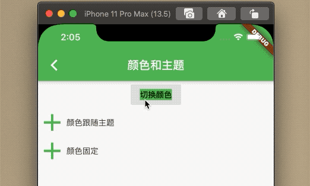
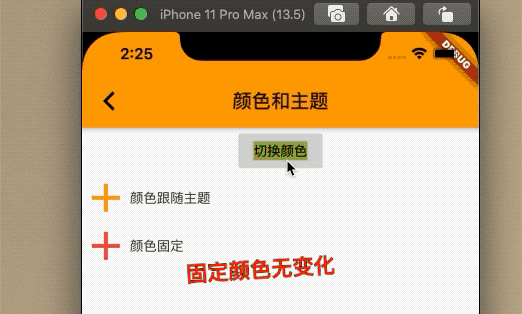

### 7.4.1 颜色

首先了解一下`Color类`。在`Flutter`中，`Color`是保存一个32位的`int`,那么`rgba`分别怎么体现呢？我们看下表格

|Bit 范围|颜色|
|:-:|:-:|
|0-7|blue 蓝色|
|8-15|green 绿色|
|16-23|red 红色|
|24-31|alpha 透明度|

那么颜色就是由这三种颜色和透明度组成的，8位int范围是`[0--255]`，所以每个值最大是`255`，最小是`0`.

我们看下构造函数：
该函数的参数`r`是红色，范围是`[0-255]`,`g`是绿色、`b`是蓝色，`a`是透明度，范围也是`[0,255]`，当`a=0`,则是完全透明度，当`a=255`,则完全不透明。
```
Color.fromARGB(int a, int r, int g, int b)
```


下边这个构造函数只有`opacity`范围变成了`[0--1]`,其他没变。

```
Color.fromRGBO(int r, int g, int b, double opacity) 
```


`Flutter`除了`Color`类，还有`MatarialColor`类，也是表示颜色的。

### MatarialColor

`MatarialColor `是`Color`的子类，实现了`Matarial Design`中颜色的类，包含了10个渐变的颜色,可以通过`[50]`来得到颜色的深度，索引包含`[50]`、`[100]`、`[200]`、`[300]`、`[400]`、`[500]`、`[600]`、`[700]`、`[800]`、`[900]`，颜色越大，颜色越深。
其实这个`[]`是操作符，看下源码了解到其实是`MatarialColor `的父类`ColorSwatch`中有个属性`Map<T,Color> _swtch`存储的值


```
/// ColorSwatch
 Color operator [](T index) => _swatch[index];

```


`teal `是`MaterialColor `类，看下它的实现。

```
  static const MaterialColor teal = MaterialColor(
    _tealPrimaryValue,
    <int, Color>{
       50: Color(0xFFE0F2F1),
      100: Color(0xFFB2DFDB),
      200: Color(0xFF80CBC4),
      300: Color(0xFF4DB6AC),
      400: Color(0xFF26A69A),
      500: Color(_tealPrimaryValue),
      600: Color(0xFF00897B),
      700: Color(0xFF00796B),
      800: Color(0xFF00695C),
      900: Color(0xFF004D40),
    },
  );
```
看下效果：


### Theme
`Theme`组件可以实现定义组件的主题，包含按钮，文本，bar。。。，子部件都会继承该效果。


### ThemeData
`ThemeData`用于保存`Material`组件库的主题数据，组件的规范都定义在`ThemeData`中，所以可以通过`THemeData`来自定义注意，在子部件可以通过`Theme.of(ctx)`获取当前的`ThemeData`.

看下`ThemeData`的部分数据：

```
ThemeData({
  Brightness brightness, //深色还是浅色
  MaterialColor primarySwatch, //主题颜色样本，见下面介绍
  Color primaryColor, //主色，决定导航栏颜色
  Color accentColor, //次级色，决定大多数Widget的颜色，如进度条、开关等。
  Color cardColor, //卡片颜色
  Color dividerColor, //分割线颜色
  ButtonThemeData buttonTheme, //按钮主题
  Color cursorColor, //输入框光标颜色
  Color dialogBackgroundColor,//对话框背景颜色
  String fontFamily, //文字字体
  TextTheme textTheme,// 字体主题，包括标题、body等文字样式
  IconThemeData iconTheme, // Icon的默认样式
  TargetPlatform platform, //指定平台，应用特定平台控件风格
  ...
})
```

例子：实现一个按钮换肤功能;


```
class _BaseColorAndThemeState extends State<BaseColorAndTheme> {
  Color _color;
  @override
  Widget build(BuildContext context) {
    ThemeData themeData = Theme.of(context);

    return Theme(
      child: Scaffold(
        appBar: AppBar(
          title: Text('颜色和主题'),
        ),
        body: _body(),
      ),
      data: ThemeData(
          primarySwatch: _color,
          iconTheme: IconThemeData(color: _color),
          textTheme: TextTheme(button: TextStyle(backgroundColor: _color))),
    );
  }

  Widget _body() {
    return Center(
      child: Column(
        children: <Widget>[
          FlatButton(
            child: Text('切换颜色'),
            color: Theme.of(context).buttonColor,
            onPressed: () {
              setState(() {
//                _iconColor = Colors.orange;
                _color = _color == Colors.orange ? Colors.green : Colors.orange;
              });
//              Navigator.of(context)
//                  .push(MaterialPageRoute(builder: (ctx) => _BaseRoutePage()));
            },
          ),
          Row(
            children: <Widget>[
              Icon(
                Icons.add,
                size: 50,
              ),
              Text('颜色跟随主题')
            ],
          ),
          Row(
            children: <Widget>[
              Icon(
                Icons.add,
                color: Colors.green,
                size: 50,
              ),
              Text('颜色固定')
            ],
          ),
        ],
      ),
    );
  }

  @override
  void initState() {
    _color = Colors.teal;

    super.initState();
  }
}
```

效果;




```
Theme = context.dependOnInheritedWidgetOfExactType<_InheritedTheme>();
```

`context.dependOnInheritedWidgetOfExactType `会按照`widget`树向上查找`_InheritedTheme`,有的话则返回，无的话`null`.

当多级`Theme`嵌套，则距离`widget`向上最近的才会有效果。


例子：

```
Theme(
            child: Row(
              children: <Widget>[
                Icon(
                  Icons.add,
                  size: 50,
                ),
                Text('颜色固定')
              ],
            ),
            data: ThemeData(
              iconTheme: IconThemeData(color: Colors.red),
            ),
          )
```

效果;




