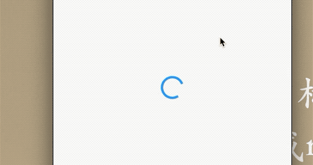
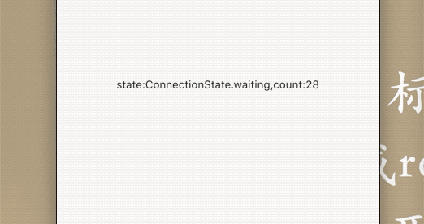

### 7.5 异步UI更新（FutureBuilder、StreamBuilder）


很多时候依赖一部分动态数据来更新UI，比如打开页面展示的列表页面，列表数据是从服务端获取的，在获取过程中展示一个动画，在数据加载到本地之后进行渲染；比如我们使用`Stream`(文件流，互联网数据等)的进度。盎然我们使用`StatefullWidget`完全可以使用这种功能，`Flutter`专门提供了`FlutterBuilder`和`StreamBuilder`两个组件实现这种功能。

### 7.5.1 FutureBuilder


```

```

|参数|含义|
|:-:|:-:|
|future|FutureBuilder依赖的Future，通常是一个异步耗时任务|
|initData|初始化数据|
|builder|构造器，Function (BuildContext context, AsyncSnapshot snapshot)，snapshot 包含异步任务的任务信息和结果，比如我们可以通过`snapshot`获取|

下边看下这个例子

```
return Center(
          child: Text('data:${snapshot.data}'),
        );
```

效果;

`ConnectionState`是个枚举，根据任务不同状态返回不同的值。

```
enum ConnectionState {
//  没任务则为none
  none,
// 等待中
  waiting,
// 任务在进行中
  active,
// 异步任务完成
  done,
}
```


### 7.5.2 StreamBuilder


`dart`中`stream`用于接受异步数据，和`Future`不同的是前者可以连续接受数据，可以用于多次数据的异步任务，如网络下载，文件读写，`streamBuilder`正是匹配`Stream`来展示数据流的数据变化UI，下边看下构造函数：


```
StreamBuilder({
  Key key,
  this.initialData,
  Stream<T> stream,
  @required this.builder,
})
```

可以看到和`FutureBuilder`的构造函数只有一点不同：前者需要一个`future`，而后者需要一个`stream`。

```
Widget _bd() {
    return Center(
      child: StreamBuilder<int>(
        stream: _counter(),
        builder: (BuildContext context, AsyncSnapshot snapshot) {
          if (snapshot.connectionState == ConnectionState.done) {
            if (snapshot.hasError) {
              return Center(
                child: Text('error:${snapshot.error}'),
              );
            } else {
              return Center(
                child: Text('data:${snapshot.data}'),
              );
            }
          } else {
            return Center(
              child: Text(
                  'state:${snapshot.connectionState},count:${snapshot.data}'),
            );
          }
        },
      ),
    );
  }

  Stream<int> _counter() {
    return Stream.periodic(Duration(milliseconds: 500), (i) {
      return i;
    });
  }

  @override
  void initState() {
    super.initState();
  }
```

效果:




