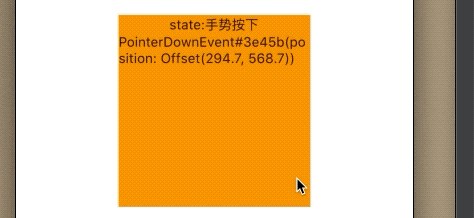
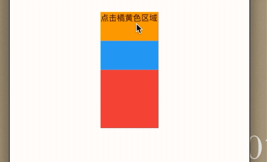
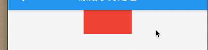
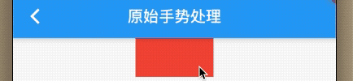

### 8.1 原始指针事件处理

本章节先介绍手势(Pointer Event，移动端设备上通常的触摸事件)，在移动端，每个平台或UI系统的原始指针事件基本一致，即:一次完整的时间分为：手势按下、手势移动、手势抬起，或者高级的手势(点击、双击、拖动等)都是基于这些原始事件的。

当指针按下时，Flutter会对应用程序执行`命中测试(Hit Test)`，以确定指针与屏幕交界处的位置存在哪些组件`widget`，指针按下事件(以及该指针的后续事件)，然后被分到有命中测试测试发现最内部的组件，然后从那里向组件树上冒泡，这些事件从内部的组件被分发到组件树根路径的所有组件，这和`iOS`的手势处理一致。

`Flutter`中可以使用`Listen`监听原始触摸事件，按照本书对组件的分裂，则`Listener`也是功能性组件。下面是`Listener`的构造函数定义：

```
Listener({
  Key key,
  this.onPointerDown, //手指按下回调
  this.onPointerMove, //手指移动回调
  this.onPointerUp,//手指抬起回调
  this.onPointerCancel,//触摸事件取消回调
  this.behavior = HitTestBehavior.deferToChild, //在命中测试期间如何表现
  Widget child
})
```

例子：

```
//定义一个状态，保存当前指针位置
  PointerEvent _event;
  String _eventState = '';
  Widget _body() {
    return Center(
      child: Listener(
        child: Container(
          width: 200,
          height: 200,
          color: Colors.orange,
          alignment: Alignment.center,
          child: Column(
            children: <Widget>[
              Text('state:$_eventState'),
              Text(_event.toString())
            ],
          ),
        ),
        onPointerCancel: (PointerCancelEvent event) {
          setState(() {
            _event = _event;
            _eventState = '取消';
          });
        },
        onPointerDown: (PointerDownEvent ev) {
          setState(() {
            _event = ev;
            _eventState = '手势按下';
          });
        },
        onPointerMove: (PointerMoveEvent ev) {
          setState(() {
            _event = ev;
            _eventState = '移动';
          });
        },
        onPointerUp: (PointerUpEvent ev) {
          setState(() {
            _event = ev;
            _eventState = '抬起手势';
          });
        },
      ),
    );
  }
```

效果：




手指在橘黄色区域移动可以看到指针便宜，当触发事件时，`PointerCancelEvent`、`PointerDownEvent`、`PointerMoveEvent`、`PointerUpEvent`都是`PointEvent`的子类，`PointEvent`中包含指针的一些信息，如

- `position`: 全局坐标
- `delta`: 两次移动距离
- `pressure`: 按压力度，支持3DTouch的，此属性才有意义，若不支持，则始终为1.
- `orientation`: 指针移动方向，是一个角度值

其他更多属性可以查看官方文档。

现在看下`HitTestBehavior`


|HitTestBehavior| 含义|
|:-:|:-:|
|deferToChild| 点击子部件可以收到响应，并不是拦截，底部还能继续收到|
|opaque|命中测试时，将当前组件当成不透明处理（和本身透明度没关系）,最终效果是当前widget整个区域都能点击|
|translucent|当点击透明部件，继续向下传递|

例子：

```
  Widget _body2() {
    return Center(
      child: Listener(
        child: Center(
          child: Container(
            color: Colors.red,
            height: 200,
            width: 100,
            child: Stack(
              children: <Widget>[
                Listener(
                  child: ConstrainedBox(
                    child: DecoratedBox(
                      decoration: BoxDecoration(color: Colors.blue),
                      child: Text(_eventState),
                    ),
                    constraints: BoxConstraints.tight(Size(100.0, 100.0)),
                  ),
                  onPointerDown: (PointerDownEvent ev) {
                    setState(() {
                      _eventState = '点击 蓝色';
                    });
                  },
                ),
                Listener(
                  child: ConstrainedBox(
                    child: DecoratedBox(
                      decoration: BoxDecoration(color: Colors.orange),
                      child: Text(_eventState),
                    ),
                    constraints: BoxConstraints.tight(Size(100.0, 50.0)),
                  ),
                  onPointerDown: (PointerDownEvent ev) {
                    setState(() {
                      _eventState = '点击橘黄色区域';
                    });
                  },
                ),
              ],
            ),
          ),
        ),
        behavior: HitTestBehavior.deferToChild,
        onPointerUp: (PointerUpEvent ev) {
          setState(() {
            _event = ev;
            _eventState = '抬起手势';
          });
        },
      ),
    );
  }
```

效果;




### 忽略PointerEvent

假如我们想让某个子树响应`PositerEvent`的话，可以使用`IgnorePointer`和`AbsorbPointer`，这两个组件都能阻止子树接受指针事件，不同之处是`AbsorbPointer `会参与命中测试，而`IgnorePointer `本身不会参与，意味着`IgnorePointer `和子树都不能传递命中测试，而`AbsorbPointer `自己可以参与，但是子树不参与。

例子：


```
 String _eventState = '';
  Widget _body() {
    return Center(
      child: Listener(
        child: Center(
          child: Column(
            children: <Widget>[
              Listener(
                child: SizedBox(
                  height: 50,
                  child: Container(
                    color: Colors.red,
                    child: Text(_eventState),
                  ),
                ),
                onPointerDown: (PointerDownEvent ev) {
                  setState(() {
                    _event = ev;
                    _eventState = '子树 -> 手势按下';
                  });
                },
              )
            ],
          ),
        ),
        onPointerUp: (PointerUpEvent ev) {
          setState(() {
            _event = ev;
            _eventState = '抬起手势';
          });
        },
      ),
    );
  }
```

效果：




我们把`AbsorbPointer `换成`IgnorePointer`,都不能接受事件了。



