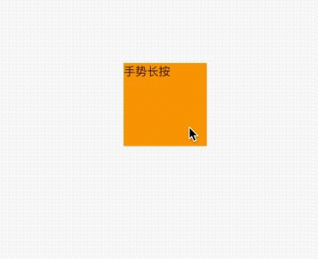
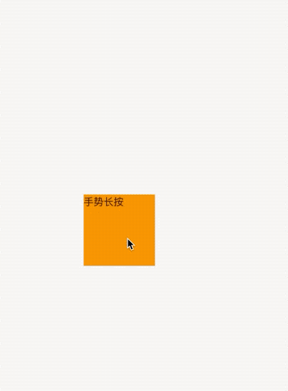
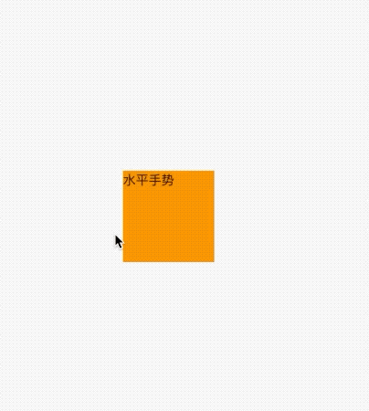
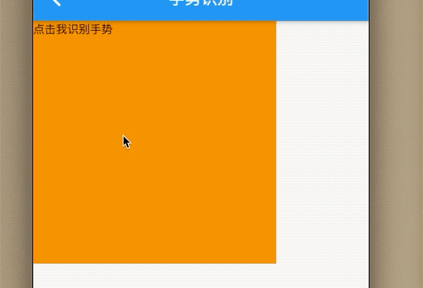

### 8.2  手势识别

首先介绍处理手势的组件`GestureDetector`和`GestureRecognizer`，后续在讲解其他复杂情况

### 8.2.1 GestureDetector


首先看下属性：

```dart
GestureDetector({
    Key key,
    this.child,
    this.onTapDown,// 手势按下
    this.onTapUp,//抬起
    this.onTap,//点击
    this.onTapCancel,//点击取消 移动出范围触发
    this.onSecondaryTapDown,//第二个指头点击
    this.onSecondaryTapUp,
    this.onSecondaryTapCancel,
    this.onDoubleTap,//双击
    this.onLongPress,//长按
    this.onLongPressStart,//长按开始
    this.onLongPressMoveUpdate,//长按移动
    this.onLongPressUp,//长按抬起
    this.onLongPressEnd,//长按结束
    this.onVerticalDragDown,//垂直拖拽 按压
    this.onVerticalDragStart,
    this.onVerticalDragUpdate,
    this.onVerticalDragEnd,
    this.onVerticalDragCancel,
    this.onHorizontalDragDown,//水平拖拽 按压
    this.onHorizontalDragStart,
    this.onHorizontalDragUpdate,
    this.onHorizontalDragEnd,
    this.onHorizontalDragCancel,
    this.onForcePressStart,
    this.onForcePressPeak,
    this.onForcePressUpdate,
    this.onForcePressEnd,
    this.onPanDown,
    this.onPanStart,
    this.onPanUpdate,
    this.onPanEnd,
    this.onPanCancel,
    this.onScaleStart,//放大开始
    this.onScaleUpdate,
    this.onScaleEnd,
    this.behavior,
    this.excludeFromSemantics = false,
    this.dragStartBehavior = DragStartBehavior.start,
  })
```
### 点击 双击 长按
点击、双击、长按可以并存，相互无影响。我们设置触控区域为`100X100`，方便操作。


例子：

```dart
GestureDetector(
        child: Container(
          width: 100,
          height: 100,
          child: Text(_string == null ? '点击我识别手势' : _string),
          color: Colors.orange,
        ),
        onTap: () {
          setState(() {
            _string = '手势按压';
          });
        },
        onDoubleTap: () {
          setState(() {
            _string = '手势双击';
          });
        },

        onLongPress: () {
          setState(() {
            _string = '手势长按';
          });
        },
}
```
> 同时监听`onTap`和`onDoubleTap`事件时，用户触发`tap`事件会有200毫秒延迟，因为用户有可能触发双击事件，所以组件会等待一段时间来确定是否是双击，如果只监听`onTap`，则无延迟。


效果：




### 拖动 滑动

长按手势根据移动的`LongPressMoveUpdateDetails`可以更新UI,根据`LongPressStartDetails`计算得出手指在组件上的位置计算得出应该移动的距离。

```dart

Stack(
      children: <Widget>[
        GestureDetector(
          child: Container(
            width: 100,
            height: 100,
            margin: EdgeInsets.only(
                left: _left > 0 ? _left : 0, top: _top < 0 ? 0 : _top),
            child: Text(_string == null ? '点击我识别手势' : _string),
            color: Colors.orange,
          ),
          onLongPress: () {
            setState(() {
              _string = '手势长按';
            });
          },
          onLongPressMoveUpdate: (LongPressMoveUpdateDetails d) {
            setState(() {
              _left = d.localPosition.dx - _offset.dx;
              _top = d.localPosition.dy - _offset.dy;
            });
          },
          onLongPressStart: (LongPressStartDetails d) {
            _offset =
                Offset(d.localPosition.dx - _left, d.localPosition.dy - _top);
          },
        )
      ],
    )
```

|回调|含义|
|:-:|:-:|
|onLongPressStart| 长按开始的位置|
|onLongPressMoveUpdate| 手指移动回调|

`LongPressStartDetails.localPosition`是基于屏幕的位置的`offset`

效果：





 当然也可以在水平或者垂直方向拖动，或者同时都监听。
 
 ```dart
Stack(
      children: <Widget>[
        GestureDetector(
          child: Container(
            width: 100,
            height: 100,
            margin: EdgeInsets.only(
                left: _left > 0 ? _left : 0, top: _top < 0 ? 0 : _top),
            child: Text(_string == null ? '点击我识别手势' : _string),
            color: Colors.orange,
          ),
          onHorizontalDragUpdate: (DragUpdateDetails detail) {
            setState(() {
              _string = '水平手势';

              _left += detail.delta.dx;
              _top += detail.delta.dy;
            });
          },
          onVerticalDragUpdate: (DragUpdateDetails detail) {
            setState(() {
              _string = '垂直手势';

              _left += detail.delta.dx;
              _top += detail.delta.dy;
            });
          },
        ),
      ],
    )

 ```
 > 垂直和水平手势冲突，同时只能响应一个，谁先响应后续都是谁监听。
 
 效果：
 
 
 
### 缩放

 双指在屏幕上张开和收缩就是放大和缩小手势，本例子放大和缩小widget。
 
 ```
 Stack(
      children: <Widget>[
        GestureDetector(
          child: Container(
            width: _width,
            height: _height,
            margin: EdgeInsets.only(
                left: _left > 0 ? _left : 0, top: _top < 0 ? 0 : _top),
            child: Text(_string == null ? '点击我识别手势' : _string),
            color: Colors.orange,
          ),
          onScaleUpdate: (ScaleUpdateDetails detail) {
            setState(() {
              _width = 200 * detail.scale.clamp(0.5, 2);
              _height = _width;
            });
          },
        ),
      ],
    )
 ```
 
 效果：
 
 
 
 
###  8.2.2 GestureRecognizer
 
 `GestureRecognizer `是抽象类，`flutter`提供了已经实现了的类，比如`TapGestureRecognizer`、`DoubleTapGestureRecognizer`、`DragGestureRecognizer`等供开发者可以实现基本的操作。
 
 ```
 bool _selected = false;
Widget _body2() {
return Center(
  child: Text.rich(
    TextSpan(text: '你好,', children: [
      TextSpan(
          text: 'Flutter',
          recognizer: _gestureRecognizer(),
          style: TextStyle(
              color: _selected ? Colors.blue : Colors.orange,
              fontSize: _selected ? 30 : 20))
    ]),
  ),
);
}

GestureRecognizer _gestureRecognizer() {
return TapGestureRecognizer()
  ..onTap = () {
    setState(() {
      _selected = !_selected;
    });
  };
}
 ```
 
 效果：

 
 
 
### 8.2.3 手势竞争


#### 竞争
在前边的例子中有一个垂直和竖直方向的监听，假如我们斜着拖动时哪个方向会生效？实际上取决于第一次移动时两个轴上的位移分量，哪个轴在本次竞争中胜出。实际`Flutter`的手势识别竞争引入了一个`Arena`的概念，`Arena`是竞技场的意思，在每一个手势识别器都是 一个竞技场，在发生滑动事件时，他们都要去竞技场去竞争本次的处理权，而最终只有一个竞争者会胜出。


#### 例子：
我们以拖动手势为例，同时识别垂直和水平手势，当 用户按下屏幕就会触发(垂直和竖直方向)，一旦某一个方向胜出，直到手势结束都会沿着该方向移动。


 ```dart
Stack(
      children: <Widget>[
        GestureDetector(
          child: Container(
            width: 100,
            height: 100,
            margin: EdgeInsets.only(
                left: _left > 0 ? _left : 0, top: _top < 0 ? 0 : _top),
            child: Text(_string == null ? '点击我识别手势' : _string),
            color: Colors.orange,
          ),
          onHorizontalDragUpdate: (DragUpdateDetails detail) {
            setState(() {
              _string = '水平手势';

              _left += detail.delta.dx;
              _top += detail.delta.dy;
            });
          },
          onVerticalDragUpdate: (DragUpdateDetails detail) {
            setState(() {
              _string = '垂直手势';

              _left += detail.delta.dx;
              _top += detail.delta.dy;
            });
          },
        ),
      ],
    )

 ```
 > 垂直和水平手势冲突，同时只能响应一个，谁先响应后续都是谁监听。
 
 效果：
 
 
 
 
#### 手势冲突
由于手势竞争最终只有一个获胜者，所以，当多个手势识别器时，可能会产生冲突，假如有可以上下移动手势，我们也想监测在他上面按下和抬起手势。


```dart
  String _moveDetail = '';
  Widget _body3() {
    return Stack(
      children: <Widget>[
        GestureDetector(
          child: Container(
            width: _width,
            height: _height,
            margin: EdgeInsets.only(
                left: _left > 0 ? _left : 0, top: _top < 0 ? 0 : _top),
            child: Text((_string == null ? '点击我识别手势' : _string) + _moveDetail),
            color: Colors.orange,
          ),
          onTap: () {
            setState(() {
              _string += '点击手势';
            });
          },
          onTapUp: (TapUpDetails detail) {
            setState(() {
              _string += 'up:' + detail.toString();
            });
          },
          onHorizontalDragUpdate: (DragUpdateDetails detail) {
            setState(() {
              _moveDetail = detail.toString();
            });
          },
        ),
      ],
    );
  }

``` 

可以发现当手势结束的时候，`up`也没有回调。当点击时是`tap`胜出，当手指开始移动的时候，`tap`和`onHorizontalDragUpdate`开始竞争，然后`onHorizontalDragUpdate`胜出，后续的操作都是有`onHorizontalDragUpdate`来处理，所以最终`up`并未回调。


 
 
 
 假如我们也想监听`up`手势，那么该怎么处理？可以监听`onHorizontalDragend`或者使用原始指针`Listener `来处理。
 
 
 
 ```dart
 Positioned(
  top:80.0,
  left: _leftB,
  child: Listener(
    onPointerDown: (details) {
      print("down");
    },
    onPointerUp: (details) {
      //会触发
      print("up");
    },
    child: GestureDetector(
      child: CircleAvatar(child: Text("B")),
      onHorizontalDragUpdate: (DragUpdateDetails details) {
        setState(() {
          _leftB += details.delta.dx;
        });
      },
      onHorizontalDragEnd: (details) {
        print("onHorizontalDragEnd");
      },
    ),
  ),
)
 ```
 
 感兴趣的同学可以自己实验下哦。。。
 
 
