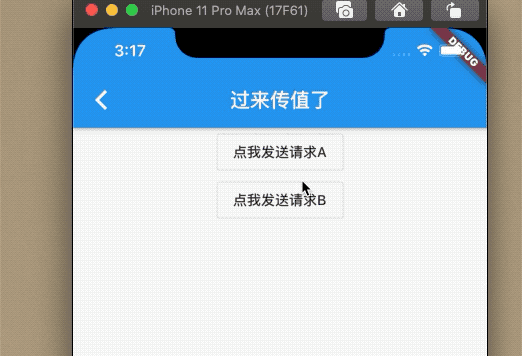

### 8.3 全局事件总线

在`APP`中，我们经常会需要一个广播机制，用来跨页面传值，比如一个APP选择了某一个参数，页面关闭之后，上级页面要显示该参数进行一些页面的更新，这时候，一个事件总线便会非常有用，事件总显示 实现订阅者模式，订阅者包含发布者和订阅者两种身份，可以通过总线触发事件和监听事件，那么我们来实现这么一个事件总线，使用单例模式。


```dart
typedef EventBusCallback = void Function(Object object);

class FYEventBus {
  static FYEventBus _bus = new FYEventBus._();
  FYEventBus._();

  /// 工厂构造 单例模式
  factory FYEventBus() => _bus;

  //保存全局
  var _emap = new Map<Object, List<EventBusCallback>>();

  ///   监听回调
  void on(eventName, EventBusCallback callback) {
    if (eventName == null || callback == null) return;
    _emap[eventName] ??= new List();
    if (_emap[eventName].contains(callback) == false) {
      _emap[eventName].add(callback);
    }
  }

  /// 删除回调
  void off(eventName, EventBusCallback callback) {
    if (eventName == null || callback == null) return;
    if (callback == null) {
      _emap[eventName] = null;
    } else {
      _emap[eventName].remove(callback);
    }
  }

  /// 发送回调
  void fire(eventName, [arg]) {
    if (eventName == null) return;
    var list = _emap[eventName];
    if (list == null) return;
    for (var j = list.length - 1; j >= 0; --j) {
      var o = list[j];
      o(arg);
    }
  }
}
```


然后我们实现一个跨页面传值，A页面展示数据，B页面传值过去。


```dart

class _BaseEventBusState extends State<BaseEventBus> {
  @override
  Widget build(BuildContext context) {
    return Scaffold(
      appBar: AppBar(
        title: Text('事件总线'),
      ),
      body: _body(),
    );
  }

  Widget _body() {
    return Center(
      child: Column(
        children: <Widget>[
          Text(_str),
          OutlineButton(
            onPressed: () {
//              _bus.fire('test', '全局调用了一次哦');

              Navigator.of(context)
                  .push(MaterialPageRoute(builder: (c) => _Page2()));
            },
            child: Text('点我push new page'),
          )
        ],
      ),
    );
  }

  String _str = '';
  FYEventBus _bus;
  @override
  void initState() {
    _bus = FYEventBus()
      ..on('test', (string) {
        setState(() {
          _str += string;
        });
      });
    super.initState();
  }

  @override
  void dispose() {
    _bus.off('test', null);
    super.dispose();
  }
}

class _Page2 extends StatelessWidget {
  @override
  Widget build(BuildContext context) {
    return Scaffold(
      appBar: AppBar(
        title: Text('过来传值了'),
      ),
      body: _body(),
    );
  }

  FYEventBus _bus = FYEventBus();
  Widget _body() {
    return Center(
      child: Column(
        children: <Widget>[
          OutlineButton(
            onPressed: () {
              _bus.fire('test', '\n点我发送请求A');
            },
            child: Text('点我发送请求A'),
          ),
          OutlineButton(
            onPressed: () {
              _bus.fire('test', '\n点我发送请求B');
            },
            child: Text('点我发送请求B'),
          )
        ],
      ),
    );
  }
}
```

效果：




> Dart 中单例用 工厂方法+静态变量可以实现，这样可以保证每次new都是返回的同一个实例。

事件总线通常用于组件之间状态共享，单关于组件之间状态共享也有一些专门的第三方包，如Eventbus、redux、bloc等，开发者感兴趣可以去pub参考下。


