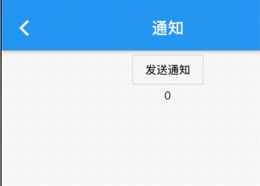

### 8.4 通知

```dart
 Widget _body() {
    return NotificationListener(
      onNotification: (notification) {
        switch (notification.runtimeType) {
          case ScrollStartNotification:
            print("开始滚动");
            break;
          case ScrollUpdateNotification:
            print("正在滚动");
            break;
          case ScrollEndNotification:
            print("滚动停止");
            break;
          case OverscrollNotification:
            print("滚动到边界");
            break;
        }
        return true;
      },
      child: CupertinoScrollbar(
        child: SingleChildScrollView(
          child: Container(
            height: 2000,
            width: 400,
            color: Colors.orange,
          ),
        ),
      ),
    );
  }
```

这个例子我们使用了`SingleChildScrollView`,当发生滚动时，就会发送滚动通知`ScrollStartNotification`，滚动通知是继承`ScrollNotification`类，不同的通知包含的信息不一样的信息，比如`ScrollUpdateNotification`有一个`scrollDelta`属性，记录了移动的位移，其他的可以看官方文档。

`NotificationListener`的属性如下

```dart

NotificationListener({
    Key key,
    @required this.child,
    this.onNotification,
  }) 
```


- `NotificationListener `继承了`StatelessWidget`类，可以直接在`widget`树中使用
- `NotificationListener `可以指定模板参数，但是必须继承`Notification`,当显式指定参数，那么返回的参数只会接受该类型的参数。

那么我们将代码改成

```dart

NotificationListener<ScrollStartNotification>(
...
...)
```
那么现在只能接收滚动开始的通知了。

- `onNotification`回调为通知处理回调，签名如下

```

final NotificationListenerCallback<T> onNotification

typedef NotificationListenerCallback<T extends Notification> = bool Function(T notification);

``` 

返回值为`bool`,当返回值为`true`,防止冒泡，当`false`,继续向上冒泡。

`Flutter`的`UI`框架实现中，除了可滚动在组件移动会发生除`ScrollNotification`之外，还有其他的一些通知，如`SizeChagneLayoutNotification`、`KeepAliveNotification`、`LayoutNotication`等，`flutter`正式通过这种通知机制使父组件可以执行一些特定的事情。

### 自定义通知

#### 定义一个继承`Notification类`

```dart

  Widget _body2() {
    return NotificationListener<FyNotification>(
      onNotification: (FyNotification notification) {
        setState(() {
          _code = notification.code;
        });
        return false;
      },
      child: Center(
        child: Column(
          children: <Widget>[
            Builder(
              builder: (context) {
                return OutlineButton(
                  child: Text('发送通知'),
                  onPressed: () {
                    FyNotification(code: 200).dispatch(context);
                  },
                );
              },
            ),
            Text('$_code'),
          ],
        ),
      ),
    );
  }
}

class FyNotification extends Notification {
  int code;
  FyNotification({this.code});
}
```
> FyNotification(code: 200).dispatch(context) 中的context的子树的context，因为我们监听的子树，所以需要build来构造一个子context，否则监听失败。
效果;




#### 阻止冒泡

当返回false，则继续冒泡，当返回true则停止冒泡。

```dart
...
Widget _body2() {
    return NotificationListener<FyNotification>(
      onNotification: (notification) {
        print('我是外层监听');
        return false;
      },
      child: NotificationListener<FyNotification>(
        onNotification: (FyNotification notification) {
          setState(() {
            _code = notification.code;
          });
          print('我是内层监听');
          return true;
        },
        child: Center(
          child: Column(
            children: <Widget>[
              Builder(
                builder: (context) {
                  return OutlineButton(
                    child: Text('发送通知'),
                    onPressed: () {
                      FyNotification(code: 200).dispatch(context);
                    },
                  );
                },
              ),
              Text('$_code'),
            ],
          ),
        ),
      ),
    );
  }
```

当里层返回true效果：

```dart
flutter: 我是内层监听
flutter: 我是内层监听
flutter: 我是内层监听
flutter: 我是内层监听

```
当里层返回false效果：

```
flutter: 我是内层监听
flutter: 我是外层监听
flutter: 我是内层监听
flutter: 我是外层监听
```

### 原理


上边已经介绍完了通知的使用和自定义通知的使用，更深入些，了解一下flutter如何实现冒泡的原理的，看下源码，从发送通知函数触发，然后深入了解。`Notification`的`dispath(context)`方法看下，看看做了什么事情

```dart
void dispatch(BuildContext target) {
    target?.visitAncestorElements(visitAncestor);
  }
```

`dispatch `调用了当前的`context`的`visitAncestorElements `,改方法从当前元素遍历向父级元素`visitAncestorElements`有一个遍历回调参数，在遍历过程中对遍历到的父级元素都会执行该回调。遍历的终止条件是：已经遍历到根`Element`或某个遍历回调返回`false`。源码中传给`visitAncestorElements`方法的遍历回调为`visitAncestor`方法，我们看看`visitAncestor`方法的实现：

```dart
//遍历回调，会对每一个父级Element执行此回调
bool visitAncestor(Element element) {
  //判断当前element对应的Widget是否是NotificationListener。

  //由于NotificationListener是继承自StatelessWidget，
  //故先判断是否是StatelessElement
  if (element is StatelessElement) {
    //是StatelessElement，则获取element对应的Widget，判断
    //是否是NotificationListener 。
    final StatelessWidget widget = element.widget;
    if (widget is NotificationListener<Notification>) {
      //是NotificationListener，则调用该NotificationListener的_dispatch方法
      if (widget._dispatch(this, element)) 
        return false;
    }
  }
  return true;
}
```

`visitAncestor`会判断每一个遍历到的父级`Widget`是否是`NotificationListener`，如果不是，则返回`true`继续向上遍历，如果是，则调用`NotificationListene`r的`_dispatch`方法，我们看看`_dispatch`方法的源码：

```
  bool _dispatch(Notification notification, Element element) {
    // 如果通知监听器不为空，并且当前通知类型是该NotificationListener
    // 监听的通知类型，则调用当前NotificationListener的onNotification
    if (onNotification != null && notification is T) {
      final bool result = onNotification(notification);
      // 返回值决定是否继续向上遍历
      return result == true; 
    }
    return false;
  }
```
我们可以看到`NotificationListener`的`onNotification`回调最终是在`_dispatch`方法中执行的，然后会根据返回值来确定是否继续向上冒泡。上面的源码实现其实并不复杂，通过阅读这些源码，一些额外的点读者可以注意一下：

`Context`上也提供了遍历`Element`树的方法。
我们可以通过`Element.widget`得到`element`节点对应的`widget`；我们已经反复讲过`Widget`和`Element`的对应关系，读者通过这些源码来加深理解。


