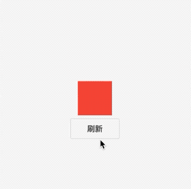
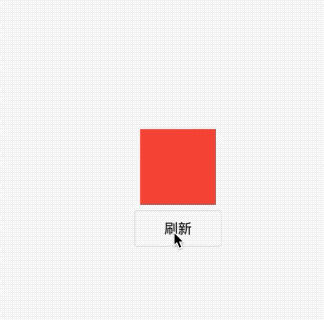
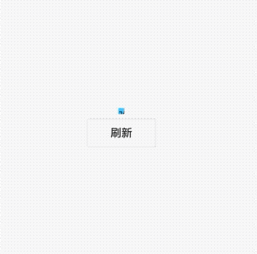
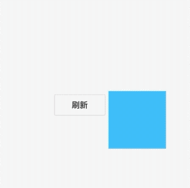

## 9.2 动画结构和状态监听

### 9.2.1 动画基本结构

Flutter中实现动画有很多在种，我们下边通过一个文本的旋转不同的实现方式演示动画。

### 基础版本


先看下效果：



我们实现一个红色方块从小变大的效果，首先看下基本的写法

```dart
class _ScaleANimationRouteState extends State<ScaleANimationRoute>
    with SingleTickerProviderStateMixin {
  AnimationController _animationController;
  @override
  void initState() {
    _animationController = AnimationController(
        duration: Duration(milliseconds: 1000),
        lowerBound: 0,
        upperBound: 1.0,
        vsync: this)
      ..addListener(() {
        ///刷新UI
        setState(() {});
      })

      ///正向启动
      ..forward();
    super.initState();
  }

  @override
  Widget build(BuildContext context) {
    return _body();
  }

  Widget _body() {
    return Container(
      width: 100 * _animationController.value,
      height: 100 * _animationController.value,
      color: Colors.red,
    );
  }
  ///销毁
  @override
  void dispose() {
    _animationController.dispose();
    super.dispose();
  }
}
```

在`controller`的`listen`中使用了`setState(){}`来刷新UI，含义是每次生成一个新的数字的时候，则调用一下`setState()`,`setState`会标记当前帧为dirty，会导致`build`方法再次调用，而在`build`中，方块的长和宽都乘了系数`controlelr.value`，所以就会被放大，当释放的时候需要手动调用`_animationController.dispose();`防止内存泄露。


上面是基础的效果，生成的值是线性的，那么我们使用`Cruve`指定一个弹簧效果，还需要改下`initState`代码

```dart
class ScaleANimationRoute extends StatefulWidget {
  ScaleANimationRoute({Key key}) : super(key: key);
  @override
  _ScaleANimationRouteState createState() => _ScaleANimationRouteState();
}

class _ScaleANimationRouteState extends State<ScaleANimationRoute>
    with SingleTickerProviderStateMixin {
  AnimationController _animationController;
  Animation _animation;
  @override
  void initState() {
    _animationController = AnimationController(
        duration: Duration(milliseconds: 1000),
        lowerBound: 0.0,
        upperBound: 1.0,
        vsync: this)
      ..addListener(() {
        ///刷新UI
        setState(() {});
      });

    _animation =
        CurvedAnimation(parent: _animationController, curve: Curves.bounceOut);
    _animation = new Tween(begin: 0.0, end: 1.0).animate(_animation)
      ..addListener(() {
        setState(() {});
      });

    ///正向启动
    _animationController.forward();
    super.initState();
  }

  @override
  Widget build(BuildContext context) {
    return _body();
  }

  Widget _body() {
    return Container(
      width: 100.0 * _animation.value,
      height: 100.0 * _animation.value,
      color: Colors.red,
    );
  }

  @override
  void dispose() {
    _animationController.dispose();

    super.dispose();
  }
}
```




### 使用AnimatedWidget封装
`AnimatedWidget `是官方提供的一个抽象类，`AnimatedWidget`内部已经实现了在`Animated`的监听`_handleChange`，我们看下`_handleChange`实现：

```dart
void _handleChange() {
setState(() {
  // The listenable's state is our build state, and it changed already.
});
```

`_handleChange `其实内部是刷新UI的`setState()`函数。

这样子只需要把`Animaiton`的值传进来就可以实现动画了。代码重构后是这样子的：

```dadrt
class AnimateWidgetFrame extends AnimatedWidget {
  AnimateWidgetFrame({Key key, Animation<double> animation})
      : super(key: key, listenable: animation);

  @override
  Widget build(BuildContext context) {
    final Animation<double> animation = listenable;
    return Container(
      width: 100 * animation.value,
      height: 100 * animation.value,
      color: Colors.lightBlueAccent,
    );
  }
}
```

调用的时候这样子调用

```dart

class _ScaleANimationRouteState extends State<ScaleANimationRoute>
    with SingleTickerProviderStateMixin {
  AnimationController _animationController;
  Animation _animation;
  @override
  void initState() {
    _animationController = AnimationController(
        duration: Duration(milliseconds: 1000),
        lowerBound: 0.0,
        upperBound: 1.0,
        vsync: this);

    _animation =
        CurvedAnimation(parent: _animationController, curve: Curves.bounceOut);
    _animation = new Tween(begin: 0.0, end: 1.0).animate(_animation);

    ///正向启动
    _animationController.forward();
    super.initState();
  }

  @override
  Widget build(BuildContext context) {
    return _body();
  }

  Widget _body() {
    return AnimateWidgetFrame(
      animation: _animation,
    );
  }

  @override
  void dispose() {
    _animationController.dispose();

    super.dispose();
  }
}
```
### AnimateBuilder重构

用`AnimatedWidget`可以从动画抽离widget，而动画的渲染过程仍然在`AnimatedWidget`中，假设我们再添加一个`widget`透明度的动画，那么我们需要再实现一个`AnimatedWidget`,这不是最好的选择，如果我们使用`AnimateWidget`，那么真正的渲染逻辑可以分开，上边的`build`函数改为：

```dart
  @override
  Widget build(BuildContext context) {
    print('刷新一次');
    int count = 0;
    return AnimatedBuilder(
      child: AnimateWidgetFrame(
        animation: _animation,
      ),
      animation: _animation,
      builder: (ctx, child) {
        print('动画刷新次数:${count++}');
        return Container(
          width: 100 * _animation.value,
          height: 100 * _animation.value,
          color: Colors.lightBlueAccent,
        );
      },
    );
  }
```

打印的数据;

```
flutter: 刷新一次
flutter: 动画刷新次数:0
......
flutter: 动画刷新次数:60

```

帧数基本在60浮动，而父级的widget只是刷新了一次，子部件是动画，刷新频率在61次？/秒，这样父部件刷新一次，节省了不少性能的开支。

上面child指定了一次，在build中又指定了一次，看起来是整理的2次，其实这是渲染和动画分开的结果，不管你是哪个child，在第一次指定之后，都可以实现build找那个的动画效果。
#### 好处：

- 没显示在父级`setState()`，渲染树可以只渲染子级的动画
- 做到了`child`和动画的分离


那么再我们APP中这个动画很常用，那么需要再封装一层了。


```dart
class AnimatedLessWidget extends StatelessWidget {
  final Widget child;
  final Animation<double> animation;
  AnimatedLessWidget({this.child, this.animation});
  @override
  Widget build(BuildContext context) {
    return AnimatedBuilder(
      child: child,
      animation: animation,
      builder: (ctx, w) {
        return Container(
          width: 100 * animation.value,
          height: 100 * animation.value,
          color: Colors.lightBlueAccent,
          child: w,
        );
      },
    );
  }
}

```

上面的build函数稍微改一下

```dart
@override
Widget build(BuildContext context) {
return AnimatedLessWidget(
  child: Text(
    '弹簧动画',
  ),
  animation: _animation,
);
}
}
```

### 9.2.2 动画监听

上面已经讲过了，`Animaiton`的`addStateListener`是来监听动画状态变更的，Flutter中有四种动画状态，他们分别是

|枚举值|含义|
|:-:|:-:|
| `dismissed` |动画在起点停止|
| `forward` |动画正向开始|
| `reverse` |动画反向执行|
| `completed` |动画在终点停止|

#### 例子

我们实现一个正向和反向不断循环的例子

完整代码:


```dart

class _ScaleANimationRouteState extends State<ScaleANimationRoute>
    with SingleTickerProviderStateMixin {
  AnimationController _animationController;
  Animation _animation;
  @override
  void initState() {
    _animationController = AnimationController(
        duration: Duration(milliseconds: 1000),
        lowerBound: 0.0,
        upperBound: 1.0,
        vsync: this)
      ..addStatusListener((status) {
        if (status == AnimationStatus.completed) {
          /// 如果结束，则反向运动
          _animationController.reverse();
        } else if (status == AnimationStatus.dismissed) {
          // 如果反向结束 则正向开始
          _animationController.forward();
        }
      });

    _animation =
        CurvedAnimation(parent: _animationController, curve: Curves.bounceOut);
    _animation = new Tween(begin: 0.0, end: 1.0).animate(_animation);

    ///正向启动
    _animationController.forward();
    super.initState();
  }

  @override
  Widget build(BuildContext context) {
    return AnimatedLessWidget(
      child: Text(
        '弹簧动画',
      ),
      animation: _animation,
    );
  }

  @override
  void dispose() {
    _animationController.dispose();

    super.dispose();
  }
}

/// 封装 部件和效果
class AnimatedLessWidget extends StatelessWidget {
  final Widget child;
  final Animation<double> animation;
  AnimatedLessWidget({this.child, this.animation});
  @override
  Widget build(BuildContext context) {
    return AnimatedBuilder(
      child: child,
      animation: animation,
      builder: (ctx, w) {
        return Container(
          width: 100 * animation.value,
          height: 100 * animation.value,
          color: Colors.lightBlueAccent,
          child: w,
        );
      },
    );
  }
}

```

最终效果是：




### 9.2.3 FadeTransition、SlideTransition、RotationTransition、SizeTransition

这几个是官方预置的几个效果，我们分别写一下例子：
#### FadeTransition
`FadeTransition `是一个渐变的效果，透明度从0到1，当然我们也可以自行处理让他范围变小。

```dart

  @override
  Widget build(BuildContext context) {
    return FadeTransition(
      opacity: _animation,
      child: Container(
        color: Colors.lightBlueAccent,
        width: 100,
        height: 100,
      ),
    );
  }
```

效果：


#### SlideTransition
`SlideTransition `是一个位移的动画，位移参数`position`的系数的自身的大小X系数大小，。

```dart

_animation = new Tween<Offset>(begin: Offset(0, 0), end: Offset(1.0, 1.0))
        .animate(_animation)
        
@override
Widget build(BuildContext context) {
return SlideTransition(
  position: _animation,
  child: Container(
    color: Colors.lightBlueAccent,
    width: 100,
    height: 100,
  ),
);
}
```

效果：



