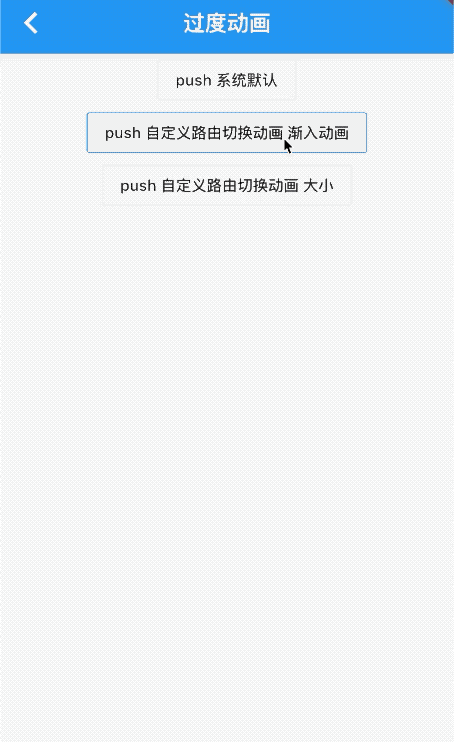
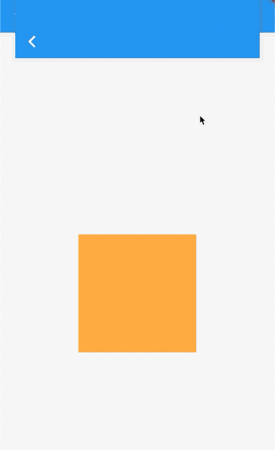

### 9.3 自定义过度动画

`Material`组件库中提供了`MaterialPageRoute`组件，他和平台风格一致，在iOS中会左右滑动，在安卓中上下滑动，现在我们想自定义动画，怎么办？

```dart
    Navigator.of(context).push(CupertinoPageRoute(builder: (ctx) => PageB()));

```

`CupertinoPageRoute `是`Cupertino`组件库中提供的`iOS`风格的路由切换组件，他实现的是左右滑动切换，那么我们如何该自定义动画？

### PageRouteBuilder

`PageRouteBuilder`可以实现自定义动画，看下下边的例子：

```dart
Navigator.push(
    context,
    PageRouteBuilder(
        transitionDuration: Duration(milliseconds: 300),
        pageBuilder: (BuildContext context, Animation<double> a1,
            Animation<double> a2) {
          return new FadeTransition(
            opacity: a1,
            child: PageB(),
          );
        }));
```



|参数|含义|
|:-:|:-:|
|transitionDuration| 转场动画时间长|
|pageBuilder|动画刷新回调函数|

我们在使用大小变换的效果

```dart
Navigator.push(
    context,
    PageRouteBuilder(
        transitionDuration: Duration(milliseconds: 300),
        pageBuilder: (BuildContext context, Animation<double> a1,
            Animation<double> a2) {
          return new ScaleTransition(
            scale: a1,
            child: PageB(),
          );
        }));
```



### 继承 PageRoute
`PageRoute `是抽象类，负责转场动画的各种参数定义。`MaterialPageRoute`、`CupertinoPageRoute`、`PageRouteBuilder`都是该类的子类，那么我们可以继承`PageRoute `来实现自己的一个转场动画。
只需要将`buildTransitons`中实现自己的动画即可。

```dart
  @override
  Widget buildTransitions(BuildContext context, Animation<double> animation,
      Animation<double> secondaryAnimation, Widget child) {
    return FadeTransition(
      child: child,
      opacity: animation,
    );
  }
```

完整代码：


```dart
class FadeTransition2 extends PageRoute {
  FadeTransition2({
    RouteSettings settings,
    @required this.pageBuilder,
    this.transitionsBuilder = _defaultTransitionsBuilder,
    this.transitionDuration = const Duration(milliseconds: 300),
    this.opaque = true,
    this.barrierDismissible = false,
    this.barrierColor,
    this.barrierLabel,
    this.maintainState = true,
    bool fullscreenDialog = false,
  })  : assert(pageBuilder != null),
        assert(transitionsBuilder != null),
        assert(opaque != null),
        assert(barrierDismissible != null),
        assert(maintainState != null),
        assert(fullscreenDialog != null),
        super(settings: settings, fullscreenDialog: fullscreenDialog);

  /// Used build the route's primary contents.
  ///
  /// See [ModalRoute.buildPage] for complete definition of the parameters.
  final RoutePageBuilder pageBuilder;

  /// Used to build the route's transitions.
  ///
  /// See [ModalRoute.buildTransitions] for complete definition of the parameters.
  final RouteTransitionsBuilder transitionsBuilder;

  @override
  final Duration transitionDuration;

  @override
  final bool opaque;

  @override
  final bool barrierDismissible;

  @override
  final Color barrierColor;

  @override
  final String barrierLabel;

  @override
  final bool maintainState;

  @override
  Widget buildPage(BuildContext context, Animation<double> animation,
      Animation<double> secondaryAnimation) {
    return pageBuilder(context, animation, secondaryAnimation);
  }

  @override
  Widget buildTransitions(BuildContext context, Animation<double> animation,
      Animation<double> secondaryAnimation, Widget child) {
    return FadeTransition(
      child: child,
      opacity: animation,
    );
  }
}
```

#### 使用

```dart
void _push3() {
Navigator.push(
    context, FadeTransition2(pageBuilder: (context, a, b) => PageB()));
}
```


### 返回使用不同的动画

转场动画分为进入和出场，刚才的代码是出场和入场动画一致，那么我们可以根据`isActive`来判断是入场还是出场动画。

```dart
@override
Widget buildTransitions(BuildContext context, Animation<double> animation,
  Animation<double> secondaryAnimation, Widget child) {
if (isActive) {
  return FadeTransition(
    child: child,
    opacity: animation,
  );
} else {
  return Padding(
    padding: EdgeInsets.zero,
    child: child,
  );
}
}
```


