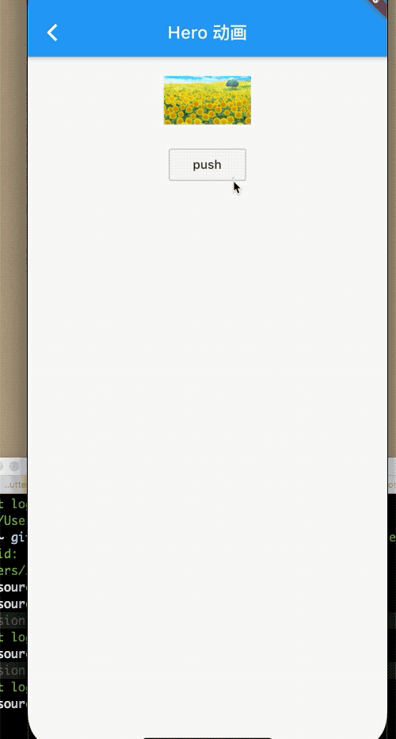

### 9.4 Hero动画

`Hero`很简单，只需要在旧页面和新页面同时使用`Hero`并配置相同的`tag`，同一个页面不允许多个`tag`同时存在。原理就是在路由切换的时候，有一个共享的widget可以在新旧路由之间进行切换，由于共享的 widget在新旧路由的位置和外观有所不同，所以从旧路由逐渐过渡到指定的位置，这就形成了`Hero`动画。


### 例子

页面A和页面B，A包含一个矩形图片，在页面顶部，B有一个圆角图片。

在AB跳转的时候，用户头像会逐步过渡到目标的头像上，我肯看下代码：


```dart
class BaseHreo extends StatefulWidget {
  final String heroKey;
  BaseHreo({Key key, this.heroKey}) : super(key: key);

  @override
  _BaseHreoState createState() => _BaseHreoState();
}

class _BaseHreoState extends State<BaseHreo> {
  @override
  Widget build(BuildContext context) {
    return Scaffold(
      appBar: AppBar(
        title: Text('Hero 动画'),
      ),
      body: _body(),
    );
  }

  Widget _body() {
    return Center(
      child: Column(
        children: <Widget>[
          Hero(
            child: Container(
              width: 100,
              height: 100,
              child: Image.asset('img/2.png'),
            ),
            tag: 'key',
          ),
          OutlineButton(
            child: Text('push'),
            onPressed: () {
              Navigator.push(
                  context,
                  MaterialPageRoute(
                      builder: (ctx) => _BaseHreo(
                            heroKey: 'key',
                          )));
            },
          )
        ],
      ),
    );
  }
}

class _BaseHreo extends StatelessWidget {
  final String heroKey;
  _BaseHreo({Key key, this.heroKey}) : super(key: key);
  @override
  Widget build(BuildContext context) {
    return Scaffold(
      appBar: AppBar(
        title: Text('hero 动画'),
      ),
      body: _body(),
    );
  }

  Widget _body() {
    return Align(
      alignment: Alignment.bottomCenter,
      child: Hero(
        child: ClipRRect(
          child: Container(
            width: 300,
            height: 300,
            child: Image.asset(
              'img/2.png',
              fit: BoxFit.fill,
            ),
          ),
          borderRadius: BorderRadius.all(Radius.circular(150)),
        ),
        tag: heroKey ?? 'key',
      ),
    );
  }
}
```



`Hero`动画原理很简单，`Flutter`知道新旧页面共享元素的位置和大小，所以根据两个位置，在动画执行过程中执行插值即可。


