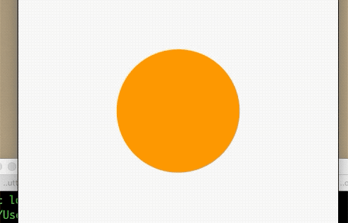

### 9.5 交织动画

有时候需要一些稍微复杂的动画，这些动画可能是重叠或者组成序列而成，比如：一个矩形形变成圆形，等完全变成圆形然后在变色。可以发现上述场景包含了形变、变色多种动画，实现这种效果，使用交织动画(Stagger Animation)很简单。

- 交织动画需要多个`Animation`
- 一个`AnimationController`控制所有动画
- 给每个动画指定间隔


所有动画都由同一个`AnimationController`驱动，无论动画需要持续多长时间，控制器的值必须在0到1之间，而每个动画的间隔也都是[0,1],对于每一个动画的属性，需要分别创建一个`Tween`来指定开始和结束的值。

### 例子
首先圆角从0变成圆形，然后半径再缩小一半。

效果：




```dart

class _BaseTaggerAnimationState extends State<BaseTaggerAnimation>
    with SingleTickerProviderStateMixin {
  AnimationController _animationController;
  Animation<double> _radius;
  Animation<double> _height;
  @override
  void initState() {
    _animationController =
        AnimationController(vsync: this, duration: Duration(milliseconds: 4000))
          ..repeat();
    _radius = Tween<double>(begin: 0, end: 100).animate(CurvedAnimation(
        parent: _animationController,
        curve: Interval(0, 0.5, curve: Curves.easeIn)));
    _height = Tween<double>(begin: 1, end: 0.5).animate(CurvedAnimation(
      parent: _animationController,
      curve: Interval(0.5, 1.0, curve: Curves.bounceOut),
    ));

    super.initState();
  }

  @override
  Widget build(BuildContext context) {
    return Scaffold(
      appBar: AppBar(
        title: Text('交织动画'),
      ),
      body: _body(),
    );
  }

  Widget _body() {
    double height = 200;
    return AnimatedBuilder(
      animation: _animationController,
      builder: (ctx, child) {
        return Center(
          child: ClipRRect(
            borderRadius: BorderRadius.all(Radius.circular(_radius.value)),
            child: Container(
              width: height * _height.value,
              height: height * _height.value,
              color: Colors.orange,
            ),
          ),
        );
      },
    );
  }

  @override
  void dispose() {
    _animationController.dispose();
    super.dispose();
  }
}
```

该页面分别定义了`_height`、`_radius`分别对高度、圆角属性的动画，然后通过`Interval`为每个动画设置起始和结束的时间点。


> 想继续学习动画内容的铜须可以看后期的动画详解与实践！