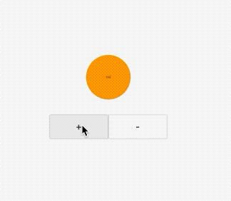

### 9.6 通用“动画切换”组件（AnimatedSwitcher）

实际开发中，经常会遇到很多过度动画，比如tab切换，路由切换。为了让用户感觉更丝滑流畅，我们可以给过度指定一个动画。

Flutter提供了很多组件，但是这些很多场景不能使用，为此，FlutterSDK提供了一个`AnimatedSwitcher `.
#### 9.6.1 AnimatedSwitcher

`AnimatedSwitcher `可以对旧组件与新组建分别实现隐藏和显示动画，首先看下定义：

```dart
const AnimatedSwitcher({
  Key key,
  this.child,
  @required this.duration, // 新child显示动画时长
  this.reverseDuration,// 旧child隐藏的动画时长
  this.switchInCurve = Curves.linear, // 新child显示的动画曲线
  this.switchOutCurve = Curves.linear,// 旧child隐藏的动画曲线
  this.transitionBuilder = AnimatedSwitcher.defaultTransitionBuilder, // 动画构建器
  this.layoutBuilder = AnimatedSwitcher.defaultLayoutBuilder, //布局构建器
})
```

当AnimatedSwitcher的child发生变化时（类型或Key不同），旧child会执行隐藏动画，新child会执行执行显示动画。究竟执行何种动画效果则由transitionBuilder参数决定，该参数接受一个AnimatedSwitcherTransitionBuilder类型的builder，定义如下：

```dart
typedef AnimatedSwitcherTransitionBuilder =
  Widget Function(Widget child, Animation<double> animation);
```

该`builder`在`AnimatedSwitcher`的`child`切换时会分别对新、旧`child`绑定动画：

对旧`child`，绑定的动画会反向执行（`reverse`）
对新`child`，绑定的动画会正向指向（`forward`）
这样一下，便实现了对新、旧`child`的动画绑定。`AnimatedSwitcher`的默认值是`AnimatedSwitcher.defaultTransitionBuilder` ：

```dart
Widget defaultTransitionBuilder(Widget child, Animation<double> animation) {
  return FadeTransition(
    opacity: animation,
    child: child,
  );
}
```
可以看到返回了`FadeTransition`对象，也就是说默认，`AnimatedSwitcher `会对旧child执行渐隐和渐显动画。

## 例子

我们实现一个计数器，每次自增/减小都执行缩小动画。


```dart
ClipRRect(
child: AnimatedSwitcher(
  child: ClipRRect(
    borderRadius: BorderRadius.all(Radius.circular(50)),
    key: Key(_count.toString()),
    child: Container(
      width: 100,
      height: 100,
      color: Colors.orange,
      alignment: Alignment.center,
      child: Text(
        '$_count',
      ),
    ),
  ),
  duration: Duration(milliseconds: 300),
  transitionBuilder: (Widget child, Animation<double> animation) {
    return ScaleTransition(
      scale: animation,
      child: child,
    );
  },
),
)
```
每次`key`都要变化，而且是在`child`的顶级部件上，所以使用`count`最合适不过了。

在使用渐入渐隐下过看下,只需要将关键代码改成下面即可：


```dart
return FadeTransition(
                  opacity: animation,
                  child: child,
                );
```

要实现一个＋向上翻滚，新的`widget`从底部出来该怎么做呢？

关键代码改成

```dart
SlideTransition(
  position:
      Tween<Offset>(begin: Offset(0, -1), end: Offset(0, 0))
          .animate(animation),
  child: child,
)
```

效果：


效果不是很理想，旧`widget`消失了，新的`weiget`从消失的地方出现了，需要改成新的`widget`从底部出现才行。


那么需要在就动画消失的时候讲坐标重置。

```dart
class MySliderTransitiion extends AnimatedWidget {
  final Widget child;
  final Ax ax;
  Tween<Offset> _tween;
  MySliderTransitiion(
      {Key key,
      @required Animation<double> position,
      this.child,
      this.ax = Ax.btt})
      : assert(position != null),
        super(key: key, listenable: position) {
   _tween = Tween(begin: Offset(0, 1), end: Offset(0, 0));
  }
  Animation<double> get position => listenable;
  @override
  Widget build(BuildContext context) {
    Offset offset = _tween.evaluate(position);

    /// 根据 动画的执行正向和反向来调节 坐标位置
    if (position.status == AnimationStatus.reverse) {
        offset = Offset(offset.dx, -offset.dy);
    }
    return FractionalTranslation(
      translation: offset,
      child: child,
    );
  }
}
```

最后将上边的`SlideTransition`换成`MySliderTransitiion`即可。

看下效果：


```dart
AnimatedSwitcher(
  child: ClipRRect(
    borderRadius: BorderRadius.all(Radius.circular(50)),
    key: Key(_count.toString()),
    child: Container(
      width: 100,
      height: 100,
      color: Colors.orange,
      alignment: Alignment.center,
      child: Text(
        '$_count',
      ),
    ),
  ),
  duration: Duration(milliseconds: 300),
  transitionBuilder: (Widget child, Animation<double> animation) {
    return MySliderTransitiion(
      position: animation,
      child: child,
    );
  },
),
```

### 高级应用

前边我们展示了从下到上，那么如果实现从下到上，从左到右，从右到左呢，当然我们可以修改上边的 代码，定义一个枚举，实现一个方向，这样子每次只需要穿传进去方向即可。

```dart
enum Ax {
  ltr,
  rtl,
  ttb,
  btt,
}

// ignore: must_be_immutable
class MySliderTransitiion extends AnimatedWidget {
  final Widget child;
  final Ax ax;
  Tween<Offset> _tween;
  MySliderTransitiion(
      {Key key,
      @required Animation<double> position,
      this.child,
      this.ax = Ax.btt})
      : assert(position != null),
        super(key: key, listenable: position) {
    /// 偏移在内部处理 每个方向的偏移量都不一样，
    /// 需要根据方向来指定偏移量
    switch (this.ax) {
      case Ax.btt:
        _tween = Tween(begin: Offset(0, 1), end: Offset(0, 0));
        break;
      case Ax.ltr:
        _tween = Tween(begin: Offset(-1, 0), end: Offset(0, 0));
        break;
      case Ax.ttb:
        _tween = Tween(begin: Offset(0, -1), end: Offset(0, 0));
        break;
      case Ax.rtl:
        _tween = Tween(begin: Offset(1, 0), end: Offset(0, 0));
        break;
    }
  }
  Animation<double> get position => listenable;
  @override
  Widget build(BuildContext context) {
    Offset offset = _tween.evaluate(position);

    /// 根据 动画的执行正向和反向来调节 坐标位置
    if (position.status == AnimationStatus.reverse) {
      switch (this.ax) {
        case Ax.ltr:
          offset = Offset(-offset.dx, offset.dy);
          break;
        case Ax.rtl:
          offset = Offset(-offset.dx, offset.dy);
          break;
        case Ax.ttb:
          offset = Offset(offset.dx, -offset.dy);
          break;
        case Ax.btt:
          offset = Offset(offset.dx, -offset.dy);
          break;
      }
    }
    return FractionalTranslation(
      translation: offset,
      child: child,
    );
  }
}
```

现在要实现从左到右只需要传入`Ax.ztl`即可。

```dart
AnimatedSwitcher(
  child: ClipRRect(
    borderRadius: BorderRadius.all(Radius.circular(50)),
    key: Key(_count.toString()),
    child: Container(
      width: 100,
      height: 100,
      color: Colors.orange,
      alignment: Alignment.center,
      child: Text(
        '$_count',
      ),
    ),
  ),
  duration: Duration(milliseconds: 300),
  transitionBuilder: (Widget child, Animation<double> animation) {
    return MySliderTransitiion(
      position: animation,
      child: child,
      ax: _ax,
    );
  },
)
```

效果：


### 总结

本节学习了`AnimatedSwitcher`的详细用法，同事介绍了`AnimatedSwitcher`的对称性方法，自己在做动画的时候需要手动切换新旧场景的动画，`AnimatedSwitcher`很有用。


