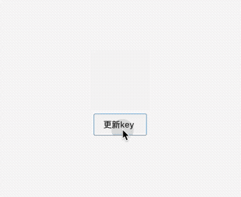
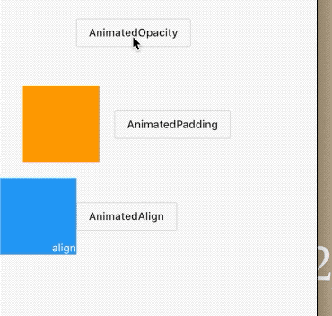

## 9.7 通用过度动画组件

当Widget组件属性发生变化执行的孤独动画统称为动画过度组件，而动画过度组件内部会与一个`AnimaitonController`。我们知道，为了定制更为贴心的动画效果，我们提供一些是一些属性动画曲线、执行时长、方向等，我们封装一下，以后用的话会比较方便。

### 9.7.1 自定义组件

我们要实现一个透明度过度组件，从旧状态到新状态执行一个动画。


```dart
class BaseDIYAnimationSwitch extends StatefulWidget {
  final Curve curve;
  final Duration duration, reverseDuration;
  final Widget child;

  BaseDIYAnimationSwitch(
      {Key key, this.curve, this.duration, this.child, this.reverseDuration})
      : super(key: key);

  @override
  _BaseDIYAnimationSwitchState createState() => _BaseDIYAnimationSwitchState();
}

class _BaseDIYAnimationSwitchState extends State<BaseDIYAnimationSwitch>
    with SingleTickerProviderStateMixin {
  AnimationController _animationController;
  Animation<double> animation;

  @override
  void initState() {
    _animationController = AnimationController(
        duration: widget.duration,
        vsync: this,
        reverseDuration: widget.reverseDuration)
      ..forward();
    animation = Tween(begin: 0.0, end: 1.0).animate(_animationController);
    super.initState();
  }

  @override
  void didUpdateWidget(BaseDIYAnimationSwitch oldWidget) {
    super.didUpdateWidget(oldWidget);
    _updateCurve();

    /// 当runType和 key有一个不一样的话再去更新动画
    if (Widget.canUpdate(oldWidget, widget) == false) {
      if (oldWidget.child != null) {
        _animationController.reverse();
      }

      _animationController
        ..duration = widget.duration
        ..reverseDuration = widget.reverseDuration;
      _animationController
        ..value = 0
        ..forward();
    }
  }

  @override
  Widget build(BuildContext context) {
    return _body();
  }

  Widget _body() {
    return AnimatedBuilder(
      child: widget.child,
      animation: animation,
      builder: (ctx, child) {
        return Opacity(
          opacity: animation.value,
          child: child,
        );
      },
    );
  }

  void _updateCurve() {
    if (widget.curve != null) {
      animation =
          CurvedAnimation(parent: _animationController, curve: widget.curve);
    } else {
      animation = _animationController;
    }
  }

  @override
  void dispose() {
    _animationController.dispose();
    super.dispose();
  }
}
```

使用的时候很简单

```dart
BaseDIYAnimationSwitch(
    key: ObjectKey(_key),
    duration: Duration(
      milliseconds: 2000,
    ),
    reverseDuration: Duration(
      milliseconds: 3000,
    ),
    child: Container(
      color: Colors.red,
      width: 100,
      height: 100,
    ),
  )
```

当key变更时才会触发动画效果。



上面的代码虽然实现了功能，但是代码稍微复杂，我们可以将`AnimationController `的管理和`Tween`更新代码抽象出来，如果我们将这些通用逻辑类封装成基类，那么实现动画过度组件只需要继承这些基类，然后定制资深不同的代码，这样子会简化不少代码。

`Flutter`提供了一个`ImplicitlyAnimatedWidget `抽象类，它继承了`StateFullWidget`,同时对应了`ImplicitlyAnimatedWidgetState `,`AnimationController`的管理就在`ImplicitlyAnimatedWidgetState`类中。开发者如果要封装动画，只需要分别继承`ImplicitlyAnimatedWidget`和`ImplicitlyAnimatedWidgetState`类即可，下面我们演示一下具体如何实现。


### 继承 ImplicitlyAnimatedWidget

```dart
class BaseAnimaitnAlign extends ImplicitlyAnimatedWidget {
  final Curve curve;
  final EdgeInsetsGeometry padding;
  final Widget child;
  final Duration duration;

  final VoidCallback onEnd;
  const BaseAnimaitnAlign(
      {Key key,
      this.curve = Curves.linear,
      @required this.duration,
      this.onEnd,
      this.padding,
      this.child})
      : assert(curve != null),
        assert(duration != null),
        assert(child != null, ''),
        super(key: key, curve: curve, onEnd: onEnd, duration: duration);
  @override
  ImplicitlyAnimatedWidgetState<ImplicitlyAnimatedWidget> createState() {
    return BaseAnimaitnAlignState();
  }
}
```

### 继承 ImplicitlyAnimatedWidgetState

```dart
class BaseAnimaitnAlignState extends ImplicitlyAnimatedWidgetState<BaseAnimaitnAlign> {
  EdgeInsetsGeometryTween _padding;
  @override
  void forEachTween(TweenVisitor<dynamic> visitor) {
    _padding = visitor(
            _padding,
            widget.padding,
            (dynamic value) =>
                EdgeInsetsGeometryTween(begin: value as EdgeInsetsGeometry))
        as EdgeInsetsGeometryTween;
  }

  @override
  Widget build(BuildContext context) {
    return Padding(
      padding: _padding
          .evaluate(animation)
          .clamp(EdgeInsets.zero, EdgeInsetsGeometry.infinity),
      child: widget.child,
    );
  }
}
```





当然官方提供了还有更多部件，我们一一列举

|部件名字|含义|
|:-:|:-:|
|TweenAnimationBuilder|使用tween来驱动动画|
|AnimatedAlign|相对坐标动画|
|AnimatedContainer| 动画Container|
|AnimatedDefaultTextStyle| 改变样式的文本|
|AnimatedOpacity| 改变透明度动画|
|AnimatedPadding|改变内边框的动画|
|AnimatedPhysicalModel|改变物理模型|
|AnimatedPositioned| Positioned动画|
|AnimatedPositionedDirectional| 改变方向动画|
|AnimatedTheme|主题动画|
|AnimatedCrossFade|渐入渐隐动画|
|AnimatedSize|改变大小动画|
|AnimatedSwitcher|新旧空间切换动画|

想要了解更多请自己查看官方API哦。
