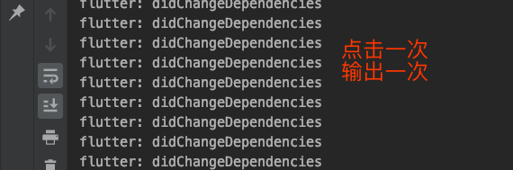

### 7.2 共享数据
共享数据在我们我们平时开发中很常用的比如`Theme.of(context)`、`Media.of()`等等，这些都是 通过`of`函数获取上级(顶级或者多层级的一级)的数据。它是用`InheritedWidget`来实现的，提供了一个静态方法`of`获取实例，通过实例获取其他属性的值。

下边看些例子：存储点击次数的`ShareData`

```dart
class ShareData extends InheritedWidget {
  int count;
  ShareData({Key key, this.count, @required Widget child})
      : super(key: key, child: child);
  @override
  bool updateShouldNotify(InheritedWidget oldWidget) {
    return this != oldWidget;
  }

  static ShareData of(BuildContext context) {
    return context.dependOnInheritedWidgetOfExactType<ShareData>();
  }
}
```

然后用它包裹子部件

```dart
class BaseShareData extends StatefulWidget {
  @override
  _BaseShareDataState createState() => _BaseShareDataState();
}

class _BaseShareDataState extends State<BaseShareData> {
  @override
  Widget build(BuildContext context) {
    return Scaffold(
      appBar: AppBar(
        title: Text('共享数据'),
      ),
      body: _body(),
      floatingActionButton: FloatingActionButton(
        child: Icon(Icons.add),
        onPressed: () {
          setState(() {
            _count += 1;
          });
        },
      ),
    );
  }

  int _count = 0;
  Widget _body() {
    return ShareData(
      count: _count,
      child: BaseShareData2(),
    );
  }
}
/// 子部件 显示共享数据的count的值
class BaseShareData2 extends StatelessWidget {
  @override
  Widget build(BuildContext context) {
    return Container(
      child: Text(
        ShareData.of(context).count.toString(),
        style: TextStyle(fontSize: 50),
      ),
      alignment: Alignment.center,
    );
  }
}
```


每点击一次按钮，数字便会增加`1`.

`didChangeDependencies`该函数式 当`state`的依赖更改时候调用，当依赖更改，则`build`会重新调用，就是会重绘，刷新页面。

上面的代码稍作修改;

```dart
class BaseShareData2 extends StatefulWidget {
  @override
  _BaseShareData2State createState() => _BaseShareData2State();
}

class _BaseShareData2State extends State<BaseShareData2> {
  @override
  Widget build(BuildContext context) {
    return Container(
      child: Text(
        ShareData.of(context).count.toString(),
        style: TextStyle(fontSize: 50),
      ),
      alignment: Alignment.center,
    );
  }

  @override
  void didChangeDependencies() {
    print('didChangeDependencies');
    super.didChangeDependencies();
  }
}
```
当依赖更改则输出日志：



输出次日志条件是当天子部件必需在`ShareData`部件下边，否则通知不到该组件，则此函数不会调用。

上边代码再稍微改下，当我们不用父级部件的话是否会调用。

```dart
class _BaseShareData2State extends State<BaseShareData2> {
  @override
  Widget build(BuildContext context) {
    return Container(
      child: Text(
        'test no sharedata',
//        ShareData.of(context).count.toString(),
        style: TextStyle(fontSize: 50),
      ),
      alignment: Alignment.center,
    );
  }

  @override
  void didChangeDependencies() {
    print('didChangeDependencies');
    super.didChangeDependencies();
  }
}
```

当我们注释掉对父级 的共享的引用，则不会调用`didChangeDependencies `,页面不会发生重绘动作，性能更好。

### didChangeDependencies 到底是做什么的

当次对象的`State`对象的依赖更改时调用，比如引用了父组件的`InheritedWidgget`数据，框架将通知次对象有关更改的方法。

当`A`是共享数据`InhertedWidget`，`B``F`是使用了`A`的数据，那么当`A`数据变化时，`B ->G`都谁会刷新？？


```
flutter: didChangeDependencies
flutter: build true
flutter: build false
flutter: build false
flutter: build false
flutter: didChangeDependencies
flutter: build true
flutter: build false
```
> 答案是都会`build`一次，但是`didChangeDependencies `只有`2`次，感兴趣的同学可以试一下。
> 原因是顶级 部件`build`会导致子类都`build`，并不是`dependencies`的原因。


### 如果又想用`ShareData`的数据但是不想重复更新该怎么办？

那么我们只是需要将`of`新增一个即可，一个负责刷新，一个只是取值不会刷新的。


```dart
  static ShareData ofNoRefresh(BuildContext context) {
    return context.getElementForInheritedWidgetOfExactType<ShareData>().widget;
  }
```

他们到底有什么联系和区别呢？

看下源码了

```dart
///--------dependOnInheritedWidgetOfExactType------
  @override
  T dependOnInheritedWidgetOfExactType<T extends InheritedWidget>({Object aspect}) {
    assert(_debugCheckStateIsActiveForAncestorLookup());
    final InheritedElement ancestor = _inheritedWidgets == null ? null : _inheritedWidgets[T];
    if (ancestor != null) {
      assert(ancestor is InheritedElement);
      return dependOnInheritedElement(ancestor, aspect: aspect) as T;
    }
    _hadUnsatisfiedDependencies = true;
    return null;
  }
  
  
  ///----getElementForInheritedWidgetOfExactType-----
  
@override
InheritedElement getElementForInheritedWidgetOfExactType<T extends InheritedWidget>() {
assert(_debugCheckStateIsActiveForAncestorLookup());
final InheritedElement ancestor = _inheritedWidgets == null ? null : _inheritedWidgets[T];
return ancestor;
}
  
```


多出的函数如下,该函数就是将渲染`obj`添加到依赖的数组中。

```dart
  @override
  InheritedWidget dependOnInheritedElement(InheritedElement ancestor, { Object aspect }) {
    assert(ancestor != null);
    _dependencies ??= HashSet<InheritedElement>();
    _dependencies.add(ancestor);
    ancestor.updateDependencies(this, aspect);
    return ancestor.widget;
  }
```

最终调用了

```dart
  @protected
  void updateDependencies(Element dependent, Object aspect) {
    setDependencies(dependent, null);
  }
```
再看一下`setDependencies `源码：

```dart
  @protected
  void setDependencies(Element dependent, Object value) {
    _dependents[dependent] = value;
  }
```
该函数只是将需要依赖的组件加入到数组中`_dependents `，这个数组就是最终通知到的`obj`，最终调用了`notifyClients`中的`      notifyDependent(oldWidget, dependent)`已达到通知组件的效果。

最后调用 的通知函数：

```dart
  @protected
  void notifyDependent(covariant InheritedWidget oldWidget, Element dependent) {
    dependent.didChangeDependencies();
  }
```